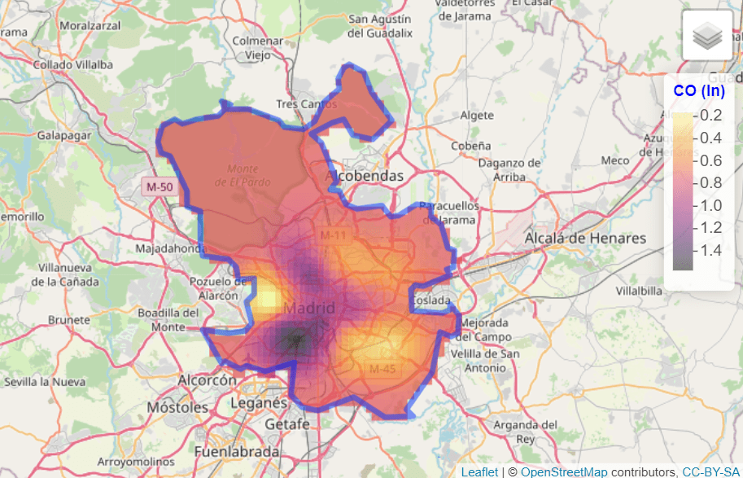
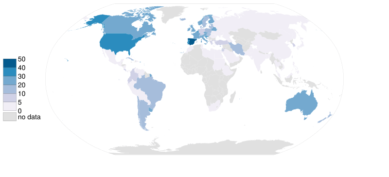
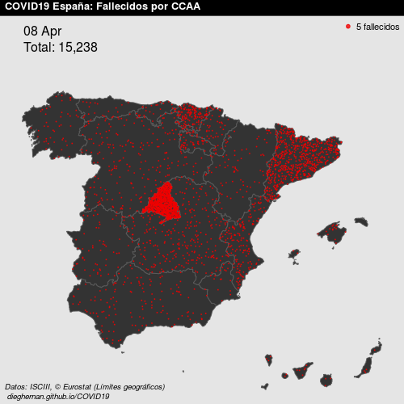

# Spatial data and study scope

Spatial data associate observations with locations on the Earth's surface. Their
statistical structure depends on how locations are sampled and how the
underlying process is represented. @cressie1993 distinguishes three broad
classes. The following examples illustrate each class:

:::: {.content-visible when-format="pdf"}
1.  **Geostatistical data:** log-transformed carbon monoxide (CO) concentrations
    measured at sampling locations in Madrid (@fig-example-geo).
2.  **Lattice data:** organ donor rates aggregated by country
    (@fig-example-lattice).
3.  **Point patterns:** locations of recorded COVID-19 deaths in Spain
    (@fig-example-point).

::: {#fig-examples layout="[[1,1], [1]]" layout-valign="bottom" fig-scap="Spatial data classes"}
{#fig-example-geo fig-alt="Geostatistical data"
fig-align="center" height="200"}

{#fig-example-lattice fig-alt="Lattice data"
fig-align="center" height="200"}

{#fig-example-point fig-alt="Point patterns"
fig-align="center" height="200"}

Examples of geostatistical, lattice and point-pattern data
:::
::::

::: {.content-visible when-format="html"}
1.  **Geostatistical data:** log-transformed carbon monoxide (CO) concentrations
    measured at sampling locations in Madrid (@fig-intro-1).

    ```{r}
    #| echo: false
    #| out-width: 60%
    #| fig-align: center
    #| label: fig-intro-1
    #| fig-cap: "Log-transformed carbon monoxide concentrations measured in
    #|   Madrid"
    #| fig-scap: "Geostatistical observations"
    # Load from cache.
    
    ```

2.  **Lattice data:** organ donor rates aggregated by country (@fig-intro-2).

```{r}
#| echo: false
#| out-width: 50%
#| fig-align: center
#| label: fig-intro-2
#| fig-cap: "Country-level organ donor rates represented as lattice data"
#| fig-scap: "Country-level lattice data"
# Load from cache.

```

3.  **Point patterns:** locations of recorded COVID-19 deaths in Spain
    (@fig-intro-3).

```{r}
#| echo: false
#| out-width: 50%
#| fig-align: center
#| label: fig-intro-3
#| fig-cap: "Recorded COVID-19 deaths represented as a point pattern"
#| fig-scap: "COVID-19 point pattern"
# Load from cache.

```
:::

See @montero2015 for a detailed treatment of these classes. The present study
focuses on geostatistical data and has two objectives: to characterize the
spatial dependence of minimum temperature observations and to compare ordinary
kriging with inverse distance weighting as interpolation methods.

## Computational environment

The analysis uses the following R packages:

```{r}
#| label: libraries
library(climaemet) # AEMET climatology data
library(mapSpain) # Base maps of Spain
library(classInt) # Classification
library(terra) # Raster data
library(sf) # Simple features
library(gstat) # Spatial interpolation
library(geoR) # Spatial analysis
library(tidyverse) # Collection of R packages designed for data science
library(tidyterra) # Tidyverse methods for terra
```

## Data source and study period

The case study examines minimum air temperature in Spain, excluding the Canary
Islands, on [8 January 2021](https://en.wikipedia.org/wiki/Storm_Filomena),
during Storm Filomena.

Daily climatological observations are retrieved with **climaemet** (\>= 1.0.0)
[@10261_250390]. The package provides access to the Spanish State Meteorological
Agency (AEMET) OpenData service through its application programming interface
(API) and is available from
[CRAN](https://CRAN.R-project.org/package=climaemet):

```{r}
#| label: cran
#| eval: false
# Install climaemet.
install.packages("climaemet")
```

### API key

Reproducing the data retrieval requires a free API key from the [AEMET OpenData
registration page](https://opendata.aemet.es/centrodedescargas/altaUsuario).

``` r
library(climaemet)
# Open the AEMET OpenData API key registration page.
# browseURL("https://opendata.aemet.es/centrodedescargas/altaUsuario")
# Set the API key for the current R session.
# YOUR_API_KEY

# aemet_api_key("YOUR_AEMET_API_KEY")
```

# Geostatistical data structure

Let $Z(s)$ denote a spatial random function defined over a continuous domain
$D$. In a geostatistical setting, the process can in principle be observed at
any location $s \in D$, although measurements are available only at a finite set
of sampling locations. Here, $Z(s)$ represents minimum daily temperature and the
sampling locations are AEMET weather stations.

The analysis begins with the weather station metadata, particularly the latitude
and longitude fields used to locate each observation.

```{r}
#| label: tbl-stations
#| tbl-cap: "Selected metadata for AEMET weather stations"
stations <- aemet_stations()

# Inspect the data.
stations |>
  dplyr::select(
    name = nombre,
    latitude = latitud,
    longitude = longitud
  ) |>
  head() |>
  knitr::kable()
```

We then retrieve daily observations for 8 January 2021:

```{r}
#| label: select-daily-data
# Select data.
date_select <- "2021-01-08"

clim_data <- aemet_daily_clim(
  start = date_select,
  end = date_select,
  return_sf = TRUE
)
```

The API returns several meteorological variables. The response variable in this
study is minimum daily temperature, stored in `tmin`:

```{r}
#| label: daily-variable-names
names(clim_data)
```

We retain the response variable and use **mapSpain** [@R-mapspain] to represent
the study area. The Canary Islands are excluded because their distance from the
Iberian Peninsula would require a separate spatial domain:

```{r}
#| label: fig-selected-temperature
#| fig-cap: "Spatial distribution of AEMET weather stations in the study area"
#| fig-scap: "AEMET weather stations"
clim_data_clean <- clim_data |>
  # Exclude Canary Islands from analysis.
  filter(str_detect(provincia, "PALMAS|TENERIFE", negate = TRUE)) |>
  dplyr::select(fecha, tmin) |>
  # Exclude NAs.
  filter(!is.na(tmin))

# Plot with outline of Spain.
esp_sf <- esp_get_ccaa(epsg = 4326) |>
  # Exclude Canary Islands from analysis.
  filter(ine.ccaa.name != "Canarias") |>
  # Group the whole country.
  st_union()

ggplot(esp_sf) +
  geom_sf() +
  geom_sf(data = clim_data_clean) +
  theme_light() +
  labs(
    title = "AEMET stations in Spain",
    subtitle = "excluding Canary Islands"
  ) +
  theme(
    plot.title = element_text(
      size = 12,
      face = "bold"
    ),
    plot.subtitle = element_text(
      size = 8,
      face = "italic"
    )
  )
```

The station observations provide an initial view of the spatial distribution of
minimum temperature:

```{r}
#| label: fig-choro
#| fig-cap: "Observed minimum temperature at AEMET weather stations on 8 January
#|   2021"
#| fig-scap: "Observed minimum temperatures"
# Use common breaks and palette throughout the article.
br_paper <- c(-Inf, seq(-20, 20, 2.5), Inf)
pal_paper <- hcl.colors(15, "PuOr", rev = TRUE)

ggplot(clim_data_clean) +
  geom_sf(data = esp_sf, fill = "grey95") +
  geom_sf(aes(fill = tmin), shape = 21, size = 4, alpha = 0.7) +
  labs(fill = "Minimum temperature") +
  scale_fill_gradientn(
    colours = pal_paper,
    breaks = br_paper,
    labels = scales::label_number(suffix = "°"),
    guide = "legend"
  ) +
  theme_light() +
  labs(
    title = "Minimum temperature",
    subtitle = format(as.Date(date_select), "%d %b %Y")
  ) +
  theme(
    plot.title = element_text(
      size = 12,
      face = "bold"
    ),
    plot.subtitle = element_text(
      size = 8,
      face = "italic"
    )
  )
```

# Evidence of spatial dependence

The First Law of Geography states that *everything is related to everything
else, but near things are more related than distant things* [@tobler1969]. This
principle motivates the concepts of spatial dependence and spatial
autocorrelation.

The mapped observations suggest positive spatial dependence, with relatively
high temperatures concentrated in southern Spain and relatively low temperatures
concentrated in northern and inland areas. This visual pattern is examined
formally through the semivariogram below.

```{r}
#| label: tbl-summ
#| tbl-cap: "Descriptive statistics for observed minimum temperature"
clim_data_clean |>
  st_drop_geometry() |>
  select(tmin) |>
  summarise(across(
    everything(),
    list(
      min = min,
      max = max,
      median = median,
      sd = sd,
      n = ~ sum(!is.na(.x)),
      q25 = ~ quantile(.x, 0.25),
      q75 = ~ quantile(., 0.75)
    ),
    .names = "{.fn}"
  )) |>
  knitr::kable()
```

For a distribution-free summary, the next map groups minimum temperature into
quartiles and displays their spatial distribution.

```{r}
#| label: fig-bubble-plot
#| fig-cap: "Spatial distribution of minimum temperature quartiles on 8 January
#|   2021"
#| fig-scap: "Minimum temperature quartiles"
bubble <- clim_data_clean |>
  arrange(desc(tmin))

# Create quartiles.
cuart <- classIntervals(bubble$tmin, n = 4)

bubble$quart <- cut(
  bubble$tmin,
  breaks = cuart$brks,
  labels = paste0("Q", seq(1:4))
)

ggplot(bubble) +
  geom_sf(
    aes(size = quart, fill = quart),
    colour = "grey20",
    alpha = 0.5,
    shape = 21
  ) +
  scale_size_manual(values = c(2, 2.5, 3, 3.5)) +
  scale_fill_manual(values = hcl.colors(4, "PuOr", rev = TRUE)) +
  theme_light() +
  labs(
    title = "Minimum temperature quartile map",
    subtitle = format(as.Date(date_select), "%d %b %Y"),
    fill = "Quartile",
    size = "Quartile"
  ) +
  theme(
    plot.title = element_text(size = 12, face = "bold"),
    plot.subtitle = element_text(size = 8, face = "italic")
  )
```

# Coordinate reference system and prediction grid

Distance-based spatial analysis requires an appropriate [coordinate reference
system (CRS)](https://en.wikipedia.org/wiki/Spatial_reference_system). We
transform the `sf` objects to the European Terrestrial Reference System 1989
(ETRS89) / Universal Transverse Mercator (UTM) zone 30N
([EPSG:25830](https://epsg.io/25830)). This projected CRS is expressed in meters
and is suitable for the study area.

```{r}
#| label: transform
clim_data_utm <- st_transform(clim_data_clean, 25830)

esp_sf_utm <- st_transform(esp_sf, 25830)
```

## Create a grid for spatial prediction

Prediction at unobserved locations requires a target grid and an interpolation
model. We use **terra** to represent the grid as a `SpatRaster`. @hijmans2023
describes the corresponding interpolation workflow with **terra** and **gstat**.

The grid consists of equally spaced 5 km cells across the bounding box of the
study area. Weather stations occupy only a subset of these cells. The
interpolation methods use the observed station values to predict minimum
temperature at the remaining grid-cell centers.

```{r}
#| label: create-grid
# Create a 5 km by 5 km grid (25 km²).
# The resolution is based on the projection unit, in this case meters.
grd <- rast(vect(esp_sf_utm), res = c(5000, 5000))

cellSize(grd)
```

Before interpolation, duplicate station geometries are removed so that each
sampling location contributes a single observation.

```{r}
#| label: remove-duplicates
# Some points are duplicated, so remove them.

clim_data_clean_nodup <- clim_data_utm |>
  distinct(geometry, .keep_all = TRUE)

nrow(clim_data_utm)

nrow(clim_data_clean_nodup)

clim_data_clean_nodup
```

# Spatial dependence analysis

## Exploratory spatial data analysis (ESDA)

ESDA assesses the marginal distribution of the response and its variation across
space before a spatial model is fitted. We examine the relationship between the
projected `X` and `Y` coordinates and `tmin`.

The following summary reports the number of observations, coordinate ranges,
distances and response values.

```{r}
#| label: esda-summary
clim_data_clean_nodup_geor <- clim_data_clean_nodup |>
  st_coordinates() |>
  as.data.frame() |>
  bind_cols(st_drop_geometry(clim_data_clean_nodup)) |>
  as.geodata(coords.col = 1:2, data.col = "tmin")

summary(clim_data_clean_nodup_geor)
```

The diagnostic display combines a quartile map, plots of `tmin` against the `X`
and `Y` coordinates and a histogram of `tmin`.

```{r}
#| label: fig-esda-plot
#| fig-cap: "Exploratory spatial diagnostics for minimum temperature: quartile
#|   map, coordinate plots and histogram"
#| fig-scap: "Exploratory spatial data analysis"
plot(clim_data_clean_nodup_geor)
```

The histogram is broadly unimodal, although marginal normality alone is neither
sufficient nor necessary to establish the assumptions of ordinary kriging. Under
the specified mean and covariance model, ordinary kriging provides a best linear
unbiased predictor
([BLUP](https://en.wikipedia.org/wiki/Best_linear_unbiased_prediction)).

```{r}
#| label: fig-hist
#| fig-cap: "Distribution of observed minimum temperature on 8 January 2021"
#| fig-scap: "Minimum temperature distribution"
ggplot(clim_data_clean_nodup, aes(x = tmin)) +
  geom_histogram(
    aes(fill = cut(tmin, 15)),
    color = "grey40",
    binwidth = 1,
    show.legend = FALSE
  ) +
  scale_fill_manual(values = pal_paper) +
  labs(
    y = "Number of observations",
    x = "Minimum temperature (°)"
  ) +
  theme_light() +
  labs(
    title = "Histogram of minimum temperature",
    subtitle = format(as.Date(date_select), "%d %b %Y")
  ) +
  theme(
    plot.title = element_text(size = 12, face = "bold"),
    plot.subtitle = element_text(size = 8, face = "italic")
  )
```

## The semivariogram

The semivariogram is central to geostatistical prediction. Following
@montero2015, it quantifies how dissimilarity between observations changes with
their separation distance. Kriging weights depend on the fitted spatial
dependence model, so the empirical and theoretical semivariograms require
careful assessment.

Valid covariance and semivariogram models must satisfy specific mathematical
conditions. An empirical semivariogram summarizes the observed realization but
does not itself define a valid model for arbitrary locations. We therefore fit a
permissible theoretical model before prediction.

Several R packages support geostatistical analysis. This article uses **geoR**
[@R-geoR] and **gstat** [@pebesma2004], including the extensions described by
@graler2016.

We first estimate an omnidirectional empirical semivariogram to summarize
average spatial dependence across all directions.

```{r}
#| label: fig-variog-geor
#| fig-asp: 0.5
#| fig-cap: "Omnidirectional empirical semivariogram of minimum temperature"
#| fig-scap: "Empirical semivariogram"
vario_geor <- variog(
  clim_data_clean_nodup_geor,
  coords = clim_data_clean_nodup_geor$coords,
  data = clim_data_clean_nodup_geor$data,
  uvec = seq(0, 1000000, l = 25)
)

plot(vario_geor, pch = 20)
```

`geoR::eyefit()` supports an interactive, visual assessment of candidate
semivariogram parameters. Formal alternatives include ordinary least squares
(OLS), weighted least squares (WLS), maximum likelihood (ML) and restricted
maximum likelihood (REML).

Because the function is interactive, it must be run in a local R session.

```{r}
#| label: eyefit-geor
#| eval: false
eyefit(vario_geor)
```

Candidate semivariogram families differ in shape and parameterization.

The main types of semivariograms are:

- *Spherical*.
- *Exponential*.
- *Gaussian*.
- *Hole effect*.
- *K-Bessel*.
- *J-Bessel*.
- *Stable*.
- *Matérn*.
- *Circular*.
- *Nugget*.

The following figure summarizes common spatial semivariogram models:

```{r}
#| label: fig-semi-models
#| fig-cap: "Common theoretical semivariogram models"
#| fig-scap: "Common semivariogram models"
show.vgms()
```

Three parameters are particularly important:

- *Sill*: The limiting semivariance for a bounded model.
- *Range*: The distance beyond which spatial dependence becomes negligible. For
  models that approach the sill asymptotically, an effective range is used.
- *Nugget*: A discontinuity at the origin that may represent measurement error,
  spatial variation below the sampling resolution or both.

For a detailed study of the semivariogram function, see @montero2015.

To assess directional variation, we estimate empirical semivariograms at 0°,
45°, 90° and 135° with `gstat::variogram()`.

```{r}
#| label: fig-variog-gstat
#| fig-asp: 0.5
#| fig-cap: "Empirical semivariograms estimated in four directions"
#| fig-scap: "Directional semivariograms"
vgm_dir <- variogram(
  tmin ~ 1,
  clim_data_clean_nodup,
  cutoff = 1000000,
  alpha = c(0, 45, 90, 135)
)

plot(vgm_dir)
```

The directional semivariograms differ in shape and magnitude, which indicates
that the dependence structure may be anisotropic. For this illustrative
analysis, subsequent model fitting uses the 90° direction. A confirmatory study
should compare alternative anisotropic models and directions systematically.

```{r}
#| label: variog-gstat-directional
vgm_dir_selected <- variogram(
  tmin ~ 1,
  clim_data_clean_nodup,
  cutoff = 1000000,
  alpha = 90
)
```

We fit a spherical theoretical semivariogram for use in the kriging system. The
`fit_var` object stores the estimated nugget, sill and range parameters.

```{r}
#| label: variog-gstat-fit-parameters
fit_var <- fit.variogram(vgm_dir_selected,
  model = vgm(model = "Sph")
)

fit_var
```

The empirical estimates and fitted theoretical model are then compared
graphically.

```{r}
#| label: fig-variog-gstat-fit
#| fig-asp: 0.5
#| fig-cap: "Empirical semivariogram at 90° and fitted spherical model"
#| fig-scap: "Fitted semivariogram model"
plot(
  vgm_dir_selected,
  fit_var,
  main = "Empirical (dots) and theoretical (line) semivariograms "
)
```

# Ordinary kriging

Once a theoretical semivariogram has been fitted, it can be used for spatial
prediction. Kriging is named after the South African mining engineer Daniel
Gerhardus Krige.

According to @montero2015, **kriging** predicts the value of a random function,
$Z(s)$, at one or more unobserved points or blocks. It uses data observed at $n$
points or blocks in a domain $D$ to provide the BLUP of the regionalized
variable.

The appropriate form of kriging depends on the assumed mean structure, spatial
support and prediction objective. Common variants include simple, ordinary and
universal kriging, as well as point and block prediction.

This analysis uses ordinary kriging, which assumes an unknown but constant local
mean. According to @Wackernagel2003, prediction at an unobserved location uses
nearby observations and a specified variogram.

We implement ordinary kriging (OK) following the workflow in @hijmans2023.

```{r}
#| label: kriging-results
# Pass the input as a data frame.
clim_data_clean_nodup_df <- vect(clim_data_clean_nodup) |>
  as_tibble(geom = "XY")

clim_data_clean_nodup_df

k <- gstat(
  formula = tmin ~ 1,
  locations = ~ x + y,
  data = clim_data_clean_nodup_df,
  model = fit_var
)

kriged <- interpolate(grd, k, debug.level = 0)
```

The resulting prediction surface, visualized with **tidyterra** [@R-tidyterra],
represents estimated minimum temperature across the target grid:

```{r}
#| label: fig-kriging-prediction
#| fig-cap: "Ordinary kriging prediction of minimum temperature on 8 January
#|   2021"
#| fig-scap: "Ordinary kriging prediction"
pred <- ggplot(esp_sf_utm) +
  geom_spatraster(data = kriged, aes(fill = var1.pred)) +
  geom_sf(colour = "black", fill = NA) +
  scale_fill_gradientn(
    colours = pal_paper,
    breaks = br_paper,
    labels = scales::label_number(suffix = "°"),
    guide = guide_legend(
      reverse = TRUE,
      title = "Minimum temperature\n(kriging)"
    )
  ) +
  theme_light() +
  labs(
    title = "Ordinary kriging - minimum temperature",
    subtitle = format(as.Date(date_select), "%d %b %Y")
  ) +
  theme(
    plot.title = element_text(size = 12, face = "bold"),
    plot.subtitle = element_text(size = 8, face = "italic"),
    panel.grid = element_blank(),
    panel.border = element_blank()
  )

pred
```

Kriging also yields the model-based prediction variance at each grid cell:

```{r}
#| label: fig-kriging-variance
#| fig-cap: "Ordinary kriging prediction variance for minimum temperature"
#| fig-scap: "Ordinary kriging variance"
ggplot(esp_sf_utm) +
  geom_spatraster_contour_filled(
    data = kriged,
    aes(z = var1.var),
    breaks = c(0, 1.5, 3, 6, 8, 10, 15, 20, Inf)
  ) +
  geom_sf(colour = "black", fill = NA) +
  geom_sf(
    data = clim_data_clean_nodup,
    colour = "blue", shape = 4
  ) +
  scale_fill_whitebox_d(
    palette = "pi_y_g",
    alpha = 0.7,
    guide = guide_legend(title = "Variance")
  ) +
  theme_light() +
  labs(
    title = "OK prediction variance - minimum temperature",
    subtitle = format(as.Date(date_select), "%d %b %Y")
  ) +
  theme(
    plot.title = element_text(size = 12, face = "bold"),
    plot.subtitle = element_text(size = 8, face = "italic"),
    panel.grid = element_blank(),
    panel.border = element_blank()
  )
```

Overlaying variance contours on the prediction surface shows how uncertainty
varies across the study area:

```{r}
#| label: fig-prediction-variance
#| fig-cap: "Ordinary kriging prediction with prediction-variance contours for
#|   minimum temperature"
#| fig-scap: "Prediction and kriging variance"
pred +
  geom_sf(
    data = clim_data_clean_nodup, colour = "darkred",
    shape = 20
  ) +
  geom_spatraster_contour(
    data = kriged,
    aes(z = var1.var),
    breaks = c(0, 2.5, 5, 10, 15, 20)
  ) +
  labs(
    title = "OK prediction and prediction variance",
    caption = "Points: Weather stations.\nLines: Variance contours"
  )
```

Prediction variance is generally lower near weather stations and higher in areas
with sparse station coverage. This pattern reflects the sampling geometry and
fitted semivariogram, conditional on the ordinary kriging model.

# Comparison with inverse distance weighting

We compare ordinary kriging with inverse distance weighting (IDW), a commonly
used deterministic interpolation method. The implementation follows @hijmans2023
and uses **terra**.

IDW predicts values as distance-weighted averages of nearby observations, with
closer observations receiving greater weight. Unlike IDW, ordinary kriging
derives its weights from the fitted semivariogram under an explicit stochastic
model. It also provides a model-based prediction variance.

```{r}
#| label: fig-idw
#| fig-cap: "Minimum temperature predicted by ordinary kriging and IDW on 8
#|   January 2021"
#| fig-scap: "Ordinary kriging and IDW predictions"
gs <- gstat(
  formula = tmin ~ 1,
  locations = ~ x + y,
  data = clim_data_clean_nodup_df,
  set = list(idp = 2.0)
)

idw <- interpolate(grd, gs)

# Create a SpatRaster with two layers, one prediction each.

all_methods <- c(
  kriged |> select(Kriging = var1.pred),
  idw |> select(IDW = var1.pred)
)

# Plot and compare.
ggplot(esp_sf_utm) +
  geom_spatraster(data = all_methods) +
  facet_wrap(~lyr) +
  geom_sf(colour = "black", fill = NA) +
  scale_fill_gradientn(
    colours = pal_paper,
    n.breaks = 10,
    labels = scales::label_number(suffix = "°"),
    guide = guide_legend(
      title = "Minimum temperature",
      direction = "horizontal",
      keyheight = 0.5,
      keywidth = 2,
      title.position = "top",
      title.hjust = 0.5,
      label.hjust = 0.5,
      nrow = 1,
      byrow = TRUE,
      reverse = FALSE,
      label.position = "bottom"
    )
  ) +
  theme_void() +
  labs(
    title = "OK vs IDW",
    subtitle = format(as.Date(date_select), "%d %b %Y")
  ) +
  theme(
    panel.grid = element_blank(),
    panel.border = element_blank(),
    plot.title = element_text(size = 12, face = "bold"),
    plot.subtitle = element_text(size = 8, face = "italic"),
    legend.text = element_text(size = 10),
    legend.title = element_text(size = 11),
    legend.position = "bottom"
  )
```

## Cross-validation

We compare OK and IDW using leave-one-out cross-validation (CV). Each
observation is withheld in turn and predicted from the remaining observations,
providing an out-of-sample assessment at the sampled locations.

```{r}
#| label: cross-validation-ok
## Cross-validation: OK
xv_ok <- krige.cv(tmin ~ 1, clim_data_clean_nodup, fit_var)

xv_ok |>
  st_drop_geometry() |>
  summarise(across(
    everything(),
    list(min = min, max = max),
    .names = "{.col}_{.fn}"
  )) |>
  pivot_longer(everything(),
    names_to = c("field", "stat"),
    names_sep = "_"
  ) |>
  pivot_wider(id_cols = stat, names_from = field)
```

```{r}
#| label: cross-validation-idw
# Cross-validation: IDW
xv_idw <- krige.cv(tmin ~ 1, clim_data_clean_nodup)

xv_idw |>
  st_drop_geometry() |>
  summarise(across(
    everything(),
    list(min = min, max = max),
    .names = "{.col}_{.fn}"
  )) |>
  pivot_longer(everything(),
    names_to = c("field", "stat"),
    names_sep = "_"
  ) |>
  pivot_wider(id_cols = stat, names_from = field)
```

The following maps show the spatial distribution of leave-one-out residuals for
both methods.

```{r }
#| label: fig-cross-validation
#| fig-cap: "Spatial distribution of leave-one-out cross-validation residuals
#|   for ordinary kriging and IDW"
#| fig-scap: "Cross-validation residuals"
# Create a unique scale.

allvalues <- terra::values(all_methods, na.rm = TRUE, mat = FALSE)

# Prepare the final data.
cross_val <- xv_ok |>
  mutate(method = "OK") |>
  bind_rows(
    xv_idw |>
      mutate(method = "IDW")
  ) |>
  select(method, residual) |>
  mutate(method = as_factor(method), cat = cut_number(residual, 5))

ggplot(cross_val) +
  geom_sf(data = esp_sf_utm, fill = "grey90") +
  geom_sf(aes(fill = cat, size = cat), shape = 21) +
  facet_wrap(~method) +
  scale_size_manual(values = c(1.5, 1, 0.5, 1, 1.5)) +
  scale_fill_whitebox_d(palette = "pi_y_g", alpha = 0.7) +
  labs(
    title = "Minimum temperature: leave-one-out cross-validation residuals",
    subtitle = "By method",
    fill = "",
    size = ""
  ) +
  theme(
    plot.title = element_text(size = 12, face = "bold"),
    plot.subtitle = element_text(size = 8, face = "italic"),
    strip.text = element_text(face = "bold")
  )
```

We summarize predictive performance using mean error (ME), which measures
average bias, and root-mean-square error (RMSE), which measures the typical
magnitude of prediction errors while giving greater weight to large errors.

```{r}
#| label: diagnostic-functions
me <- function(observed, predicted) {
  mean((predicted - observed), na.rm = TRUE)
}

rmse <- function(observed, predicted) {
  sqrt(mean((predicted - observed)^2, na.rm = TRUE))
}
```

```{r}
#| label: diagnostic-statistics
# Calculate OK diagnostic statistics.

me_ok <- me(xv_ok$observed, xv_ok$var1.pred)

rmse_ok <- rmse(xv_ok$observed, xv_ok$var1.pred)

# Calculate IDW diagnostic statistics.

me_idw <- me(xv_idw$observed, xv_idw$var1.pred)

rmse_idw <- rmse(xv_idw$observed, xv_idw$var1.pred)
```

For this dataset and validation design, the method with ME closest to zero has
the lowest estimated bias, while the method with the lower RMSE has the better
overall predictive accuracy. These results apply to the sampled station
locations and should not be interpreted as a general ranking of interpolation
methods.

```{r}
#| label: tbl-diag
#| tbl-cap: "Leave-one-out cross-validation diagnostics by interpolation method"
#| echo: false
data.frame(
  D = c("OK", "IDW"),
  ME = round(c(me_ok, me_idw), 3),
  RMSE = round(c(rmse_ok, rmse_idw), 3)
) |>
  knitr::kable(digits = 3, col.names = c("Diagnostic statistics", "ME", "RMSE"))
```

# Conclusions

This case study demonstrates a reproducible workflow for converting
station-based minimum temperature observations into continuous spatial
predictions. The analysis combines projected spatial data, exploratory
diagnostics, empirical semivariograms, a fitted theoretical model and
leave-one-out cross-validation. Ordinary kriging additionally quantifies
model-based prediction uncertainty, which is particularly informative in areas
with sparse station coverage.

The comparison with IDW illustrates why interpolation methods should be
evaluated empirically for the data and prediction objective at hand. The
cross-validation results characterize performance at sampled locations, but they
do not establish accuracy at all unsampled grid cells. Moreover, this analysis
considers a single day and uses an illustrative directional semivariogram model.
Further work could assess temporal stability, compare isotropic and anisotropic
specifications and evaluate sensitivity to grid resolution and station density.

# References {.unnumbered}

::: {#refs}
:::
