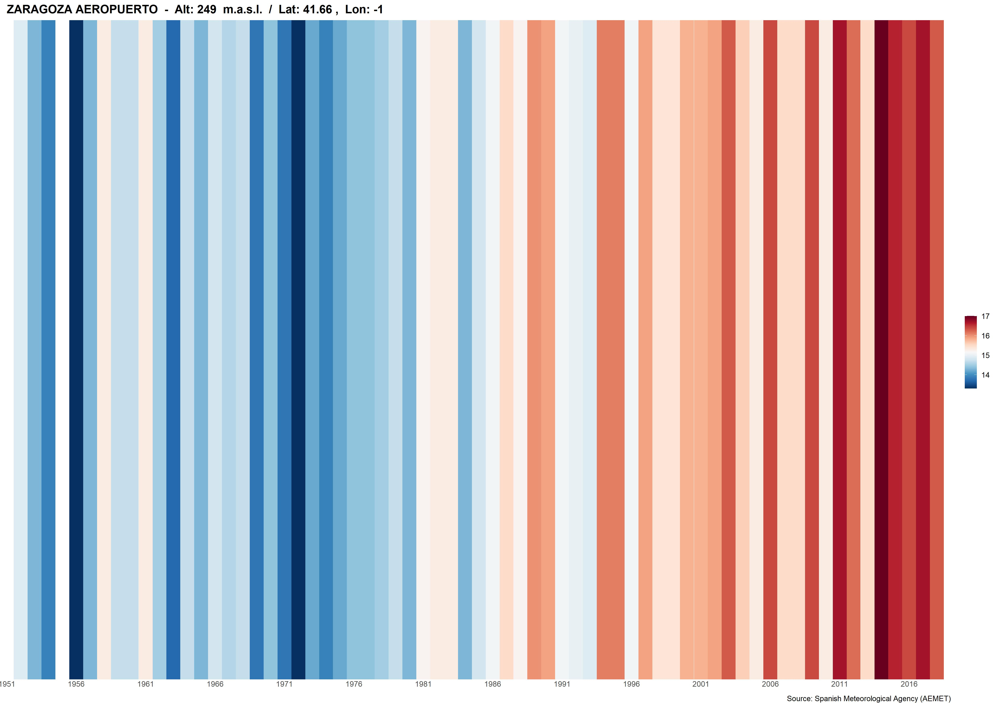
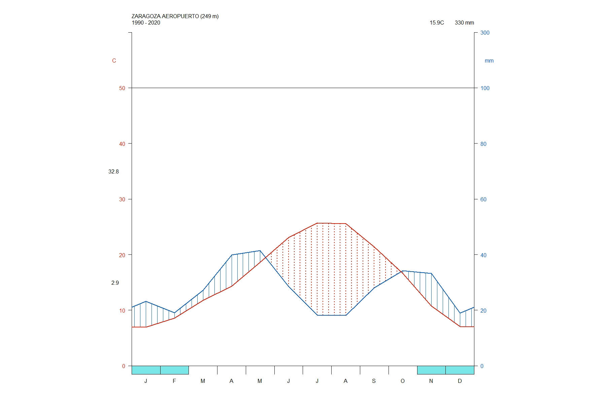
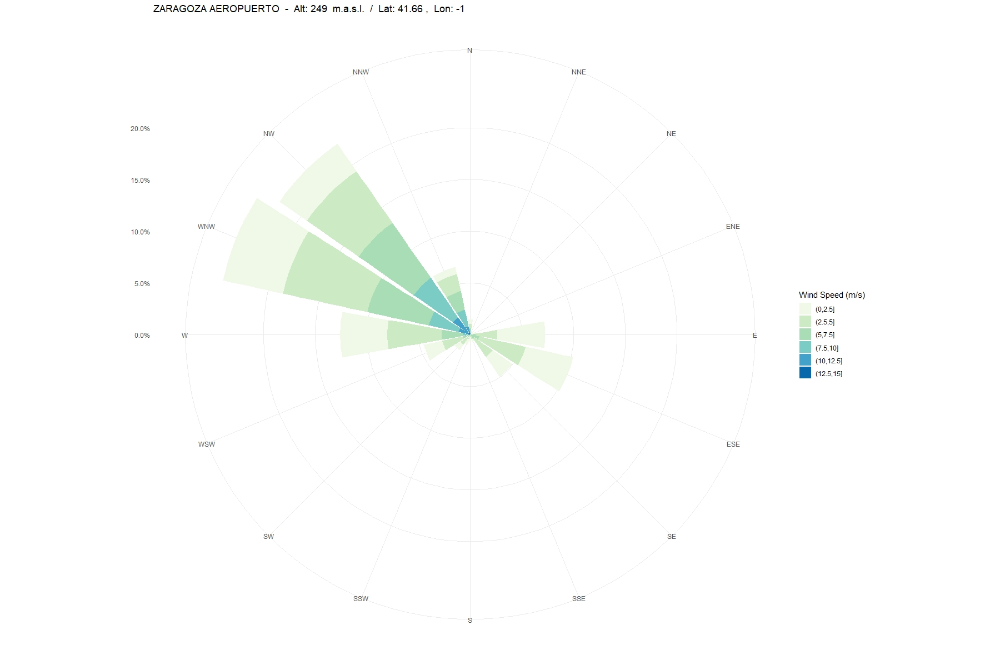

# R Climate AEMET Tools (climaemet) 

<!-- badges: start -->
[](https://CRAN.R-project.org/package=climaemet)
[](https://cran.r-project.org/package=climaemet)
[](https://cran.r-project.org/package=climaemet)
[](https://www.tidyverse.org/lifecycle/#stable)
[](https://www.rdocumentation.org/packages/climaemet)
[](https://cran.r-project.org/package=climaemet)
[](https://www.gnu.org/licenses/gpl-3.0.en.html)
<!-- badges: end -->


#### Manuel Pizarro (http://www.ipe.csic.es)


## Description

The goal of "climaemet" is to serve as an interface to download the climatic data of the Spanish Meteorological Agency (AEMET) directly from R using their API (https://opendata.aemet.es/) and create scientific graphs (climate charts, trend analysis of climate time series, temperature and precipitation anomalies maps, "warming stripes" graphics, climatograms, etc.).

## AEMET Open Data

AEMET OpenData is a REST API developed by AEMET that allows the dissemination and reuse of the Agency's meteorological and climatological information. To see more details visit: https://opendata.aemet.es/centrodedescargas/inicio

## License for the original data

Information prepared by the Spanish Meteorological Agency (© AEMET). You can read about it here (in spanish): http://www.aemet.es/es/nota_legal

A summary for the usage of the data could be interpreted as:

People can use freely this data. You should mention AEMET as the collector of the original data in every situation except if you are using this data privately and individually. AEMET makes no warranty as to the accuracy or completeness of the data. All data are provided on an "as is" basis. AEMET is not responsible for any damage or loss derived from the interpretation or use of this data.

## Installation

You can install the released version of climaemet from [CRAN](https://CRAN.R-project.org) with:

``` r
install.packages("climaemet")
```

## Requirements

To be able to download data from AEMET you will need a free API key which you can get at https://opendata.aemet.es/centrodedescargas/obtencionAPIKey

## Examples

These are basic examples to obtain data from the AEMET Open Data API:

``` r
library(climaemet)

## Get api key from AEMET
browseURL("https://opendata.aemet.es/centrodedescargas/obtencionAPIKey")

## Get AEMET stations
stations <- aemet_stations(apikey)
View(stations)
station <- "9434" # Zaragoza Aeropuerto

## Get last observation values for a station
data_observation <- aemet_last_obs(station, apikey)

## Get normal climatology values for a station
data_normal <- aemet_normal_clim(station, apikey)

## Get daily/annual climatology values for a station
data_daily <- aemet_daily_clim(station, apikey, "2000-01-01", "2000-12-31")

## Get monthly/annual climatology values for a station
data_monthly <- aemet_monthly_clim(station, apikey, 2000)

## Get recorded extreme values of temperature for a station
data_extremes <- aemet_extremes_clim(station, apikey, "T")

## Get normal climatology values for all stations
data_normal_clim_all <- aemet_normal_clim_all(apikey)

## Get monthly climatology values for a period of years for a station
data_monthly_period_station <- aemet_monthly_period(station, apikey, start = 2018, end = 2019)

## Get monthly climatology values for a period of years for all stations
data_monthly_period_all <- aemet_monthly_period_all(apikey, start = 2020, end = 2020)

# Get daily climatology values for a period of years for a station
data_daily_period_station <- aemet_daily_period(station, apikey, 2000, 2010)

# Get daily climatology values for a period of years for all stations
data_daily_period_all <- aemet_daily_period_all(apikey, 2000, 2010)
```
We can also draw a "warming stripes" graph with the downloaded data from a weather station:

``` r
library(climaemet)

## Get api key from AEMET
browseURL("https://opendata.aemet.es/centrodedescargas/obtencionAPIKey")

## Get AEMET stations
stations <- aemet_stations(apikey)
View(stations)
station <- "9434" # Zaragoza Aeropuerto

# Plot a climate stripes graph for a period of years for a station
climatestripes_station(station, apikey, start = 1950, end = 2020)

# Plot a climate stripes background image for a period of years for a station
climatestripes_station(station, apikey, with_labels = "no")

# Save plot
ggsave(plot = last_plot(), filename ="stripes.jpeg", "jpeg", scale = 1, width = 420, height = 297, units = "mm", dpi = 300)
```

# 

Furthermore, we can draw the well-known Walter & Lieth climatic diagram for a weather station and over a specified period of time:

``` r
library(climaemet)

## Get api key from AEMET
browseURL("https://opendata.aemet.es/centrodedescargas/obtencionAPIKey")

## Get AEMET stations
stations <- aemet_stations(apikey)
View(stations)
station <- "9434" # Zaragoza Aeropuerto

# Plot of a Walter & Lieth climatic diagram (normal climatology values) for a station
climatogram_normal(station, apikey, labels = "en")

# Plot of a Walter & Lieth climatic diagram from a time period for a station
climatogram_period(station, apikey, start = 1990, end = 2020, labels = "en")

# Save plot
ggsave(plot = last_plot(), filename ="climatogram.jpeg", "jpeg", scale = 1, width = 420, height = 297, units = "mm", dpi = 300)
```

# 

Additionally, we may be interested in drawing the wind speed and direction over a period of time for the data downloaded from a weather station.:

``` r
library(climaemet)

## Get api key from AEMET
browseURL("https://opendata.aemet.es/centrodedescargas/obtencionAPIKey")

## Get AEMET stations
stations <- aemet_stations(apikey)
View(stations)
station <- "9434" # Zaragoza Aeropuerto

# Plot a windrose showing the wind speed and direction for a station over a days period.
windrose_days(station, apikey, start = "2000-01-01", end = "2000-12-31", n_speeds = 5, speed_cuts = c(2.5,5,7.5,10,12.5,15))

# Plot a windrose diagram for a station over a time period with 16 directions
windrose_period(station, apikey, start = 2000, end = 2010, n_directions = 16, n_speeds = 5, speed_cuts = c(2.5,5,7.5,10,12.5,15), col_pal = "GnBu")

# Save plot
ggsave(plot = last_plot(), filename ="windrose.jpeg", "jpeg", scale = 1, width = 420, height = 297, units = "mm", dpi = 300)
```

# 

## Code of Conduct
Please note that this project is released with a Contributor Code of Conduct. By participating in this project you agree to abide by its terms.

## Citation

Using **climaemet** for a paper you are writing?. Consider citing it

```{r}
citation("climaemet")
```

## Links
Download from CRAN at
https://cloud.r-project.org/package=climaemet

Browse source code at
https://github.com/mpizarrotig/climaemet

