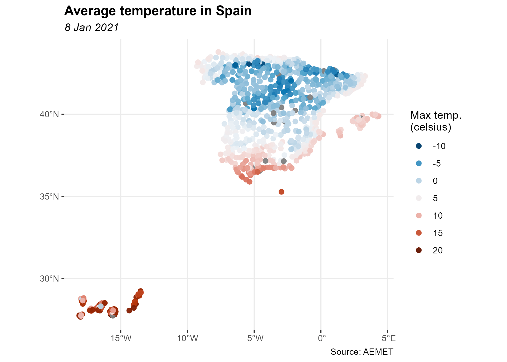
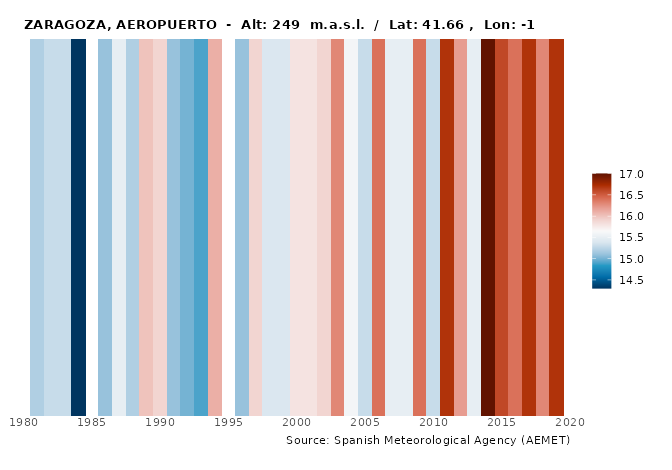
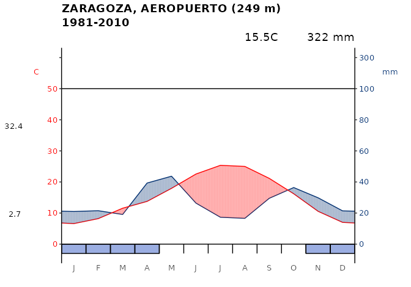
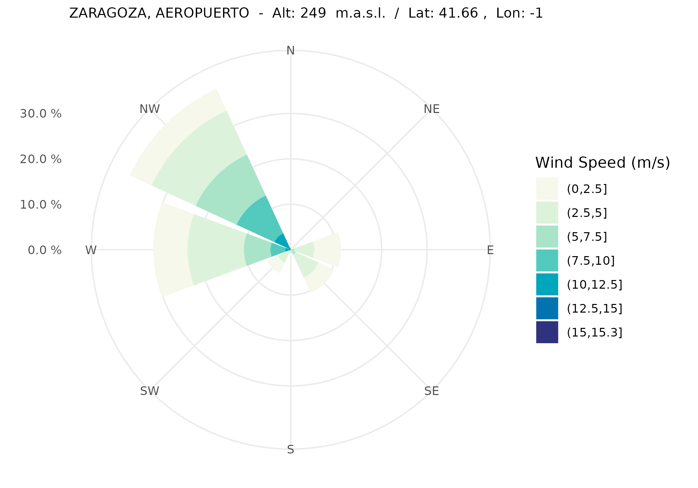

<!-- README.md is generated from README.qmd. Please edit that file -->

# climaemet <a href="https://ropenspain.github.io/climaemet/"></a>

<!-- badges: start -->

[](https://ropenspain.es/)
[](https://CRAN.R-project.org/package=climaemet)
[](https://cran.r-project.org/package=climaemet)
[](https://cran.r-project.org/package=climaemet)
[](https://cran.r-project.org/web/checks/check_results_climaemet.html)
[](https://ropenspain.r-universe.dev/climaemet)
[](https://github.com/rOpenSpain/climaemet/actions/workflows/roscron-check-full.yaml)
[](https://app.codecov.io/gh/rOpenSpain/climaemet)
[](https://doi.org/10.32614/CRAN.package.climaemet)
[](https://cran.r-project.org/package=climaemet)

[](https://www.repostatus.org/#active)

<!-- badges: end -->

The goal of **climaemet** is to provide an interface for downloading
climate data from the Spanish Meteorological Agency (AEMET) directly in
**R** and for creating scientific visualizations, including climate
charts, climate time series trend analysis, temperature and
precipitation anomaly maps, warming stripes and climatograms.

Browse the manual and vignettes at
<https://ropenspain.github.io/climaemet/>.

## AEMET Open Data

AEMET Open Data is a REST API developed by AEMET for disseminating and
reusing the agency’s meteorological and climatological information. For
more details, visit
<https://opendata.aemet.es/centrodedescargas/inicio>.

## License for the original data

Information prepared by the Spanish Meteorological Agency (© AEMET). You
can read about it [here](https://www.aemet.es/en/nota_legal).

A summary of data usage is:

> People can use these data freely. You should mention AEMET as the
> collector of the original data in every situation except when you are
> using these data privately and individually. AEMET makes no warranty
> as to the accuracy or completeness of the data. All data are provided
> on an “as is” basis. AEMET is not responsible for any damage or loss
> derived from the interpretation or use of these data.

## Installation

Install the released version of **climaemet** from
[CRAN](https://CRAN.R-project.org) with:

``` r
install.packages("climaemet")
```

Install the development version of **climaemet** from
[r-universe](https://ropenspain.r-universe.dev/climaemet):

``` r
# Install climaemet in R:
install.packages(
  "climaemet",
  repos = c(
    "https://ropenspain.r-universe.dev",
    "https://cloud.r-project.org"
  )
)
```

Alternatively, install the development version of **climaemet** with:

``` r
# install.packages("pak")
pak::pak("ropenspain/climaemet")
```

## API key

To download data from AEMET, you need a free API key, which you can get
[here](https://opendata.aemet.es/centrodedescargas/altaUsuario).

``` r
library(climaemet)

## Get API key from AEMET.
browseURL("https://opendata.aemet.es/centrodedescargas/altaUsuario")

## Use this function to register your API key temporarily or permanently.
aemet_api_key("MY API KEY")
```

## Changes in version 1.0.0

The `apikey` argument in the functions is now deprecated. You may need
to set your API key globally using `aemet_api_key()`. Note that you also
need to remove the `apikey` argument from older code.

### Tidy outputs

From version 1.0.0 onward, **climaemet** provides its results in
[**tibble** format](https://tibble.tidyverse.org/). The functions also
try to infer the correct format of fields. For example, date and hour
fields are parsed as date-time objects, and numeric fields are parsed as
doubles.

``` r
library(climaemet)

# See a tibble in action

aemet_last_obs("9434")
#> # A tibble: 12 × 25
#>    idema   lon fint                 prec   alt  vmax    vv    dv   lat  dmax
#>    <chr> <dbl> <dttm>              <dbl> <dbl> <dbl> <dbl> <dbl> <dbl> <dbl>
#>  1 9434  -1.00 2026-06-01 11:00:00     0   249   6.8   3.2   320  41.7   320
#>  2 9434  -1.00 2026-06-01 12:00:00     0   249   6.6   1.3   303  41.7   305
#>  3 9434  -1.00 2026-06-01 13:00:00     0   249   4     1.3   259  41.7   320
#>  4 9434  -1.00 2026-06-01 14:00:00     0   249   3.7   1.7    78  41.7   308
#>  5 9434  -1.00 2026-06-01 15:00:00     0   249   4.3   2.6    79  41.7   103
#>  6 9434  -1.00 2026-06-01 16:00:00     0   249   4.8   2.9   129  41.7   125
#>  7 9434  -1.00 2026-06-01 17:00:00     0   249   4.4   1.8   124  41.7    98
#>  8 9434  -1.00 2026-06-01 18:00:00     0   249   3.5   1.5   249  41.7    80
#>  9 9434  -1.00 2026-06-01 19:00:00     0   249   4.5   2.9   328  41.7   313
#> 10 9434  -1.00 2026-06-01 20:00:00     0   249   4.2   2.5   319  41.7   325
#> 11 9434  -1.00 2026-06-01 21:00:00     0   249   3.3   2.1   293  41.7   243
#> 12 9434  -1.00 2026-06-01 22:00:00     0   249   7.6   3.9   313  41.7   293
#> # ℹ 15 more variables: ubi <chr>, pres <dbl>, hr <dbl>, stdvv <dbl>, ts <dbl>,
#> #   pres_nmar <dbl>, tamin <dbl>, ta <dbl>, tamax <dbl>, tpr <dbl>,
#> #   stddv <dbl>, inso <dbl>, tss5cm <dbl>, pacutp <dbl>, tss20cm <dbl>
```

### Spatial outputs

Another major change in version 1.0.0 is the ability to return
information as spatial **sf** objects using `return_sf = TRUE`. The
coordinate reference system (CRS) is **EPSG:4326**, which corresponds to
the **World Geodetic System 1984 (WGS 84)** and returns coordinates in
latitude/longitude (unprojected coordinates):

``` r
# You need to install sf if it is not already installed.
# Run install.packages("sf") to install it.
library(ggplot2)
library(dplyr)

all_stations <- aemet_daily_clim(
  start = "2021-01-08",
  end = "2021-01-08",
  return_sf = TRUE
)

ggplot(all_stations) +
  geom_sf(aes(colour = tmed), shape = 19, size = 2, alpha = 0.95) +
  labs(
    title = "Average temperature in Spain",
    subtitle = "8 Jan 2021",
    color = "Max temp.\n(celsius)",
    caption = "Source: AEMET"
  ) +
  scale_colour_gradientn(
    colours = hcl.colors(10, "RdBu", rev = TRUE),
    breaks = c(-10, -5, 0, 5, 10, 15, 20),
    guide = "legend"
  ) +
  theme_bw() +
  theme(
    panel.border = element_blank(),
    plot.title = element_text(face = "bold"),
    plot.subtitle = element_text(face = "italic")
  )
```



## Plots

You can also draw a warming stripes graph from downloaded weather
station data. These functions return **ggplot2** plots:

``` r
# Plot a climate stripes graph for a period of years for a station.

library(ggplot2)

# Example data
temp_data <- climaemet::climaemet_9434_temp

ggstripes(temp_data, plot_title = "Zaragoza Airport") +
  labs(subtitle = "(1950-2020)")
```



You can also draw the well-known Walter & Lieth climatic diagram for a
weather station over a specified period:

``` r
# Plot a Walter & Lieth climatic diagram for a station.

# Example data
wl_data <- climaemet::climaemet_9434_climatogram

ggclimat_walter_lieth(
  wl_data,
  alt = "249",
  per = "1981-2010",
  est = "Zaragoza Airport"
)
```



Additionally, you can plot wind speed and direction over time from
weather station data.

``` r
# Plot a windrose showing wind speed and direction for a station.

# Example data
wind_data <- climaemet::climaemet_9434_wind

speed <- wind_data$velmedia
direction <- wind_data$dir

ggwindrose(
  speed = speed,
  direction = direction,
  speed_cuts = seq(0, 16, 4),
  legend_title = "Wind speed (m/s)",
  calm_wind = 0,
  n_col = 1,
  plot_title = "Zaragoza Airport"
) +
  labs(subtitle = "2000-2020", caption = "Source: AEMET")
```



## Code of Conduct

Please note that this project is released with a Contributor Code of
Conduct. By participating in this project you agree to abide by its
terms.

## Citation

If you use **climaemet** in a paper, please consider citing it:

<p>

Pizarro M, Hernangómez D, Fernández-Avilés G (2021). <em>climaemet:
Climate AEMET Tools</em>.
<a href="https://doi.org/10.32614/CRAN.package.climaemet">doi:10.32614/CRAN.package.climaemet</a>.
</p>

A BibTeX entry for LaTeX users is:

    @Manual{10261_250390,
      author = {Manuel Pizarro and Diego Hernangómez and Gema Fernández-Avilés},
      title = {{climaemet}: Climate {AEMET} Tools},
      year = {2021},
      abstract = {The goal of climaemet is to serve as an interface to download the climatic data of the Spanish Meteorological Agency (AEMET) directly from R using their API (https://opendata.aemet.es/) and create scientific graphs (climate charts, trend analysis of climate time series, temperature and precipitation anomalies maps, “warming stripes” graphics, climatograms, etc.).},
      doi = {10.32614/CRAN.package.climaemet},
    }

## Links

- Download from CRAN at <https://cran.r-project.org/package=climaemet>
- Browse source code at <https://github.com/ropenspain/climaemet>
