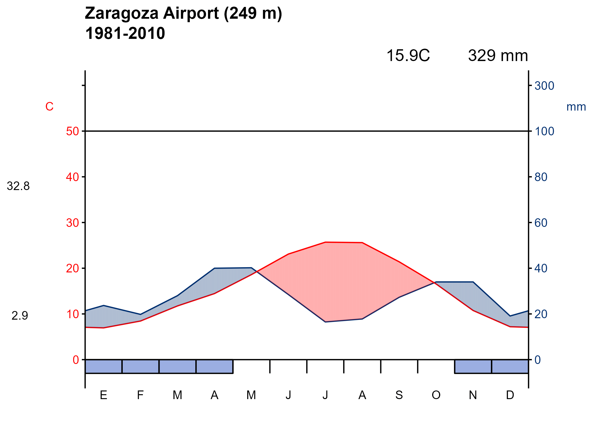

<!-- README.md is generated from README.Rmd. Please edit that file -->

# climaemet 

<!-- badges: start -->

[](https://ropenspain.es/)
[](https://CRAN.R-project.org/package=climaemet)
[](https://cran.r-project.org/package=climaemet)
[](https://cran.r-project.org/package=climaemet)
[](https://cran.r-project.org/web/checks/check_results_climaemet.html)
[](https://ropenspain.r-universe.dev/climaemet)
[](https://github.com/rOpenSpain/climaemet/actions/workflows/roscron-check-full.yaml)
[](https://github.com/rOpenSpain/climaemet/actions/workflows/rhub.yaml)
[](https://app.codecov.io/gh/rOpenSpain/climaemet)
[](https://doi.org/10.32614/CRAN.package.climaemet)
[](https://cran.r-project.org/package=climaemet)

[](https://www.repostatus.org/#active)

<!-- badges: end -->

The goal of **climaemet** is to serve as an interface to download the
climatic data of the Spanish Meteorological Agency (AEMET) directly from
R using their [API](https://opendata.aemet.es/) and create scientific
graphs (climate charts, trend analysis of climate time series,
temperature and precipitation anomalies maps, “warming stripes”
graphics, climatograms, etc.).

Browse manual and vignettes at
<https://ropenspain.github.io/climaemet/>.

## AEMET Open Data

AEMET OpenData is a REST API developed by AEMET that allows the
dissemination and reuse of the Agency’s meteorological and
climatological information. To see more details visit:
<https://opendata.aemet.es/centrodedescargas/inicio>

## License for the original data

Information prepared by the Spanish Meteorological Agency (© AEMET). You
can read about it [here](https://www.aemet.es/en/nota_legal).

A summary for the usage of the data could be interpreted as:

> People can use freely this data. You should mention AEMET as the
> collector of the original data in every situation except if you are
> using this data privately and individually. AEMET makes no warranty as
> to the accuracy or completeness of the data. All data are provided on
> an “as is” basis. AEMET is not responsible for any damage or loss
> derived from the interpretation or use of this data.

## Installation

You can install the released version of **climaemet** from
[CRAN](https://CRAN.R-project.org) with:

``` r
install.packages("climaemet")
```

You can install the developing version of **climaemet** using the
[r-universe](https://ropenspain.r-universe.dev/climaemet):

``` r
# Install climaemet in R:
install.packages("climaemet",
  repos = c("https://ropenspain.r-universe.dev", "https://cloud.r-project.org")
)
```

Alternatively, you can install the developing version of **climaemet**
with:

``` r
library(remotes)
install_github("ropenspain/climaemet")
```

## API key

To be able to download data from AEMET you will need a free API key
which you can get
[here](https://opendata.aemet.es/centrodedescargas/obtencionAPIKey).

``` r
library(climaemet)

## Get api key from AEMET
browseURL("https://opendata.aemet.es/centrodedescargas/obtencionAPIKey")

## Use this function to register your API Key temporarly or permanently
aemet_api_key("MY API KEY")
```

## Changes on v1.0.0!

Now the `apikey` parameter on the functions have been deprecated. You
may need to set your API Key globally using `aemet_api_key()`. Note that
you would need also to remove the `apikey` parameter on your old codes.

### Now **climaemet** is tidy…

From `v1.0.0` onward, **climaemet** provides its results in [`tibble`
format](https://tibble.tidyverse.org/). Also, the functions try to guess
the correct format of the fields (i.e. something as a Date/Hour now is
an hour, numbers are parsed as double, etc.).

``` r
library(climaemet)

# See a tibble in action

aemet_last_obs("9434")
#> # A tibble: 13 × 25
#>    idema   lon fint                 prec   alt  vmax    vv    dv   lat  dmax
#>    <chr> <dbl> <dttm>              <dbl> <dbl> <dbl> <dbl> <dbl> <dbl> <dbl>
#>  1 9434  -1.00 2025-02-06 03:00:00     0   249   3.7   2.4   278  41.7   298
#>  2 9434  -1.00 2025-02-06 04:00:00     0   249   3.5   2.5   288  41.7   263
#>  3 9434  -1.00 2025-02-06 05:00:00     0   249   3.1   1.5     8  41.7   308
#>  4 9434  -1.00 2025-02-06 06:00:00     0   249   1.9   0.4   307  41.7     8
#>  5 9434  -1.00 2025-02-06 07:00:00     0   249   0.9   0.4    86  41.7    90
#>  6 9434  -1.00 2025-02-06 08:00:00     0   249   0.9   0.6   323  41.7   335
#>  7 9434  -1.00 2025-02-06 09:00:00     0   249   1.6   0.8    45  41.7   358
#>  8 9434  -1.00 2025-02-06 10:00:00     0   249   1.6   0.5   140  41.7    48
#>  9 9434  -1.00 2025-02-06 11:00:00     0   249   2.9   1.3   316  41.7   310
#> 10 9434  -1.00 2025-02-06 12:00:00     0   249   4.3   2.1   322  41.7   315
#> 11 9434  -1.00 2025-02-06 13:00:00     0   249   5.4   2.9   311  41.7   320
#> 12 9434  -1.00 2025-02-06 14:00:00     0   249   3.8   0.8   292  41.7   310
#> 13 9434  -1.00 2025-02-06 15:00:00     0   249   2.7   0.8   158  41.7   120
#> # ℹ 15 more variables: ubi <chr>, pres <dbl>, hr <dbl>, stdvv <dbl>, ts <dbl>,
#> #   pres_nmar <dbl>, tamin <dbl>, ta <dbl>, tamax <dbl>, tpr <dbl>,
#> #   stddv <dbl>, inso <dbl>, tss5cm <dbl>, pacutp <dbl>, tss20cm <dbl>
```

### … and spatial!

Another major change in `v1.0.0` is the ability of return information on
spatial `sf` format, using `return_sf = TRUE`. The coordinate reference
system (CRS) used is **EPSG 4326**, that correspond to the **World
Geodetic System (WGS)** and return coordinates in latitude/longitude
(unprojected coordinates):

``` r
# You would need to install `sf` if not installed yet
# run install.packages("sf") for installation

library(ggplot2)
library(dplyr)

all_stations <- aemet_daily_clim(
  start = "2021-01-08", end = "2021-01-08",
  return_sf = TRUE
)


ggplot(all_stations) +
  geom_sf(aes(colour = tmed), shape = 19, size = 2, alpha = 0.95) +
  labs(
    title = "Average temperature in Spain",
    subtitle = "8 Jan 2021",
    color = "Max temp.\n(celsius)",
    caption = "Source: AEMET"
  ) +
  scale_colour_gradientn(
    colours = hcl.colors(10, "RdBu", rev = TRUE),
    breaks = c(-10, -5, 0, 5, 10, 15, 20),
    guide = "legend"
  ) +
  theme_bw() +
  theme(
    panel.border = element_blank(),
    plot.title = element_text(face = "bold"),
    plot.subtitle = element_text(face = "italic")
  )
```


## Plots

We can also draw a “warming stripes” graph with the downloaded data from
a weather station. These functions returns **ggplot2** plots:

``` r
# Plot a climate stripes graph for a period of years for a station

library(ggplot2)

# Example data
temp_data <- climaemet::climaemet_9434_temp

ggstripes(temp_data, plot_title = "Zaragoza Airport") +
  labs(subtitle = "(1950-2020)")
```


Furthermore, we can draw the well-known Walter & Lieth climatic diagram
for a weather station and over a specified period of time:

``` r
# Plot of a Walter & Lieth climatic diagram for a station

# Example data
wl_data <- climaemet::climaemet_9434_climatogram

ggclimat_walter_lieth(wl_data,
  alt = "249", per = "1981-2010",
  est = "Zaragoza Airport"
)
```



Additionally, we may be interested in drawing the wind speed and
direction over a period of time for the data downloaded from a weather
station.:

``` r
# Plot a windrose showing the wind speed and direction for a station

# Example data
wind_data <- climaemet::climaemet_9434_wind

speed <- wind_data$velmedia
direction <- wind_data$dir

ggwindrose(
  speed = speed, direction = direction,
  speed_cuts = seq(0, 16, 4), legend_title = "Wind speed (m/s)",
  calm_wind = 0, n_col = 1, plot_title = "Zaragoza Airport"
) +
  labs(subtitle = "2000-2020", caption = "Source: AEMET")
```


## Code of Conduct

Please note that this project is released with a Contributor Code of
Conduct. By participating in this project you agree to abide by its
terms.

## Citation

Using **climaemet** for a paper you are writing?. Consider citing it:

<p>
Pizarro M, Hernangómez D, Fernández-Avilés G (2021). <em>climaemet:
Climate AEMET Tools</em>.
<a href="https://doi.org/10.32614/CRAN.package.climaemet">doi:10.32614/CRAN.package.climaemet</a>,
<a href="https://hdl.handle.net/10261/250390">https://hdl.handle.net/10261/250390</a>.
</p>

A BibTeX entry for LaTeX users is:

    @Manual{R-climaemet,
      title = {{climaemet}: Climate {AEMET} Tools},
      author = {Manuel Pizarro and Diego Hernangómez and Gema Fernández-Avilés},
      abstract = {The goal of climaemet is to serve as an interface to download the climatic data of the Spanish Meteorological Agency (AEMET) directly from R using their API (https://opendata.aemet.es/) and create scientific graphs (climate charts, trend analysis of climate time series, temperature and precipitation anomalies maps, “warming stripes” graphics, climatograms, etc.).},
      year = {2021},
      month = {8},
      url = {https://hdl.handle.net/10261/250390},
      doi = {10.32614/CRAN.package.climaemet},
      keywords = {Climate, Rcran,  Tools, Graphics, Interpolation, Maps},
    }

## Links

- Download from CRAN at <https://cran.r-project.org/package=climaemet>
- Browse source code at <https://github.com/ropenspain/climaemet>

## Contributors

<!-- ALL-CONTRIBUTORS-LIST:START - Do not remove or modify this section -->
<!-- prettier-ignore-start -->
<!-- markdownlint-disable -->

All contributions to this project are gratefully acknowledged using the
[`allcontributors` package](https://github.com/ropensci/allcontributors)
following the [allcontributors](https://allcontributors.org)
specification. Contributions of any kind are welcome!

### Code

<table class="table allctb-table">
<tr>
<td align="center">
<a href="https://github.com/dieghernan">

</a><br>
<a href="https://github.com/rOpenSpain/climaemet/commits?author=dieghernan">dieghernan</a>
</td>
<td align="center">
<a href="https://github.com/mpizarrotig">

</a><br>
<a href="https://github.com/rOpenSpain/climaemet/commits?author=mpizarrotig">mpizarrotig</a>
</td>
<td align="center">
<a href="https://github.com/gemafaviles">

</a><br>
<a href="https://github.com/rOpenSpain/climaemet/commits?author=gemafaviles">gemafaviles</a>
</td>
</tr>
</table>

### Issue Authors

<table class="table allctb-table">
<tr>
<td align="center">
<a href="https://github.com/dominicroye">

</a><br>
<a href="https://github.com/rOpenSpain/climaemet/issues?q=is%3Aissue+author%3Adominicroye">dominicroye</a>
</td>
<td align="center">
<a href="https://github.com/indycool79">

</a><br>
<a href="https://github.com/rOpenSpain/climaemet/issues?q=is%3Aissue+author%3Aindycool79">indycool79</a>
</td>
<td align="center">
<a href="https://github.com/jesbrz">

</a><br>
<a href="https://github.com/rOpenSpain/climaemet/issues?q=is%3Aissue+author%3Ajesbrz">jesbrz</a>
</td>
</tr>
</table>

### Issue Contributors

<table class="table allctb-table">
<tr>
<td align="center">
<a href="https://github.com/llrs">

</a><br>
<a href="https://github.com/rOpenSpain/climaemet/issues?q=is%3Aissue+commenter%3Allrs">llrs</a>
</td>
<td align="center">
<a href="https://github.com/verajosemanuel">

</a><br>
<a href="https://github.com/rOpenSpain/climaemet/issues?q=is%3Aissue+commenter%3Averajosemanuel">verajosemanuel</a>
</td>
</tr>
</table>
<!-- markdownlint-enable -->
<!-- prettier-ignore-end -->
<!-- ALL-CONTRIBUTORS-LIST:END -->
