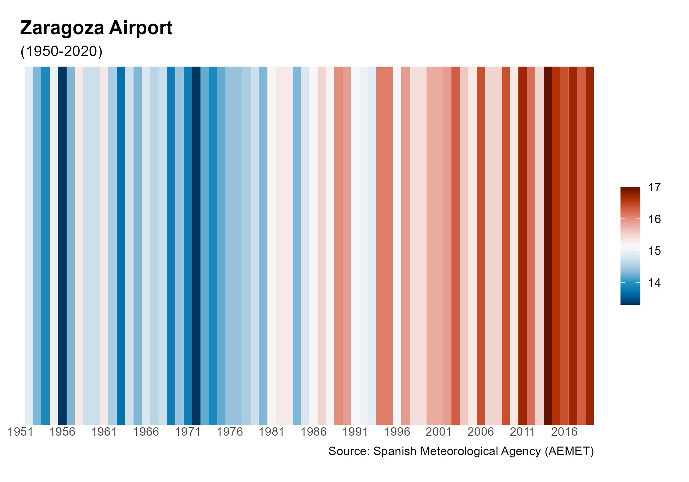
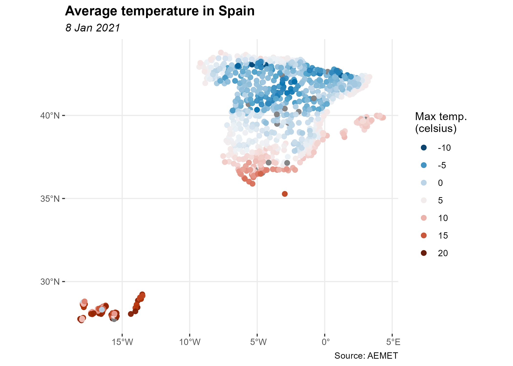

<!-- README.md is generated from README.Rmd. Please edit that file -->

# climaemet 

<!-- badges: start -->

[](https://ropenspain.es/)
[](https://CRAN.R-project.org/package=climaemet)
[](https://cran.r-project.org/package=climaemet)
[](https://cran.r-project.org/package=climaemet)
[](https://cran.r-project.org/web/checks/check_results_climaemet.html)
[](https://ropenspain.r-universe.dev/)
[](https://github.com/rOpenSpain/climaemet/actions/workflows/roscron-check-full.yaml)
[](https://doi.org/10.5281/zenodo.5205573)
[](https://cran.r-project.org/package=climaemet)
[](https://www.gnu.org/licenses/gpl-3.0.en.html)
[](https://www.repostatus.org/#active)

<!-- badges: end -->

The goal of **climaemet** is to serve as an interface to download the
climatic data of the Spanish Meteorological Agency (AEMET) directly from
R using their [API](https://opendata.aemet.es/) and create scientific
graphs (climate charts, trend analysis of climate time series,
temperature and precipitation anomalies maps, “warming stripes”
graphics, climatograms, etc.).

Browse manual and vignettes at
<https://ropenspain.github.io/climaemet/>.

## AEMET Open Data

AEMET OpenData is a REST API developed by AEMET that allows the
dissemination and reuse of the Agency’s meteorological and
climatological information. To see more details visit:
<https://opendata.aemet.es/centrodedescargas/inicio>

## License for the original data

Information prepared by the Spanish Meteorological Agency (© AEMET). You
can read about it [here](http://www.aemet.es/en/nota_legal).

A summary for the usage of the data could be interpreted as:

> People can use freely this data. You should mention AEMET as the
> collector of the original data in every situation except if you are
> using this data privately and individually. AEMET makes no warranty as
> to the accuracy or completeness of the data. All data are provided on
> an “as is” basis. AEMET is not responsible for any damage or loss
> derived from the interpretation or use of this data.

## Installation

You can install the released version of **climaemet** from
[CRAN](https://CRAN.R-project.org) with:

``` r
install.packages("climaemet")
```

You can install the developing version of **climaemet** using the
[r-universe](https://ropenspain.r-universe.dev/ui#builds):

``` r
# Enable this universe
options(repos = c(
  ropenspain = "https://ropenspain.r-universe.dev",
  CRAN = "https://cloud.r-project.org"
))

install.packages("climaemet")
```

Alternatively, you can install the developing version of **climaemet**
with:

``` r
library(remotes)
install_github("ropenspain/climaemet")
```

## API key

To be able to download data from AEMET you will need a free API key
which you can get
[here](https://opendata.aemet.es/centrodedescargas/obtencionAPIKey).

``` r
library(climaemet)

## Get api key from AEMET
browseURL("https://opendata.aemet.es/centrodedescargas/obtencionAPIKey")

## Use this function to register your API Key temporarly or permanently
aemet_api_key("MY API KEY")
```

### Changes on v1.0.0!

Now the `apikey` parameter on the functions have been deprecated. You
may need to set your API Key globally using `aemet_api_key()`. Note that
you would need also to remove the `apikey` parameter on your old codes.

## Now **climaemet** is tidy…

From `v1.0.0` onward, **climaemet** provides its results in [tibble
format](https://tibble.tidyverse.org/). Also, the functions try to guess
the correct format of the fields (i.e. something as a Date/Hour now is
an hour, numbers are parsed as double, etc.).

``` r
library(climaemet)

# See a tibble in action

aemet_last_obs("9434")
#> # A tibble: 24 × 25
#>    idema   lon fint                 prec   alt  vmax    vv    dv   lat  dmax
#>    <chr> <dbl> <dttm>              <dbl> <dbl> <dbl> <dbl> <dbl> <dbl> <dbl>
#>  1 9434  -1.00 2022-08-12 15:00:00     0   249   5.7   2.7    79  41.7   100
#>  2 9434  -1.00 2022-08-12 16:00:00     0   249   5.7   3.2   118  41.7    53
#>  3 9434  -1.00 2022-08-12 17:00:00     0   249   6.4   3.6   111  41.7   120
#>  4 9434  -1.00 2022-08-12 18:00:00     0   249   5.9   3      94  41.7   105
#>  5 9434  -1.00 2022-08-12 19:00:00     0   249   6.9   4.2   139  41.7   150
#>  6 9434  -1.00 2022-08-12 20:00:00     0   249   5.7   2.8   195  41.7   153
#>  7 9434  -1.00 2022-08-12 21:00:00     0   249   5.2   2.1   165  41.7   115
#>  8 9434  -1.00 2022-08-12 22:00:00     0   249   5.2   2.3   206  41.7   235
#>  9 9434  -1.00 2022-08-12 23:00:00     0   249   4.9   2     296  41.7   128
#> 10 9434  -1.00 2022-08-13 00:00:00     0   249   5.2   2.4   305  41.7   270
#> # … with 14 more rows, and 15 more variables: ubi <chr>, pres <dbl>, hr <dbl>,
#> #   stdvv <dbl>, ts <dbl>, pres_nmar <dbl>, tamin <dbl>, ta <dbl>, tamax <dbl>,
#> #   tpr <dbl>, stddv <dbl>, inso <dbl>, tss5cm <dbl>, pacutp <dbl>,
#> #   tss20cm <dbl>
#> # ℹ Use `print(n = ...)` to see more rows, and `colnames()` to see all variable names
```

### Examples

The package provides several functions to access the data of the API.
Here you can find some examples:

``` r
## Get AEMET stations
stations <- aemet_stations() # Need to have the API Key registered

knitr::kable(head(stations))
```

| indicativo | indsinop | nombre               | provincia | altitud | longitud |  latitud |
|:-----------|:---------|:---------------------|:----------|--------:|---------:|---------:|
| 0252D      | 08186    | ARENYS DE MAR        | BARCELONA |      74 | 2.540000 | 41.58750 |
| 0076       | 08181    | BARCELONA AEROPUERTO | BARCELONA |       4 | 2.070000 | 41.29278 |
| 0200E      |          | BARCELONA, FABRA     | BARCELONA |     408 | 2.124167 | 41.41833 |
| 0201D      | 08180    | BARCELONA            | BARCELONA |       6 | 2.200000 | 41.39056 |
| 0149X      | 08174    | MANRESA              | BARCELONA |     291 | 1.840278 | 41.72000 |
| 0229I      | 08192    | SABADELL AEROPUERTO  | BARCELONA |     146 | 2.103056 | 41.52361 |

``` r
station <- "9434" # Zaragoza Aeropuerto

## Get last observation values for a station
data_observation <- aemet_last_obs(station)

knitr::kable(head(data_observation))
```

| idema |       lon | fint                | prec | alt | vmax |  vv |  dv |      lat | dmax | ubi                 |  pres |  hr | stdvv |   ts | pres_nmar | tamin |   ta | tamax |  tpr | stddv | inso | tss5cm | pacutp | tss20cm |
|:------|----------:|:--------------------|-----:|----:|-----:|----:|----:|---------:|-----:|:--------------------|------:|----:|------:|-----:|----------:|------:|-----:|------:|-----:|------:|-----:|-------:|-------:|--------:|
| 9434  | -1.004167 | 2022-08-12 15:00:00 |    0 | 249 |  5.7 | 2.7 |  79 | 41.66056 |  100 | ZARAGOZA AEROPUERTO | 980.6 |  14 |   0.9 | 45.4 |    1007.6 |  40.5 | 41.5 |  41.5 |  8.7 |    21 |   60 |   44.7 |      0 |    35.8 |
| 9434  | -1.004167 | 2022-08-12 16:00:00 |    0 | 249 |  5.7 | 3.2 | 118 | 41.66056 |   53 | ZARAGOZA AEROPUERTO | 979.9 |  17 |   1.1 | 45.1 |    1006.9 |  41.3 | 41.3 |  41.8 | 11.3 |    18 |   60 |   44.9 |      0 |    36.3 |
| 9434  | -1.004167 | 2022-08-12 17:00:00 |    0 | 249 |  6.4 | 3.6 | 111 | 41.66056 |  120 | ZARAGOZA AEROPUERTO | 979.5 |  18 |   0.6 | 42.3 |    1006.6 |  40.1 | 40.1 |  41.3 | 11.2 |    10 |   60 |   44.4 |      0 |    36.8 |
| 9434  | -1.004167 | 2022-08-12 18:00:00 |    0 | 249 |  5.9 | 3.0 |  94 | 41.66056 |  105 | ZARAGOZA AEROPUERTO | 979.7 |  22 |   0.6 | 39.6 |    1006.9 |  38.6 | 38.6 |  40.1 | 13.1 |    13 |   60 |   43.3 |      0 |    37.3 |
| 9434  | -1.004167 | 2022-08-12 19:00:00 |    0 | 249 |  6.9 | 4.2 | 139 | 41.66056 |  150 | ZARAGOZA AEROPUERTO | 979.8 |  19 |   0.8 | 37.5 |    1007.1 |  37.2 | 37.8 |  38.6 | 10.2 |    11 |   10 |   41.9 |      0 |    37.6 |
| 9434  | -1.004167 | 2022-08-12 20:00:00 |    0 | 249 |  5.7 | 2.8 | 195 | 41.66056 |  153 | ZARAGOZA AEROPUERTO | 980.3 |  19 |   0.8 | 35.9 |    1007.7 |  36.9 | 37.0 |  37.8 |  9.6 |    28 |    0 |   40.5 |      0 |    37.8 |

``` r
## Get daily/annual climatology values for a station
data_daily <-
  aemet_daily_clim(station, start = "2020-01-01", end = "2020-12-31")

knitr::kable(head(data_daily))
```

| fecha      | indicativo | nombre               | provincia | altitud | tmed | prec | tmin | horatmin | tmax | horatmax | dir | velmedia | racha | horaracha | sol | presMax | horaPresMax | presMin | horaPresMin |
|:-----------|:-----------|:---------------------|:----------|--------:|-----:|:-----|-----:|:---------|-----:|:---------|:----|---------:|------:|:----------|----:|--------:|:------------|--------:|:------------|
| 2020-01-01 | 9434       | ZARAGOZA, AEROPUERTO | ZARAGOZA  |     249 |  1.0 | 0,0  |  0.3 | 06:10    |  1.8 | 14:50    | 28  |      1.7 |   5.6 | 04:40     | 0.0 |  1004.6 | 10          |  1001.9 | 15          |
| 2020-01-02 | 9434       | ZARAGOZA, AEROPUERTO | ZARAGOZA  |     249 |  0.6 | 0,0  | -0.3 | 08:10    |  1.6 | 18:40    | 29  |      1.1 |   3.6 | 00:40     | 0.0 |  1003.4 | 10          |  1000.7 | 16          |
| 2020-01-03 | 9434       | ZARAGOZA, AEROPUERTO | ZARAGOZA  |     249 |  4.2 | 0,0  | -0.1 | 07:10    |  8.5 | 19:10    | 30  |      4.4 |   8.3 | 21:40     | 2.4 |  1003.6 | 10          |  1000.7 | Varias      |
| 2020-01-04 | 9434       | ZARAGOZA, AEROPUERTO | ZARAGOZA  |     249 |  8.6 | 0,0  |  3.6 | 06:40    | 13.6 | 14:50    | 33  |      5.0 |  12.5 | 12:30     | 8.2 |  1003.9 | 10          |  1001.2 | 15          |
| 2020-01-05 | 9434       | ZARAGOZA, AEROPUERTO | ZARAGOZA  |     249 |  8.2 | 0,0  |  3.0 | 23:00    | 13.3 | 15:20    | 30  |      3.6 |  10.3 | 05:30     | 8.9 |  1001.9 | 00          |   996.9 | Varias      |
| 2020-01-06 | 9434       | ZARAGOZA, AEROPUERTO | ZARAGOZA  |     249 |  2.3 | 0,0  |  1.4 | 23:59    |  3.2 | 00:00    | 29  |      3.1 |   7.2 | 20:20     | 0.0 |  1001.7 | 22          |   998.6 | 04          |

``` r

## Get monthly/annual climatology values for a station
data_monthly <- aemet_monthly_clim(station, year = 2000)
knitr::kable(head(data_monthly))
```

| fecha  | indicativo | p_max    | n_cub |  hr | n_gra | n_fog | inso | q_max      | nw_55 |  q_mar | q_med | tm_min | ta_max   | ts_min | nt_30 | nv_0050 | n_des | w_racha     | np_100 | n_nub | p_sol | nw_91 | ts_20 | np_001 | ta_min   |   e | np_300 | nv_1000 | evap | p_mes | n_llu | n_tor | ts_10 | w_med | nt_00 | ti_max | n_nie | tm_mes | tm_max | nv_0100 | ts_50 | q_min     | np_010 |
|:-------|:-----------|:---------|------:|----:|------:|------:|-----:|:-----------|------:|-------:|------:|-------:|:---------|-------:|------:|--------:|------:|:------------|-------:|------:|------:|------:|------:|-------:|:---------|----:|-------:|--------:|-----:|------:|------:|------:|------:|------:|------:|-------:|------:|-------:|-------:|--------:|------:|:----------|-------:|
| 2000-1 | 9434       | 8.0(15)  |     8 |  77 |     0 |     6 |  5.4 | 1003.5(11) |     5 | 1026.0 | 994.1 |   -0.1 | 16.3(31) |    6.2 |     0 |       0 |    12 | 32/22.2(22) |      0 |    11 |    56 |     0 |   4.9 |      3 | -5.8(12) |  65 |      0 |       5 |  861 |  14.9 |     3 |     0 |   5.0 |    15 |    16 |    1.0 |     0 |    4.3 |    8.7 |       0 |   5.6 | 979.7(14) |      2 |
| 2000-2 | 9434       | 0.0(–)   |     0 |  60 |     0 |     0 |  7.7 | 1004.9(04) |     9 | 1027.1 | 996.0 |    4.8 | 20.8(27) |   10.7 |     0 |       0 |     8 | 33/21.4(17) |      0 |    21 |    72 |     0 |  11.8 |      0 | -1.5(06) |  79 |      0 |       0 | 1638 |   0.0 |     0 |     0 |  12.7 |    16 |     4 |   13.4 |     0 |   10.8 |   16.9 |       0 |  10.6 | 988.6(17) |      0 |
| 2000-3 | 9434       | 5.4(22)  |     4 |  58 |     0 |     0 |  7.8 | 1001.0(09) |     8 | 1020.3 | 989.5 |    6.0 | 24.0(11) |   11.0 |     0 |       0 |     8 | 32/20.0(15) |      0 |    19 |    65 |     0 |  14.9 |      7 | -0.8(03) |  83 |      0 |       0 | 2062 |  11.1 |     7 |     0 |  15.7 |    18 |     1 |   12.1 |     0 |   12.0 |   17.9 |       0 |  13.6 | 976.5(28) |      4 |
| 2000-4 | 9434       | 22.2(26) |     8 |  61 |     0 |     0 |  6.2 | 991.5(07)  |     7 | 1008.0 | 977.8 |    8.4 | 27.2(25) |   14.9 |     0 |       0 |     1 | 10/20.0(02) |      1 |    21 |    46 |     0 |  16.7 |     10 | 1.7(06)  |  99 |      0 |       0 | 1730 |  49.1 |    14 |     1 |  17.5 |    17 |     0 |   11.7 |     0 |   13.7 |   18.9 |       0 |  15.2 | 959.5(02) |      6 |
| 2000-5 | 9434       | 23.4(05) |     6 |  61 |     2 |     2 |  8.7 | 991.4(30)  |    NA | 1014.4 | 984.7 |   13.2 | 33.0(30) |   18.8 |     5 |       0 |     1 | NA          |      3 |    24 |    59 |    NA |  23.5 |     13 | 9.2(01)  | 143 |      0 |       1 | 2116 |  67.5 |    11 |     8 |  24.8 |    13 |     0 |   21.5 |     0 |   19.5 |   25.7 |       0 |  20.8 | 977.5(06) |      8 |
| 2000-6 | 9434       | 12.2(09) |     2 |  57 |     0 |     0 | 11.3 | 995.0(14)  |    NA | 1017.1 | 987.6 |   16.0 | 37.5(27) |   20.3 |    19 |       0 |    18 | NA          |      1 |    10 |    75 |    NA |  27.7 |      6 | 11.0(08) | 164 |      0 |       0 | 2955 |  34.9 |     8 |     4 |  29.2 |    21 |     0 |   16.5 |     0 |   23.0 |   29.8 |       0 |  26.1 | 977.9(09) |      5 |

``` r

## Get recorded extreme values of temperature for a station
data_extremes <- aemet_extremes_clim(station, parameter = "T")
knitr::kable(head(data_extremes))
```

| indicativo | nombre               | ubicacion | codigo | temMin | diaMin | anioMin | mesMin | temMax | diaMax | anioMax | mesMax | temMedBaja | anioMedBaja | mesMedBaja | temMedAlta | anioMedAlta | mesMedAlta | temMedMin | anioMedMin | mesMedMin | temMedMax | anioMedMax | mesMedMax |
|:-----------|:---------------------|:----------|:-------|-------:|-------:|--------:|-------:|-------:|-------:|--------:|-------:|-----------:|------------:|-----------:|-----------:|------------:|-----------:|----------:|-----------:|----------:|----------:|-----------:|----------:|
| 9434       | ZARAGOZA, AEROPUERTO | ZARAGOZA  | 023000 |   -104 |      4 |    1971 |      2 |    206 |      8 |    2016 |      7 |         29 |        1953 |          2 |         97 |        2016 |          7 |       -12 |       1957 |         2 |       135 |       2016 |         7 |
| 9434       | ZARAGOZA, AEROPUERTO | ZARAGOZA  | 023000 |   -114 |      5 |    1963 |      2 |    255 |     27 |    2019 |      7 |         15 |        1956 |          2 |        121 |        1990 |          7 |       -30 |       1956 |         2 |       180 |       1990 |         7 |
| 9434       | ZARAGOZA, AEROPUERTO | ZARAGOZA  | 023000 |    -63 |      9 |    1964 |      2 |    283 |     19 |    1957 |      7 |         71 |        1971 |          2 |        146 |        2001 |          7 |        19 |       1973 |         2 |       207 |       1997 |         7 |
| 9434       | ZARAGOZA, AEROPUERTO | ZARAGOZA  | 023000 |    -24 |      3 |    1967 |      2 |    324 |      9 |    2011 |      7 |        104 |        1986 |          2 |        174 |        2014 |          7 |        54 |       1970 |         2 |       237 |       2014 |         7 |
| 9434       | ZARAGOZA, AEROPUERTO | ZARAGOZA  | 023000 |      5 |      4 |    1967 |      2 |    365 |     29 |    2001 |      7 |        132 |        1984 |          2 |        216 |        2022 |          7 |        85 |       1984 |         2 |       282 |       2022 |         7 |
| 9434       | ZARAGOZA, AEROPUERTO | ZARAGOZA  | 023000 |     52 |     11 |    1971 |      2 |    432 |     29 |    2019 |      7 |        182 |        1953 |          2 |        267 |        2022 |          7 |       126 |       1969 |         2 |       339 |       2022 |         7 |

We can also draw a “warming stripes” graph with the downloaded data from
a weather station. These functions returns `ggplot2` plots:

``` r
# Plot a climate stripes graph for a period of years for a station

library(ggplot2)

climatestripes_station("9434", start = 1980, end = 2020) +
  theme(plot.title = element_text(size = 10))
```



Furthermore, we can draw the well-known Walter & Lieth climatic diagram
for a weather station and over a specified period of time:

``` r
# Plot of a Walter & Lieth climatic diagram (normal climatology values) for a station
climatogram_normal("9434", labels = "en")
```


Additionally, we may be interested in drawing the wind speed and
direction over a period of time for the data downloaded from a weather
station.:

``` r
# Plot a windrose showing the wind speed and direction for a station over a days period.
windrose_days(
  "9434",
  start = "2010-01-01",
  end = "2020-12-31",
  n_speeds = 5,
  speed_cuts = c(2.5, 5, 7.5, 10, 12.5, 15)
) +
  theme(plot.title = element_text(size = 10))
```


## … and spatial!

Another major change in `v1.0.0` is the ability of return information on
spatial `sf` format, using `return_sf = TRUE`. The coordinate reference
system (CRS) used is **EPSG 4326**, that correspond to the **World
Geodetic System (WGS)** and return coordinates in latitude/longitude
(unprojected coordinates):

``` r
# You would need to install `sf` if not installed yet
# run install.packages("sf") for installation

library(ggplot2)
library(dplyr)

all_stations <- aemet_last_obs(return_sf = TRUE)
# Last hour
all_last <-
  all_stations %>% filter(fint == all_stations[["fint"]][1])

last_hour <- max(all_last$fint)


ggplot(all_last) +
  geom_sf(aes(colour = ta),
    shape = 19,
    size = 2,
    alpha = 0.5
  ) +
  labs(
    title = "Temperature in Spain",
    subtitle = last_hour,
    color = "Max temp.\n(celsius)",
    caption = "Source: AEMET"
  ) +
  scale_colour_gradientn(
    colours = hcl.colors(10, "RdBu", rev = TRUE, alpha = 0.5),
    guide = "legend"
  ) +
  guides(colour = guide_legend(n.breaks = 10)) +
  theme_bw() +
  theme(
    panel.border = element_blank(),
    plot.title = element_text(face = "bold"),
    plot.subtitle = element_text(face = "italic")
  )
```



## Code of Conduct

Please note that this project is released with a Contributor Code of
Conduct. By participating in this project you agree to abide by its
terms.

## Citation

Using **climaemet** for a paper you are writing?. Consider citing it:

Pizarro M, Hernangómez D, Fernández-Avilés G (2022). climaemet: Climate
AEMET Tools. <https://doi.org/10.5281/zenodo.5205573>,
<https://hdl.handle.net/10261/250390>

A BibTeX entry for LaTeX users is:

    @Manual{R-climaemet,
      title = {{climaemet}: Climate {AEMET} Tools},
      author = {Manuel Pizarro and Diego Hernangómez and Gema Fernández-Avilés},
      abstract = {The goal of climaemet is to serve as an interface to download the climatic data of the Spanish Meteorological Agency (AEMET) directly from R using their API (https://opendata.aemet.es/) and create scientific graphs (climate charts, trend analysis of climate time series, temperature and precipitation anomalies maps, “warming stripes” graphics, climatograms, etc.).},
      year = {2021},
      month = {8},
      url = {https://hdl.handle.net/10261/250390},
      doi = {10.5281/zenodo.5205573},
      keywords = {Climate, Rcran,  Tools, Graphics, Interpolation, Maps},
    }

## Links

Download from CRAN at <https://cran.r-project.org/package=climaemet>

Browse source code at <https://github.com/ropenspain/climaemet>
