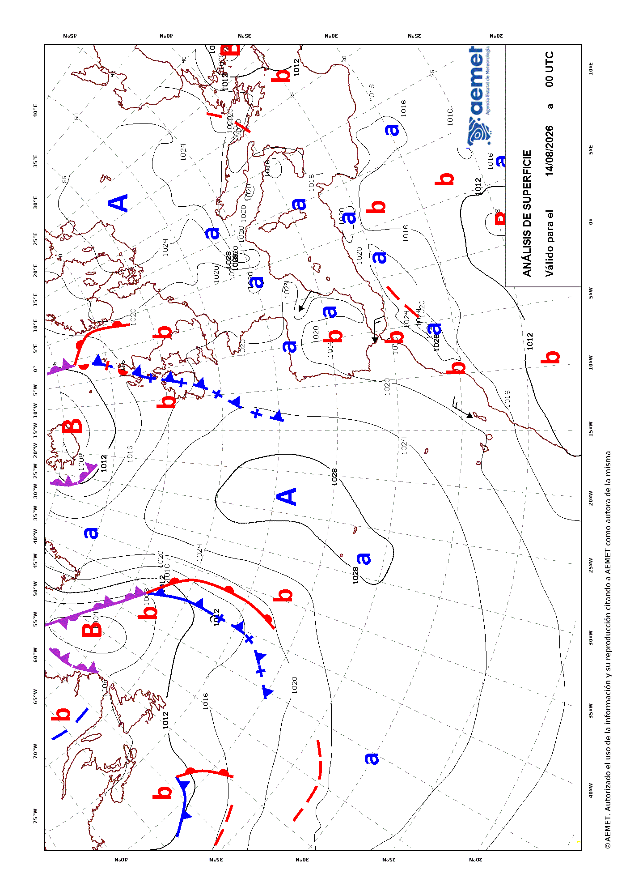

# Extending climaemet

**climaemet** provides functions for selected [AEMET OpenData API
endpoints](https://opendata.aemet.es/dist/index.html). However, the
package does not cover every endpoint.

[`get_data_aemet()`](https://ropenspain.github.io/climaemet/reference/get_data_aemet.md)
provides access to any AEMET OpenData API endpoint. Users must parse
endpoint-specific results themselves.

``` r

library(climaemet)
```

## Retrieve normalized text

Some API endpoints, such as `predicciones-normalizadas-texto`, return
plain text. **climaemet** does not parse these responses, but you can
retrieve them directly:

``` r

# Endpoint: today's forecast.

today <- "/api/prediccion/nacional/hoy"

# Retrieve metadata.
knitr::kable(get_metadata_aemet(today))
```

| unidad_generadora | descripcion | periodicidad | formato | copyright | notaLegal |
|:---|:---|:---|:---|:---|:---|
| Grupo Funcional de Predicción de Referencia | Predicción general nacional para hoy / mañana / pasado mañana / medio plazo (tercer y cuarto día) / tendencia (del quinto al noveno día) | Disponibilidad. Para hoy, solo se confecciona si hay cambios significativos. Para mañana y pasado mañana diaria a las 15:00 h.o.p.. Para el medio plazo diaria a las 16:00 h.o.p.. La tendencia, diaria a las 18:30 h.o.p. | ascii/txt | © AEMET. Autorizado el uso de la información y su reproducción citando a AEMET como autora de la misma. | https://www.aemet.es/es/nota_legal |

``` r


# Retrieve data.
pred_today <- get_data_aemet(today)
#> ℹ Response MIME type: "text/plain".
#> → Returning a UTF-8 <character> string.
```

``` r

# Produce a result.

clean <- gsub("\r", "\n", pred_today, fixed = TRUE)
clean <- gsub("\n\n\n", "\n", clean, fixed = TRUE)

cat("<blockquote>", clean, "</blockquote>", sep = "\n")
```

> AGENCIA ESTATAL DE METEOROLOGÍA PREDICCIÓN GENERAL PARA ESPAÑA DÍA 04
> DE AGOSTO DE 2026 A LAS 08:36 HORA OFICIAL PREDICCIÓN VÁLIDA PARA EL
> MARTES 4
>
> A.- FENÓMENOS SIGNIFICATIVOS Probables chubascos y tormentas fuertes
> acompañadas de granizo que pueden afectar al nordeste peninsular e
> interior de Mallorca. Temperaturas muy altas en Canarias, y
> significativamente altas en zonas de Baleares, Alborán y tercio este
> peninsular. Alisio con rachas muy fuertes en Canarias
>
> B.- PREDICCIÓN Se prevé una situación de estabilidad en la mayor parte
> del país con predominio de cielos poco nubosos o despejados.
> Únicamente en Galicia y área cantábrica predominarán los nubosos o
> cubiertos, con precipitaciones débiles y dispersas que podrían ser más
> intensas y afectar a más zonas por la tarde en forma de chubascos.
> Asimismo, por la tarde se formará nubosidad de evolución en otras
> zonas de la mitad norte peninsular, con chubascos y tormentas en el
> cuadrante nordeste que podrían ser localmente fuertes e ir con granizo
> en puntos de Cataluña, Aragón, norte de la Comunidad Valenciana e
> interior de Mallorca.
>
> Probables bancos de niebla matinales en Galicia, área cantábrica y
> puntos del Levante. Calima en altura en Canarias.
>
> Las temperaturas máximas descenderán en el oeste peninsular, Pirineos
> y Alborán, predominando los ascensos en el resto de la mitad oriental
> de la Península y permaneciendo sin cambios en el resto. Se prevé
> superar los 35 grados en los tercios sur y este peninsulares, así como
> en Baleares y en Canarias, donde se podrán alcanzar localmente los 40.
> Las mínimas descenderán en el centro peninsular, manteniéndose con
> pocos cambios en el resto. Con ello se darán noches tropicales, sin
> bajar de 20 grados, en amplias zonas de la mitad sureste peninsular y
> en Baleares, quedando por encima de 25 en puntos del litoral
> mediterráneo y en Canarias, donde incluso localmente podrían no bajar
> de 30 grados.
>
> Soplará el alisio con intervalos fuertes y rachas muy fuertes en
> Canarias, con viento moderado de componente norte en los litorales de
> Cataluña y de componente oeste en los del sur peninsular y norte de
> Galicia. Viento flojo en general en el resto con un predominio de la
> componente oeste en la Península, la norte en Baleares y con régimen
> de brisas en litorales.

## Retrieve maps

AEMET also provides maps, usually with the `image/gif` MIME type. You
can retrieve these binary responses directly:

``` r

# Map endpoint.
a_map <- "/api/mapasygraficos/analisis"

# Retrieve metadata.
knitr::kable(get_metadata_aemet(a_map))
```

| unidad_generadora | descripción | periodicidad | formato | copyright | notaLegal |
|:---|:---|:---|:---|:---|:---|
| Grupo Funcional de Jefes de Turno | Mapas de análisis de frentes en superficie | Dos veces al día, a las 02:00 y 14:00 h.o.p. en invierno y a las 03:00 y 15:00 en verano. | image/gif | © AEMET. Autorizado el uso de la información y su reproducción citando a AEMET como autora de la misma. | https://www.aemet.es/es/nota_legal |

``` r

the_map <- get_data_aemet(a_map)
#> ℹ Response MIME type: "image/gif".
#> → Returning <raw> bytes. See also `base::writeBin()`.

# Write as GIF and include it.
giffile <- "example-gif.gif"
writeBin(the_map, giffile)

# Display in the vignette. It may be rotated.
knitr::include_graphics(giffile)
```



Example: surface analysis map provided by AEMET
