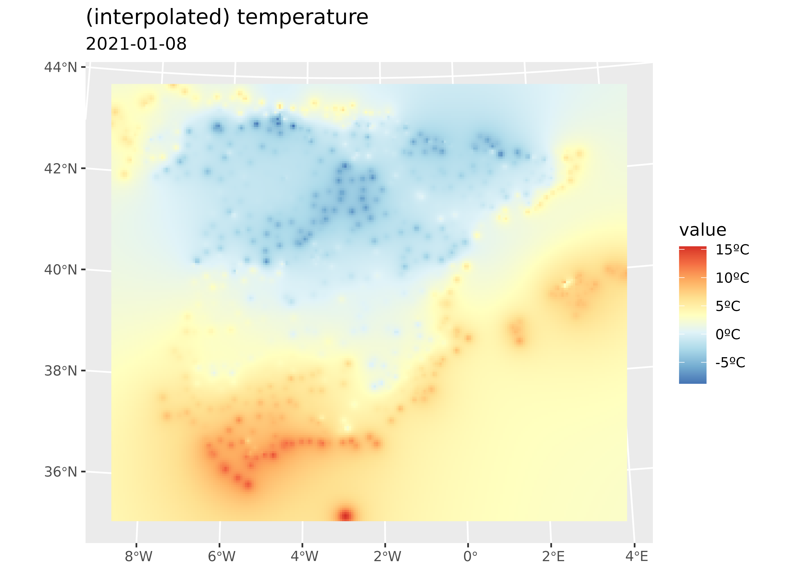
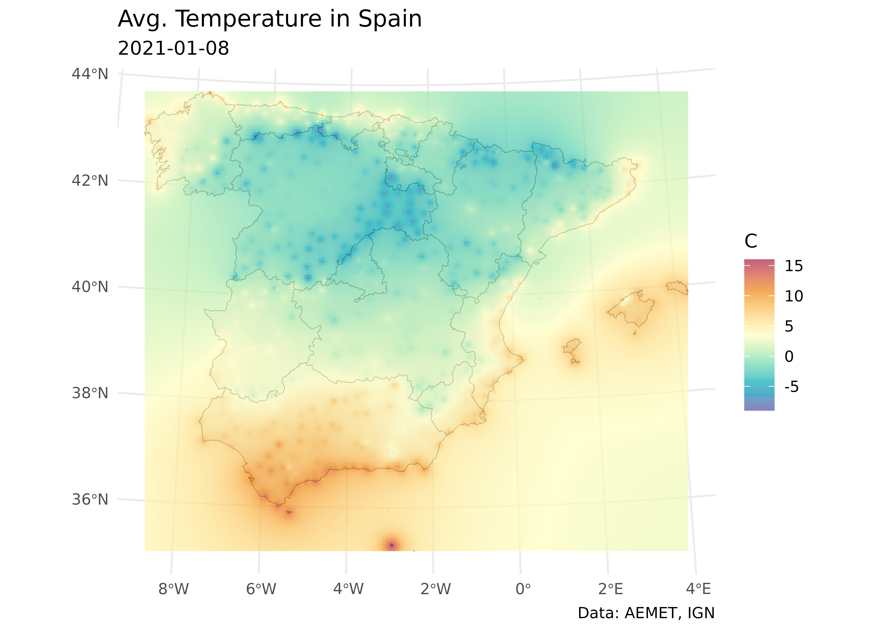
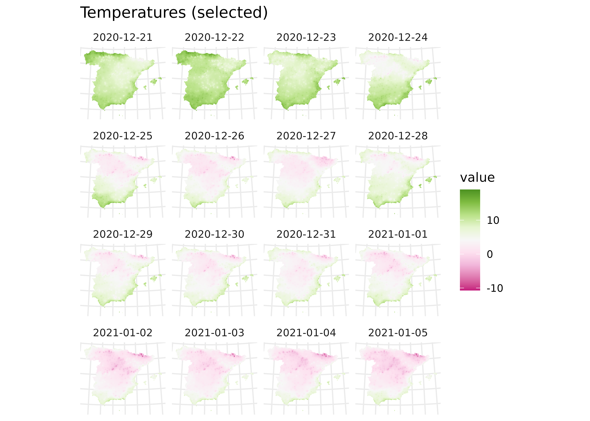

# Spatial interpolation with climaemet

**climaemet** can retrieve data from the stations included on [AEMET
Open Data](https://opendata.aemet.es/centrodedescargas/inicio). However,
in terms of spatial analysis and visualization, it can be useful to
extend the data from points (stations) to the whole extent of Spain. On
this article we would explain a method to interpolate the climatic data
trough [Spatial
Interpolation](https://docs.qgis.org/3.16/en/docs/gentle_gis_introduction/spatial_analysis_interpolation.html),
that is the process of using points with known values to estimate values
at other unknown points.

## Initial config

For this analysis, we would need the following libraries:

``` r
library(climaemet)
library(mapSpain) # Base maps of Spain
library(sf) # spatial shape handling
library(terra) # Spatial raster handling
library(gstat) # for spatial interpolation
library(tidyverse) # data handling
library(ggplot2) # for plots
library(tidyterra) # Plotting SpatRasters with tidyterra
library(gifski) # we would create an animation
```

## Retrieving data

We choose here the daily climatic data from Winter 2020-2021 in Spain.
Note that on the first half of January, [Storm
Filomena](https://en.wikipedia.org/wiki/Storm_Filomena) brought unusual
heavy snowfall to parts of Spain, with Madrid recording its heaviest
snowfall since 1971. We should be able to spot that.

``` r
clim_data <- aemet_daily_clim(
  start = "2020-12-21",
  end = "2021-03-20",
  return_sf = TRUE
)
```

Let’s keep only the stations on mainland Spain:

``` r
clim_data_clean <- clim_data |>
  # Exclude Canary Islands from analysis
  filter(str_detect(provincia, "PALMAS|TENERIFE", negate = TRUE)) |>
  dplyr::select(fecha, tmed) |>
  # Exclude NAs
  filter(!is.na(tmed))

summary(clim_data_clean$tmed)
#>    Min. 1st Qu.  Median    Mean 3rd Qu.    Max. 
#> -16.200   5.500   9.000   8.369  11.800  23.200

ccaa_esp <- esp_get_ccaa(epsg = 4326) |>
  # Exclude Canary Islands from analysis
  filter(ine.ccaa.name != "Canarias")

# We load also a basic shape file of Spain using mapSpain
ggplot(ccaa_esp) +
  geom_sf() +
  geom_sf(data = clim_data_clean)
```


Figure 1: AEMET stations in Spain (excl. Canary Islands)

As it can be seed, the climatic data we have available so far is
restricted to the stations (points), but we want to extend these values
to the whole territory.

## Filling the gaps: Interpolation

As we need to predict values at locations where no measurements have
been made, we would need to interpolate the data. On this example we
would use the **terra** package and we would apply the [Inverse Distance
Weighted
method](https://rspatial.org/terra/analysis/4-interpolation.html#inverse-distance-weighted),
that is one of several approaches to perform spatial interpolation. We
recommend consulting Hijmans and Ghosh ([2023](#ref-hijmans2023)) on how
to perform these analysis on **R**.

The process would be as follow:

- Create an spatial object (SpatRaster) where the predicted values would
  be applied.
- Perform an spatial interpolation.
- Visualize the results.

### Creating a grid

For this analysis, we need a destination object with the locations to be
predicted. A common technique is to create a spatial grid (a “raster”)
covering the targeted locations.

On this example, we would use **terra** to create a regular grid that we
would use for interpolation.

**An important thing to consider in any spatial analysis or
visualization** is the [coordinate reference system
(CRS)](https://en.wikipedia.org/wiki/Spatial_reference_system). We won’t
cover this in detail on this article, but we should mention a few key
considerations:

- When using several spatial objects, we should ensure that **all of
  them present the same CRS**. This can be achieved projecting the
  objects (i.e. transforming their coordinates) to the same CRS.
- Longitude/latitude coordinates are unprojected coordinates. When we
  project an object (i.e. Mercator projection) we actually change the
  values of every point (x,y) coordinates (i.e. a projection is a
  transformation of the coordinates.)
- For measuring distance in meters, etc. we should choose the right
  projection. Distances on unprojected coordinates are meaningless.
  Think that 1 degree of longitude on the equator means 111 kms but on
  the North Pole means roughly 0.11 m. The degrees just split a
  circumference on equally spaced buckets, but the Earth is an spheroid
  and the circumferences at different latitudes doesn’t have the same
  length (opposed to a cylinder, where circumferences are the same at
  any latitude or y-axis.)

On this exercise, we choose to project our objects to **ETRS89 / UTM
zone 30N** [EPSG:25830](https://epsg.io/25830), that provides x and y
values on meters and maximizes the accuracy for Spain.

``` r
clim_data_utm <- st_transform(clim_data_clean, 25830)
ccaa_utm <- st_transform(ccaa_esp, 25830)

# Note the original projection

st_crs(ccaa_esp)$proj4string
#> [1] "+proj=longlat +datum=WGS84 +no_defs"

# vs the utm projection

st_crs(ccaa_utm)$proj4string
#> [1] "+proj=utm +zone=30 +ellps=GRS80 +towgs84=0,0,0,0,0,0,0 +units=m +no_defs"
```

Now, we create a regular grid using **terra**. This grid is composed to
equally spaced points over the whole extent (bounding box) of Spain.

We use here a density of 5,000 (m), so the grid density is 5 x 5 kms (25
km2):

``` r
# Create grid 5*5 km (25 km2)

grd <- rast(ccaa_utm, res = c(5000, 5000))

# Number of cells

ncell(grd)
#> [1] 44004
```

### Interpolating the data

Now we just need to populate the (empty) grid with the predicted values
based on the observations:

``` r
# Test with a single day

test_day <- clim_data_utm |> filter(fecha == "2021-01-08")

# Interpolate temp
init_p <- test_day |>
  vect() |>
  as_tibble(geom = "XY")

gs <- gstat(
  formula = tmed ~ 1, locations = ~ x + y, data = init_p,
  set = list(idp = 2)
)

interp_temp <- interpolate(grd, gs)
#> [inverse distance weighted interpolation]
#> [inverse distance weighted interpolation]

# Plot with tidyterra
ggplot() +
  geom_spatraster(data = interp_temp |> select(var1.pred)) +
  scale_fill_whitebox_c(
    palette = "bl_yl_rd",
    labels = scales::label_number(suffix = "ºC")
  ) +
  labs(
    title = "(interpolated) temperature",
    subtitle = "2021-01-08"
  )
```



Figure 2: Example: IDW interpolation

Let’s create a nice **ggplot2** plot! See also Royé
([2020](#ref-roye2020)) for more on this.

``` r
# Making a nice plot on ggplot2
temp_values <- interp_temp |>
  pull(var1.pred) |>
  range(na.rm = TRUE)

# Get min and max from interpolated values
min_temp <- floor(min(temp_values))
max_temp <- ceiling(max(temp_values))

ggplot() +
  geom_sf(data = ccaa_utm, fill = "grey95") +
  geom_spatraster(data = interp_temp |> select(var1.pred)) +
  scale_fill_gradientn(
    colours = hcl.colors(11, "Spectral", rev = TRUE, alpha = 0.7),
    limits = c(min_temp, max_temp)
  ) +
  theme_minimal() +
  labs(
    title = "Avg. Temperature in Spain",
    subtitle = "2021-01-08",
    caption = "Data: AEMET, IGN",
    fill = "C"
  )
```



Figure 3: Avg. Temperature in Spain (2021-01-08) (Interpolated)

## Animation

On this section, we would loop over the dates to create a single
SpatRaster with several layers, each one holding the interpolation for a
specific date. After that, we would create an animation to observe the
evolution of temperature through the winter of 2020/21.

``` r
# We would create a SpatRaster with a layer for each date
dates <- sort(unique(clim_data_clean$fecha))

# Loop through days and create interpolation
interp_list <- lapply(dates, function(x) {
  thisdate <- x
  tmp_day <- clim_data_utm |>
    filter(fecha == thisdate) |>
    vect() |>
    as_tibble(geom = "XY")

  gs_day <- gstat(formula = tmed ~ 1, locations = ~ x + y, data = tmp_day)
  interp_day <- interpolate(grd, gs_day, idp = 2.0) |>
    select(interpolated = var1.pred)

  names(interp_day) <- format(thisdate)

  interp_day
})

# Concatenate to a single SpatRaster
interp_rast <- do.call(c, interp_list) |> mask(vect(ccaa_utm))

time(interp_rast) <- dates
```

Now we can check the results:

``` r
interp_rast
#> class       : SpatRaster 
#> size        : 193, 228, 90  (nrow, ncol, nlyr)
#> resolution  : 5000.706, 5006.959  (x, y)
#> extent      : -13882.95, 1126278, 3892802, 4859145  (xmin, xmax, ymin, ymax)
#> coord. ref. : ETRS89 / UTM zone 30N (EPSG:25830) 
#> source(s)   : memory
#> names       : 2020-12-21, 2020-12-22, 2020-12-23, 2020-12-24, 2020-12-25, 2020-12-26, ... 
#> min values  :  0.8441982,   4.199887,   2.470233,  -1.814927,   -7.80700,  -9.228323, ... 
#> max values  : 18.9977714,  18.864570,  16.683431,  16.854208,   16.01072,  14.617574, ... 
#> time (days) : 2020-12-21 to 2021-03-20 (90 steps)

nlyr(interp_rast)
#> [1] 90

head(names(interp_rast))
#> [1] "2020-12-21" "2020-12-22" "2020-12-23" "2020-12-24" "2020-12-25"
#> [6] "2020-12-26"

# Facet map with some data

ggplot() +
  geom_spatraster(data = interp_rast |> select(1:16)) +
  facet_wrap(~lyr) +
  scale_fill_whitebox_c(palette = "pi_y_g", alpha = 1) +
  theme_minimal() +
  theme(axis.text = element_blank()) +
  labs(title = "Temperatures (selected)")
```



Figure 4: Temperatures (selected)

And finally we loop through each layer to produce a plot (png file) for
each date. The last step is to concatenate each png file into a gif file
with **gifski**.

``` r
# Extending and animating
# Create gif

# We need a common scale using all the observed values on each layer
allvalues <- values(interp_rast, mat = FALSE, na.rm = TRUE)

min_temp2 <- floor(min(allvalues))
max_temp2 <- ceiling(max(allvalues))

# Loop through all the layers
all_layers <- names(interp_rast)

for (i in seq_along(all_layers)) {
  # Create a gif for each date
  this <- all_layers[i]
  interp_rast_day <- interp_rast |> select(all_of(this))

  this_date <- as.Date(gsub("interp_", "", this))

  g <- ggplot() +
    geom_spatraster(data = interp_rast_day) +
    geom_sf(data = ccaa_utm, fill = NA) +
    coord_sf(expand = FALSE) +
    scale_fill_gradientn(
      colours = hcl.colors(20, "Spectral", rev = TRUE, alpha = 0.8),
      limits = c(min_temp2, max_temp2),
      na.value = NA,
      labels = scales::label_number(suffix = "º")
    ) +
    theme_minimal() +
    labs(
      title = "Avg. Temperature in Spain",
      subtitle = this_date,
      caption = "Data: AEMET, IGN",
      fill = ""
    )

  tmp <- file.path(tempdir(), paste0(this, ".png"))
  ggsave(tmp, g, width = 1600, height = 1200, units = "px", bg = "white")
}
```

And finally we use **gifski** to create the animation:

``` r
# Create gif from temporary pngs
allfiles <- file.path(tempdir(), paste0(all_layers, ".png"))
gifski::gifski(allfiles,
  loop = TRUE, delay = 1 / 6,
  gif_file = "winter_2021.gif",
  width = 1600, height = 1200
)
```


Figure 5: Animation of avg. temperature in Spain, Jan-Mar 2021

## References

Hijmans, Robert J., and Aniruddha Ghosh. 2023. “Interpolation.” In
*Spatial Data Analysis with R*, 31–54. Spatial Data Science with R and
"terra". Online. <https://rspatial.org/analysis/analysis.pdf>.

Royé, Dominic. 2020. “Climate Animation of Maximum Temperatures.”
<https://dominicroye.github.io/blog/climate-animation-maximum-temperature/>.
