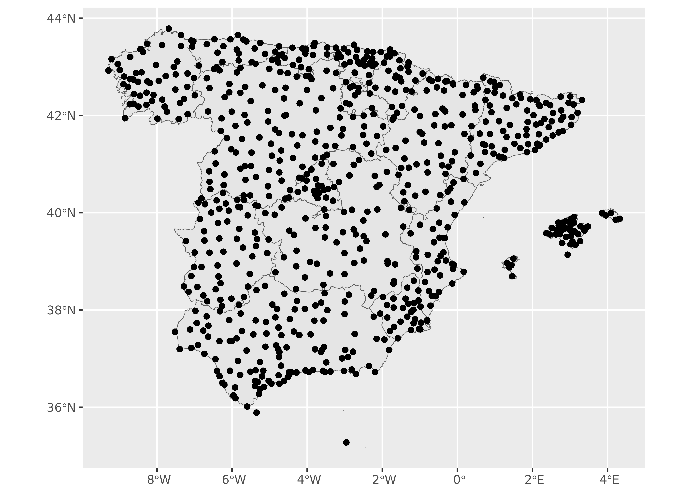
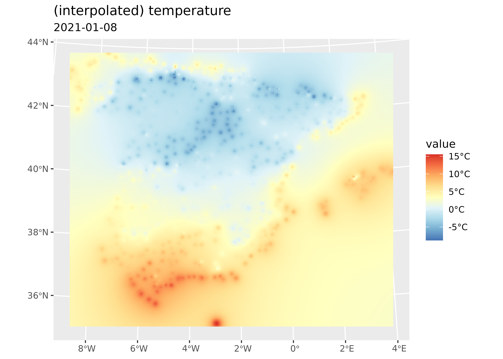
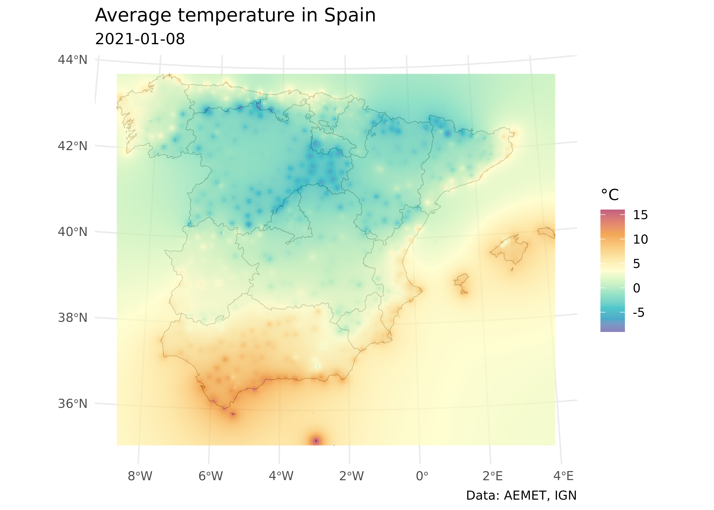
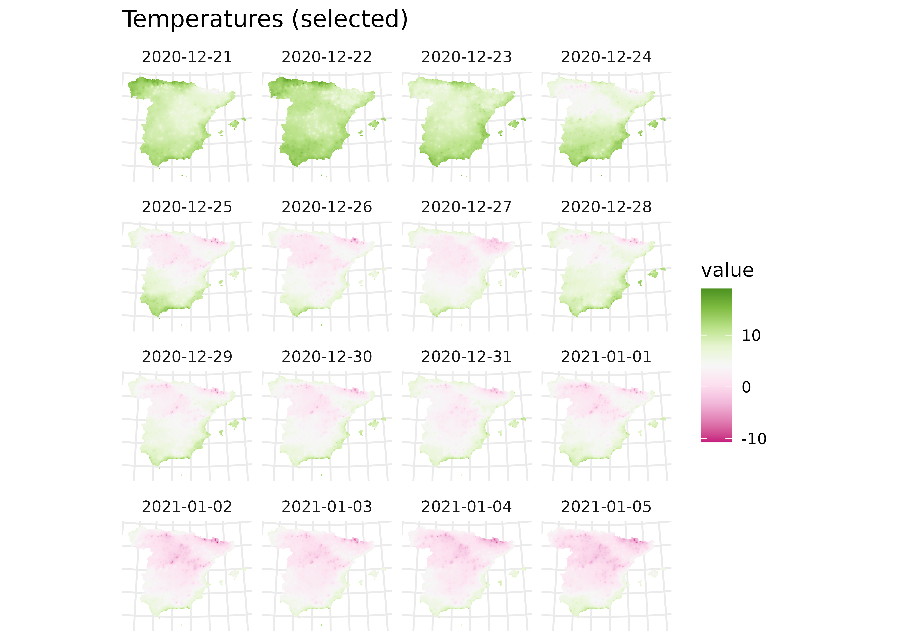

# Spatial interpolation with climaemet

**climaemet** can retrieve data from weather stations available through
the [AEMET API](https://opendata.aemet.es/centrodedescargas/inicio). For
spatial analysis and visualization, we extend point observations across
Spain. This article interpolates climatology values using [spatial
interpolation](https://docs.qgis.org/3.16/en/docs/gentle_gis_introduction/spatial_analysis_interpolation.html),
which is the process of using points with known values to estimate
values at other unknown locations.

## Initial configuration

For this analysis, we need the following libraries:

``` r

library(climaemet)
library(mapSpain) # Base maps of Spain
library(sf) # Spatial shape handling
library(terra) # Spatial raster handling
library(gstat) # Spatial interpolation
library(tidyverse) # Data handling
library(ggplot2) # Plots
library(tidyterra) # Plot SpatRasters with tidyterra
library(gifski) # Create an animation
```

## Retrieve data

We use daily climatology values for winter 2020–2021 in Spain. In the
first half of January, [Storm
Filomena](https://en.wikipedia.org/wiki/Storm_Filomena) brought
unusually heavy snowfall to parts of Spain, with Madrid recording its
heaviest snowfall since 1971. We should be able to spot that.

``` r

clim_data <- aemet_daily_clim(
  start = "2020-12-21",
  end = "2021-03-20",
  return_sf = TRUE
)
```

Keep only the stations on mainland Spain:

``` r

clim_data_clean <- clim_data |>
  # Exclude Canary Islands from analysis.
  filter(str_detect(provincia, "PALMAS|TENERIFE", negate = TRUE)) |>
  dplyr::select(fecha, tmed) |>
  # Exclude NAs.
  filter(!is.na(tmed))

summary(clim_data_clean$tmed)
#>    Min. 1st Qu.  Median    Mean 3rd Qu.    Max. 
#> -16.200   5.500   9.000   8.369  11.800  23.200

ccaa_esp <- esp_get_ccaa(epsg = 4326) |>
  # Exclude Canary Islands from analysis.
  filter(ine.ccaa.name != "Canarias")

# Load a basic shapefile of Spain using mapSpain.
ggplot(ccaa_esp) +
  geom_sf() +
  geom_sf(data = clim_data_clean)
```



Figure 1: AEMET stations in Spain (excl. Canary Islands)

The observations are available only at weather stations, but we want to
estimate values across the entire study area.

## Filling the gaps: interpolation

Prediction at unobserved locations requires spatial interpolation. In
this example, we use the **terra** package and apply [inverse distance
weighting
method](https://rspatial.org/terra/analysis/4-interpolation.html#inverse-distance-weighted),
one of several spatial interpolation approaches. See Hijmans and Ghosh
([2023](#ref-hijmans2023)) for a detailed explanation of this analysis
in **R**.

The process is as follows:

- Create a spatial object (`SpatRaster`) where the predicted values are
  applied.
- Perform a spatial interpolation.
- Visualize the results.

### Create a grid

The analysis requires a destination object representing the locations to
predict. A common approach is to create a spatial grid, or raster, that
covers the target area.

In this example, we use **terra** to create a regular grid that we use
for interpolation.

An important consideration in any spatial analysis or visualization is
the [coordinate reference system
(CRS)](https://en.wikipedia.org/wiki/Spatial_reference_system). We do
not cover this in detail in this article, but we should mention a few
key points:

- When using multiple spatial objects, ensure that all of them use the
  same CRS. This can be achieved by projecting the objects
  (i.e. transforming their coordinates) to the same CRS.
- Longitude/latitude coordinates are unprojected. When we project an
  object (for example, to a Mercator projection), we change the x/y
  values of every point. A projection transforms coordinates.
- To measure distance in meters, choose a projection appropriate for the
  region. Distances in longitude/latitude are not uniform: one degree of
  longitude is about 111 km at the equator but much smaller near the
  poles. Degrees divide a circle into equal angular segments, but the
  Earth’s meridians converge toward the poles, so ground distances vary
  with latitude.

In this exercise, we choose to project our objects to **ETRS89 / UTM
zone 30N** [EPSG:25830](https://epsg.io/25830), which provides x and y
values in meters and maximizes the accuracy for Spain.

``` r

clim_data_utm <- st_transform(clim_data_clean, 25830)
ccaa_utm <- st_transform(ccaa_esp, 25830)

# Note the original projection.

st_crs(ccaa_esp)$proj4string
#> [1] "+proj=longlat +datum=WGS84 +no_defs"

# Compare it with the UTM projection.

st_crs(ccaa_utm)$proj4string
#> [1] "+proj=utm +zone=30 +ellps=GRS80 +towgs84=0,0,0,0,0,0,0 +units=m +no_defs"
```

Create a regular grid with **terra**. The grid contains equally spaced
cells across the bounding box of Spain.

Here we use a resolution of 5,000 m, so the grid cells are 5 by 5 km (25
square km):

``` r

# Create a 5 by 5 km grid (25 square km).

grd <- rast(ccaa_utm, res = c(5000, 5000))

# Count cells.

ncell(grd)
#> [1] 44004
```

### Interpolate the data

Populate the empty grid with values predicted from the observations:

``` r

# Test with a single day.

test_day <- clim_data_utm |> filter(fecha == "2021-01-08")

# Interpolate temperature.
init_p <- test_day |>
  vect() |>
  as_tibble(geom = "XY")

gs <- gstat(
  formula = tmed ~ 1,
  locations = ~ x + y,
  data = init_p,
  set = list(idp = 2)
)

interp_temp <- interpolate(grd, gs)
#> [inverse distance weighted interpolation]
#> [inverse distance weighted interpolation]

# Plot with tidyterra.
ggplot() +
  geom_spatraster(data = interp_temp |> select(var1.pred)) +
  scale_fill_whitebox_c(
    palette = "bl_yl_rd",
    labels = scales::label_number(suffix = "ºC")
  ) +
  labs(
    title = "(interpolated) temperature",
    subtitle = "2021-01-08"
  )
```



Figure 2: Example: IDW interpolation

Create a polished **ggplot2** plot. See Royé ([2020](#ref-roye2020)) for
further examples.

``` r

# Create a polished ggplot2 plot.
temp_values <- interp_temp |>
  pull(var1.pred) |>
  range(na.rm = TRUE)

# Get minimum and maximum interpolated values.
min_temp <- floor(min(temp_values))
max_temp <- ceiling(max(temp_values))

ggplot() +
  geom_sf(data = ccaa_utm, fill = "grey95") +
  geom_spatraster(data = interp_temp |> select(var1.pred)) +
  scale_fill_gradientn(
    colours = hcl.colors(11, "Spectral", rev = TRUE, alpha = 0.7),
    limits = c(min_temp, max_temp)
  ) +
  theme_minimal() +
  labs(
    title = "Average temperature in Spain",
    subtitle = "2021-01-08",
    caption = "Data: AEMET, IGN",
    fill = "C"
  )
```



Figure 3: Average temperature in Spain (2021-01-08, interpolated)

## Animation

In this section, we loop over the dates to create a single `SpatRaster`
with several layers, each one holding the interpolation for a specific
date. After that, we create an animation to show how temperature changes
through winter 2020–2021.

``` r

# Create a SpatRaster with a layer for each date.
dates <- sort(unique(clim_data_clean$fecha))

# Loop through days and create interpolations.
interp_list <- lapply(dates, function(x) {
  thisdate <- x
  tmp_day <- clim_data_utm |>
    filter(fecha == thisdate) |>
    vect() |>
    as_tibble(geom = "XY")

  gs_day <- gstat(formula = tmed ~ 1, locations = ~ x + y, data = tmp_day)
  interp_day <- interpolate(grd, gs_day, idp = 2.0) |>
    select(interpolated = var1.pred)

  names(interp_day) <- format(thisdate)

  interp_day
})

# Concatenate to a single SpatRaster.
interp_rast <- do.call(c, interp_list) |> mask(vect(ccaa_utm))

time(interp_rast) <- dates
```

Inspect the results:

``` r

interp_rast
#> class       : SpatRaster
#> size        : 193, 228, 90  (nrow, ncol, nlyr)
#> resolution  : 5000.706, 5006.959  (x, y)
#> extent      : -13882.95, 1126278, 3892802, 4859145  (xmin, xmax, ymin, ymax)
#> coord. ref. : ETRS89 / UTM zone 30N (EPSG:25830)
#> source(s)   : memory
#> names       : 2020-12-21, 2020-12-22, 2020-12-23, 2020-12-24, 2020-12-25, 2020-12-26, ...
#> min values  :   0.844198,   4.199887,   2.470233,  -1.814927,     -7.807,  -9.228323, ...
#> max values  :  18.997771,   18.86457,  16.683431,  16.854208,  16.010724,  14.617574, ...
#> time (days) : 2020-12-21 to 2021-03-20 (90 steps)

nlyr(interp_rast)
#> [1] 90

head(names(interp_rast))
#> [1] "2020-12-21" "2020-12-22" "2020-12-23" "2020-12-24" "2020-12-25"
#> [6] "2020-12-26"

# Create a faceted map with selected dates.

ggplot() +
  geom_spatraster(data = interp_rast |> select(1:16)) +
  facet_wrap(~lyr) +
  scale_fill_whitebox_c(palette = "pi_y_g", alpha = 1) +
  theme_minimal() +
  theme(axis.text = element_blank()) +
  labs(title = "Temperatures (selected)")
```



Figure 4: Temperatures (selected)

Finally, loop through the layers to produce one PNG file per date. Then
combine the PNG files into a GIF with **gifski**.

``` r

# Extend and animate the results.
# Create GIF.

# Use a common scale from all observed values in each layer.
allvalues <- values(interp_rast, mat = FALSE, na.rm = TRUE)

min_temp2 <- floor(min(allvalues))
max_temp2 <- ceiling(max(allvalues))

# Loop through all the layers.
all_layers <- names(interp_rast)

for (i in seq_along(all_layers)) {
  # Create a GIF for each date.
  this <- all_layers[i]
  interp_rast_day <- interp_rast |> select(all_of(this))

  this_date <- as.Date(gsub("interp_", "", this, fixed = TRUE))

  g <- ggplot() +
    geom_spatraster(data = interp_rast_day) +
    geom_sf(data = ccaa_utm, fill = NA) +
    coord_sf(expand = FALSE) +
    scale_fill_gradientn(
      colours = hcl.colors(20, "Spectral", rev = TRUE, alpha = 0.8),
      limits = c(min_temp2, max_temp2),
      na.value = NA,
      labels = scales::label_number(suffix = "º")
    ) +
    theme_minimal() +
    labs(
      title = "Average temperature in Spain",
      subtitle = this_date,
      caption = "Data: AEMET, IGN",
      fill = ""
    )

  tmp <- file.path(tempdir(), paste0(this, ".png"))
  ggsave(tmp, g, width = 1600, height = 1200, units = "px", bg = "white")
}
```

Use **gifski** to create the animation:

``` r

# Create GIF from temporary PNGs.
allfiles <- file.path(tempdir(), paste0(all_layers, ".png"))
gifski::gifski(
  allfiles,
  loop = TRUE,
  delay = 1 / 6,
  gif_file = "winter_2021.gif",
  width = 1600,
  height = 1200
)
```


Figure 5: Animation of average temperature in Spain, Jan-Mar 2021

## References

Hijmans, Robert J., and Aniruddha Ghosh. 2023. “Interpolation.” Chap. 4
in *Spatial Data Analysis with R*. Spatial Data Science with R and
"terra". Online. <https://rspatial.org/analysis/analysis.pdf>.

Royé, Dominic. 2020. *Climate Animation of Maximum Temperatures*.
<https://dominicroye.github.io/blog/climate-animation-maximum-temperature/>.
