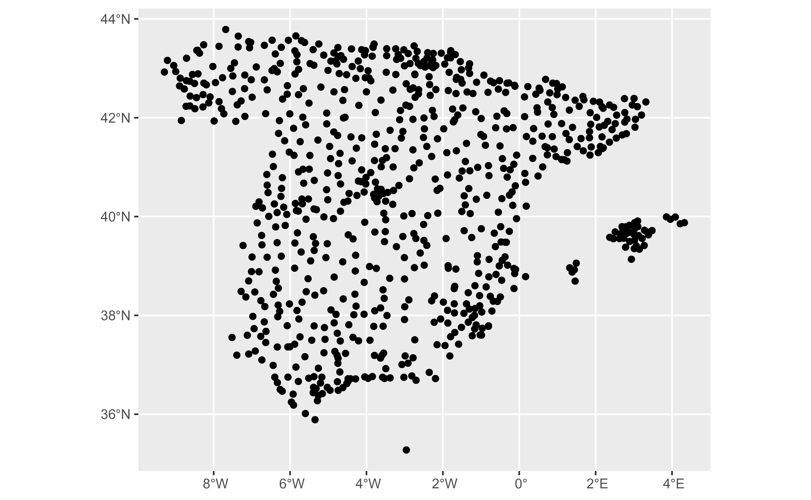
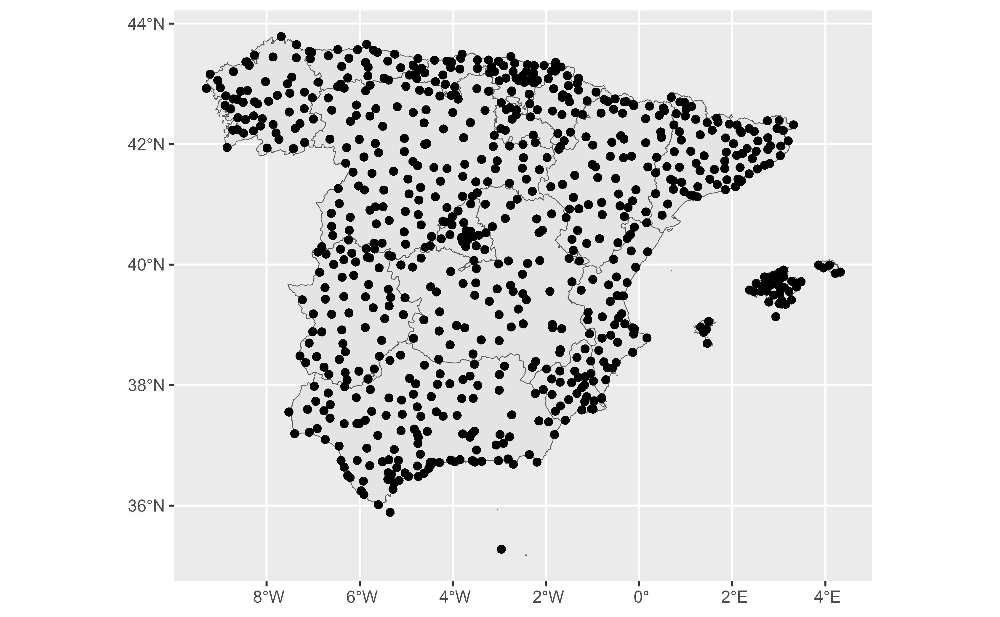
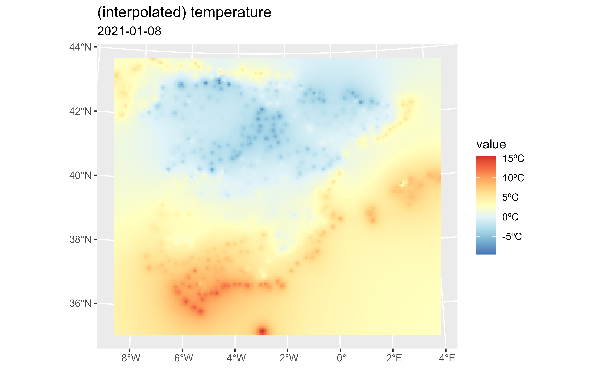
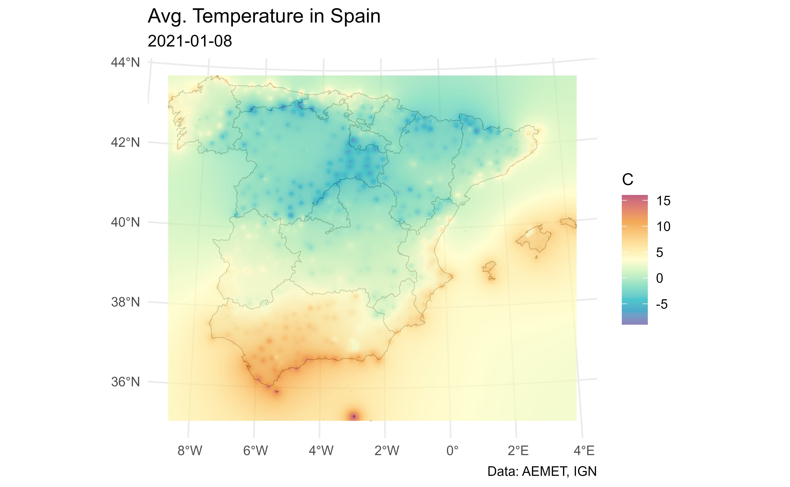
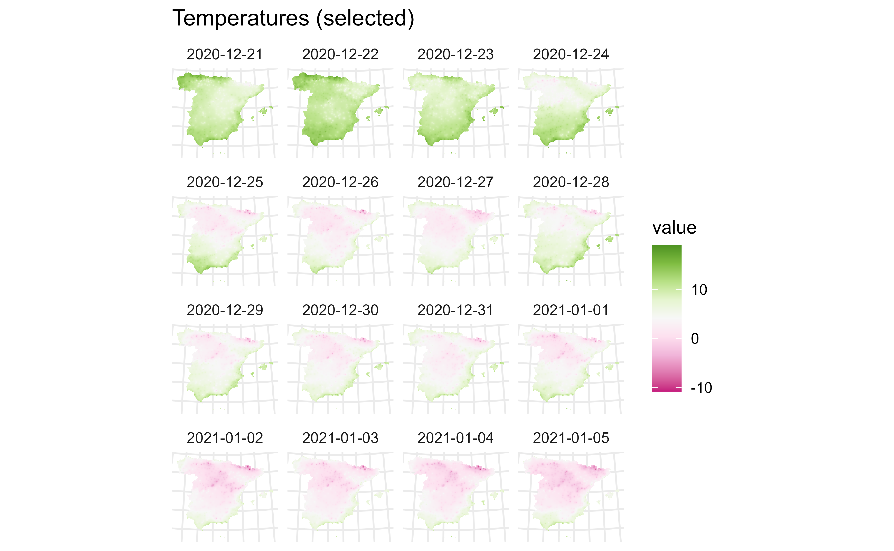

# Spatial Interpolation with climaemet

**climaemet** can retrieve data from the stations included on [AEMET
Open Data](https://opendata.aemet.es/centrodedescargas/inicio). However,
in terms of spatial analysis and visualization, it can be useful to
extend the data from points (stations) to the whole extent of Spain. On
this article we would explain a method to interpolate the climatic data
trough [Spatial
Interpolation](https://docs.qgis.org/3.16/en/docs/gentle_gis_introduction/spatial_analysis_interpolation.html),
that is the process of using points with known values to estimate values
at other unknown points.

## Initial config

For this analysis, we would need the following libraries:

``` r
library(climaemet)
library(mapSpain) # Base maps of Spain
library(sf) # spatial shape handling
library(terra) # Spatial raster handling
library(gstat) # for spatial interpolation
library(tidyverse) # data handling
library(ggplot2) # for plots
library(tidyterra) # Plotting SpatRasters with tidyterra
library(gifski) # we would create an animation
```

## Retrieving data

We choose here the daily climatic data from Winter 2020-2021 in Spain.
Note that on the first half of January, [Storm
Filomena](https://en.wikipedia.org/wiki/Storm_Filomena) brought unusual
heavy snowfall to parts of Spain, with Madrid recording its heaviest
snowfall since 1971. We should be able to spot that.

``` r
clim_data <- aemet_daily_clim(
  start = "2020-12-21",
  end = "2021-03-20",
  return_sf = TRUE
)
```

Let’s keep only the stations on mainland Spain:

``` r
clim_data_clean <- clim_data %>%
  # Exclude Canary Islands from analysis
  filter(str_detect(provincia, "PALMAS|TENERIFE", negate = TRUE)) %>%
  dplyr::select(fecha, tmed) %>%
  # Exclude NAs
  filter(!is.na(tmed))

summary(clim_data_clean$tmed)
#>    Min. 1st Qu.  Median    Mean 3rd Qu.    Max. 
#> -16.200   5.500   9.000   8.369  11.800  23.200

ggplot(clim_data_clean) +
  geom_sf()
```



We load also a basic shape file of Spain using **mapSpain**:

``` r
ccaa_esp <- esp_get_ccaa(epsg = 4326) %>%
  # Exclude Canary Islands from analysis
  filter(ine.ccaa.name != "Canarias")

ggplot(ccaa_esp) +
  geom_sf() +
  geom_sf(data = clim_data_clean)
```



As it can be seed, the climatic data we have available so far is
restricted to the stations (points), but we want to extend these values
to the whole territory.

## Filling the gaps: Interpolation

As we need to predict values at locations where no measurements have
been made, we would need to interpolate the data. On this example we
would use the **terra** package and we would apply the [Inverse Distance
Weighted
method](https://rspatial.org/terra/analysis/4-interpolation.html#inverse-distance-weighted),
that is one of several approaches to perform spatial interpolation. We
recommend consulting Hijmans and Ghosh ([2023](#ref-hijmans2023)) on how
to perform these analysis on **R**.

The process would be as follow:

- Create an spatial object (SpatRaster) where the predicted values would
  be applied.
- Perform an spatial interpolation.
- Visualize the results.

### Creating a grid

For this analysis, we need a destination object with the locations to be
predicted. A common technique is to create a spatial grid (a “raster”)
covering the targeted locations.

On this example, we would use **terra** to create a regular grid that we
would use for interpolation.

**An important thing to consider in any spatial analysis or
visualization** is the [coordinate reference system
(CRS)](https://en.wikipedia.org/wiki/Spatial_reference_system). We won’t
cover this in detail on this article, but we should mention a few key
considerations:

- When using several spatial objects, we should ensure that **all of
  them present the same CRS**. This can be achieved projecting the
  objects (i.e. transforming their coordinates) to the same CRS.
- Longitude/latitude coordinates are unprojected coordinates. When we
  project an object (i.e. Mercator projection) we actually change the
  values of every point (x,y) coordinates (i.e. a projection is a
  transformation of the coordinates.)
- For measuring distance in meters, etc. we should choose the right
  projection. Distances on unprojected coordinates are meaningless.
  Think that 1 degree of longitude on the equator means 111 kms but on
  the North Pole means roughly 0.11 m. The degrees just split a
  circumference on equally spaced buckets, but the Earth is an spheroid
  and the circumferences at different latitudes doesn’t have the same
  length (opposed to a cylinder, where circumferences are the same at
  any latitude or y-axis.)

On this exercise, we choose to project our objects to **ETRS89 / UTM
zone 30N** [EPSG:25830](https://epsg.io/25830), that provides x and y
values on meters and maximizes the accuracy for Spain.

``` r
clim_data_utm <- st_transform(clim_data_clean, 25830)
ccaa_utm <- st_transform(ccaa_esp, 25830)

# Note the original projection

st_crs(ccaa_esp)$proj4string
#> [1] "+proj=longlat +datum=WGS84 +no_defs"

# vs the utm projection

st_crs(ccaa_utm)$proj4string
#> [1] "+proj=utm +zone=30 +ellps=GRS80 +units=m +no_defs"
```

Now, we create a regular grid using **terra**. This grid is composed to
equally spaced points over the whole extent (bounding box) of Spain.

We use here a density of 5,000 (m), so the grid density is 5 x 5 kms (25
km2):

``` r
# Create grid 5*5 km (25 km2)

grd <- rast(ccaa_utm, res = c(5000, 5000))

# Number of cells

ncell(grd)
#> [1] 44004
```

### Interpolating the data

Now we just need to populate the (empty) grid with the predicted values
based on the observations:

``` r
# Test with a single day

test_day <- clim_data_utm %>% filter(fecha == "2021-01-08")

# Interpolate temp
init_p <- test_day %>%
  vect() %>%
  as_tibble(geom = "XY")

gs <- gstat(
  formula = tmed ~ 1, locations = ~ x + y, data = init_p,
  set = list(idp = 2)
)

interp_temp <- interpolate(grd, gs)
#> [inverse distance weighted interpolation]
#> [inverse distance weighted interpolation]

# Plot with tidyterra
ggplot() +
  geom_spatraster(data = interp_temp %>% select(var1.pred)) +
  scale_fill_whitebox_c(
    palette = "bl_yl_rd",
    labels = scales::label_number(suffix = "ºC")
  ) +
  labs(
    title = "(interpolated) temperature",
    subtitle = "2021-01-08"
  )
```



Let’s create a nice **ggplot2** plot! See also Royé
([2020](#ref-roye2020)) for more on this.

``` r
# Making a nice plot on ggplot2
temp_values <- interp_temp %>%
  pull(var1.pred) %>%
  range(na.rm = TRUE)

# Get min and max from interpolated values
min_temp <- floor(min(temp_values))
max_temp <- ceiling(max(temp_values))

ggplot() +
  geom_sf(data = ccaa_utm, fill = "grey95") +
  geom_spatraster(data = interp_temp %>% select(var1.pred)) +
  scale_fill_gradientn(
    colours = hcl.colors(11, "Spectral", rev = TRUE, alpha = 0.7),
    limits = c(min_temp, max_temp)
  ) +
  theme_minimal() +
  labs(
    title = "Avg. Temperature in Spain",
    subtitle = "2021-01-08",
    caption = "Data: AEMET, IGN",
    fill = "C"
  )
```



## Animation

On this section, we would loop over the dates to create a single
SpatRaster with several layers, each one holding the interpolation for a
specific date. After that, we would create an animation to observe the
evolution of temperature through the winter of 2020/21.

``` r
# We would create a SpatRaster with a layer for each date
dates <- sort(unique(clim_data_clean$fecha))

# Loop through days and create interpolation
interp_list <- lapply(dates, function(x) {
  thisdate <- x
  tmp_day <- clim_data_utm %>%
    filter(fecha == thisdate) %>%
    vect() %>%
    as_tibble(geom = "XY")

  gs_day <- gstat(formula = tmed ~ 1, locations = ~ x + y, data = tmp_day)
  interp_day <- interpolate(grd, gs_day, idp = 2.0) %>%
    select(interpolated = var1.pred)

  names(interp_day) <- format(thisdate)

  interp_day
})

# Concatenate to a single SpatRaster
interp_rast <- do.call(c, interp_list) %>% mask(vect(ccaa_utm))

time(interp_rast) <- dates
```

Now we can check the results:

``` r
interp_rast
#> class       : SpatRaster 
#> size        : 193, 228, 90  (nrow, ncol, nlyr)
#> resolution  : 5001.215, 5006.488  (x, y)
#> extent      : -13968.29, 1126309, 3892750, 4859002  (xmin, xmax, ymin, ymax)
#> coord. ref. : ETRS89 / UTM zone 30N (EPSG:25830) 
#> source(s)   : memory
#> names       : 2020-12-21, 2020-12-22, 2020-12-23, 2020-12-24, 2020-12-25, 2020-12-26, ... 
#> min values  :  0.7780482,   4.150187,   2.500192,  -1.833779,  -7.944428,  -9.339365, ... 
#> max values  : 19.0254894,  18.849155,  16.697471,  16.877918,  15.996937,  14.590902, ... 
#> time (days) : 2020-12-21 to 2021-03-20 (90 steps)

nlyr(interp_rast)
#> [1] 90

head(names(interp_rast))
#> [1] "2020-12-21" "2020-12-22" "2020-12-23" "2020-12-24" "2020-12-25"
#> [6] "2020-12-26"

# Facet map with some data

ggplot() +
  geom_spatraster(data = interp_rast %>% select(1:16)) +
  facet_wrap(~lyr) +
  scale_fill_whitebox_c(palette = "pi_y_g", alpha = 1) +
  theme_minimal() +
  theme(axis.text = element_blank()) +
  labs(title = "Temperatures (selected)")
```



And finally we loop through each layer to produce a plot (png file) for
each date. The last step is to concatenate each png file into a gif file
with **gifski**.

``` r
# Extending and animating
# Create gif

# We need a common scale using all the observed values on each layer
allvalues <- values(interp_rast, mat = FALSE, na.rm = TRUE)

min_temp2 <- floor(min(allvalues))
max_temp2 <- ceiling(max(allvalues))

# Loop through all the layers
all_layers <- names(interp_rast)

for (i in seq_len(length(all_layers))) {
  # Create a gif for each date
  this <- all_layers[i]
  interp_rast_day <- interp_rast %>% select(all_of(this))

  this_date <- as.Date(gsub("interp_", "", this))

  g <- ggplot() +
    geom_spatraster(data = interp_rast_day) +
    geom_sf(data = ccaa_utm, fill = NA) +
    coord_sf(expand = FALSE) +
    scale_fill_gradientn(
      colours = hcl.colors(20, "Spectral", rev = TRUE, alpha = 0.8),
      limits = c(min_temp2, max_temp2),
      na.value = NA,
      labels = scales::label_number(suffix = "º")
    ) +
    theme_minimal() +
    labs(
      title = "Avg. Temperature in Spain",
      subtitle = this_date,
      caption = "Data: AEMET, IGN",
      fill = ""
    )

  tmp <- file.path(tempdir(), paste0(this, ".png"))
  ggsave(tmp, g, width = 1600, height = 1200, units = "px", bg = "white")
}
```

And finally we use **gifski** to create the animation:

``` r
# Create gif from temporary pngs
allfiles <- file.path(tempdir(), paste0(all_layers, ".png"))
gifski::gifski(allfiles,
  loop = TRUE, delay = 1 / 6,
  gif_file = "winter_2021.gif",
  width = 1600, height = 1200
)
```


## Session info

Details

    #> ─ Session info ───────────────────────────────────────────────────────────────
    #>  setting  value
    #>  version  R version 4.5.2 (2025-10-31 ucrt)
    #>  os       Windows Server 2022 x64 (build 26100)
    #>  system   x86_64, mingw32
    #>  ui       RTerm
    #>  language en
    #>  collate  English_United States.utf8
    #>  ctype    English_United States.utf8
    #>  tz       UTC
    #>  date     2025-11-26
    #>  pandoc   3.1.11 @ C:/HOSTED~1/windows/pandoc/31F387~1.11/x64/PANDOC~1.11/ (via rmarkdown)
    #>  quarto   NA
    #> 
    #> ─ Packages ───────────────────────────────────────────────────────────────────
    #>  package      * version  date (UTC) lib source
    #>  bslib          0.9.0    2025-01-30 [1] RSPM
    #>  cachem         1.1.0    2024-05-16 [1] RSPM
    #>  class          7.3-23   2025-01-01 [3] CRAN (R 4.5.2)
    #>  classInt       0.4-11   2025-01-08 [1] RSPM
    #>  cli            3.6.5    2025-04-23 [1] RSPM
    #>  climaemet    * 1.4.2    2025-11-26 [1] local
    #>  codetools      0.2-20   2024-03-31 [3] CRAN (R 4.5.2)
    #>  data.table     1.17.8   2025-07-10 [1] RSPM
    #>  DBI            1.2.3    2024-06-02 [1] RSPM
    #>  desc           1.4.3    2023-12-10 [1] RSPM
    #>  digest         0.6.39   2025-11-19 [1] RSPM
    #>  dplyr        * 1.1.4    2023-11-17 [1] RSPM
    #>  e1071          1.7-16   2024-09-16 [1] RSPM
    #>  evaluate       1.0.5    2025-08-27 [1] RSPM
    #>  farver         2.1.2    2024-05-13 [1] RSPM
    #>  fastmap        1.2.0    2024-05-15 [1] RSPM
    #>  FNN            1.1.4.1  2024-09-22 [1] RSPM
    #>  forcats      * 1.0.1    2025-09-25 [1] RSPM
    #>  fs             1.6.6    2025-04-12 [1] RSPM
    #>  generics       0.1.4    2025-05-09 [1] RSPM
    #>  ggplot2      * 4.0.1    2025-11-14 [1] RSPM
    #>  gifski       * 1.32.0-2 2025-03-18 [1] RSPM
    #>  glue           1.8.0    2024-09-30 [1] RSPM
    #>  gstat        * 2.1-4    2025-07-10 [1] RSPM
    #>  gtable         0.3.6    2024-10-25 [1] RSPM
    #>  hms            1.1.4    2025-10-17 [1] RSPM
    #>  htmltools      0.5.8.1  2024-04-04 [1] RSPM
    #>  htmlwidgets    1.6.4    2023-12-06 [1] RSPM
    #>  intervals      0.15.5   2024-08-23 [1] RSPM
    #>  jquerylib      0.1.4    2021-04-26 [1] RSPM
    #>  jsonlite       2.0.0    2025-03-27 [1] RSPM
    #>  KernSmooth     2.23-26  2025-01-01 [3] CRAN (R 4.5.2)
    #>  knitr          1.50     2025-03-16 [1] RSPM
    #>  labeling       0.4.3    2023-08-29 [1] RSPM
    #>  lattice        0.22-7   2025-04-02 [3] CRAN (R 4.5.2)
    #>  lifecycle      1.0.4    2023-11-07 [1] RSPM
    #>  lubridate    * 1.9.4    2024-12-08 [1] RSPM
    #>  magrittr       2.0.4    2025-09-12 [1] RSPM
    #>  mapSpain     * 0.10.0   2024-12-15 [1] RSPM
    #>  pillar         1.11.1   2025-09-17 [1] RSPM
    #>  pkgconfig      2.0.3    2019-09-22 [1] RSPM
    #>  pkgdown        2.2.0    2025-11-06 [1] any (@2.2.0)
    #>  proxy          0.4-27   2022-06-09 [1] RSPM
    #>  purrr        * 1.2.0    2025-11-04 [1] RSPM
    #>  R.cache        0.17.0   2025-05-02 [1] RSPM
    #>  R.methodsS3    1.8.2    2022-06-13 [1] RSPM
    #>  R.oo           1.27.1   2025-05-02 [1] RSPM
    #>  R.utils        2.13.0   2025-02-24 [1] RSPM
    #>  R6             2.6.1    2025-02-15 [1] RSPM
    #>  ragg           1.5.0    2025-09-02 [1] RSPM
    #>  RColorBrewer   1.1-3    2022-04-03 [1] RSPM
    #>  Rcpp           1.1.0    2025-07-02 [1] RSPM
    #>  readr        * 2.1.6    2025-11-14 [1] RSPM
    #>  rlang          1.1.6    2025-04-11 [1] RSPM
    #>  rmarkdown      2.30     2025-09-28 [1] RSPM
    #>  S7             0.2.1    2025-11-14 [1] RSPM
    #>  sass           0.4.10   2025-04-11 [1] RSPM
    #>  scales         1.4.0    2025-04-24 [1] RSPM
    #>  sessioninfo  * 1.2.3    2025-02-05 [1] any (@1.2.3)
    #>  sf           * 1.0-22   2025-11-10 [1] RSPM
    #>  sp             2.2-0    2025-02-01 [1] RSPM
    #>  spacetime      1.3-3    2025-02-13 [1] RSPM
    #>  stringi        1.8.7    2025-03-27 [1] RSPM
    #>  stringr      * 1.6.0    2025-11-04 [1] RSPM
    #>  styler         1.11.0   2025-10-13 [1] any (@1.11.0)
    #>  systemfonts    1.3.1    2025-10-01 [1] RSPM
    #>  terra        * 1.8-80   2025-11-05 [1] RSPM
    #>  textshaping    1.0.4    2025-10-10 [1] RSPM
    #>  tibble       * 3.3.0    2025-06-08 [1] RSPM
    #>  tidyr        * 1.3.1    2024-01-24 [1] RSPM
    #>  tidyselect     1.2.1    2024-03-11 [1] RSPM
    #>  tidyterra    * 0.7.2    2025-04-14 [1] RSPM
    #>  tidyverse    * 2.0.0    2023-02-22 [1] RSPM
    #>  timechange     0.3.0    2024-01-18 [1] RSPM
    #>  tzdb           0.5.0    2025-03-15 [1] RSPM
    #>  units          1.0-0    2025-10-09 [1] RSPM
    #>  vctrs          0.6.5    2023-12-01 [1] RSPM
    #>  withr          3.0.2    2024-10-28 [1] RSPM
    #>  xfun           0.54     2025-10-30 [1] RSPM
    #>  xts            0.14.1   2024-10-15 [1] RSPM
    #>  yaml           2.3.10   2024-07-26 [1] RSPM
    #>  zoo            1.8-14   2025-04-10 [1] RSPM
    #> 
    #>  [1] D:/a/_temp/Library
    #>  [2] C:/R/site-library
    #>  [3] C:/R/library
    #>  * ── Packages attached to the search path.
    #> 
    #> ──────────────────────────────────────────────────────────────────────────────

## References

Hijmans, Robert J., and Aniruddha Ghosh. 2023. “Interpolation.” In
*Spatial Data Analysis with R*, 31–54. Spatial Data Science with R and
"terra". Online. <https://rspatial.org/analysis/analysis.pdf>.

Royé, Dominic. 2020. “Climate Animation of Maximum Temperatures.” *Dr.
Dominic Royé*.
<https://dominicroye.github.io/en/2020/climate-animation-of-maximum-temperatures/>.
