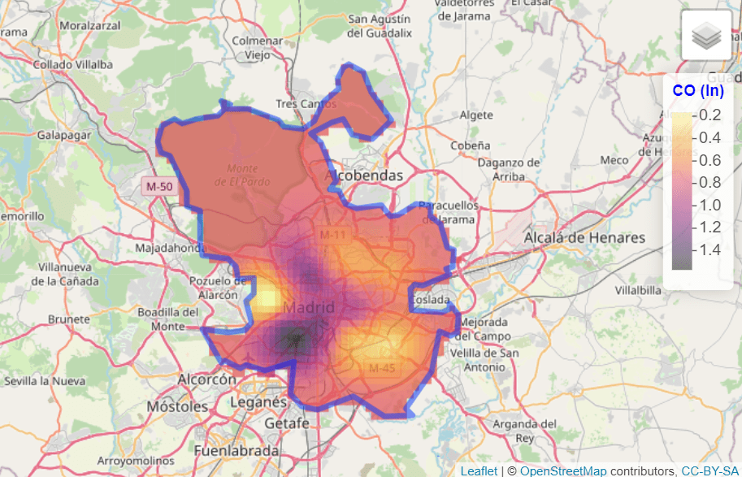
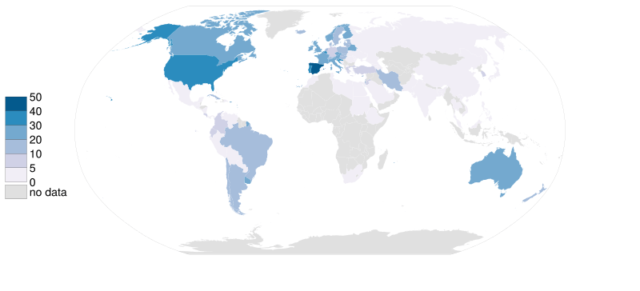
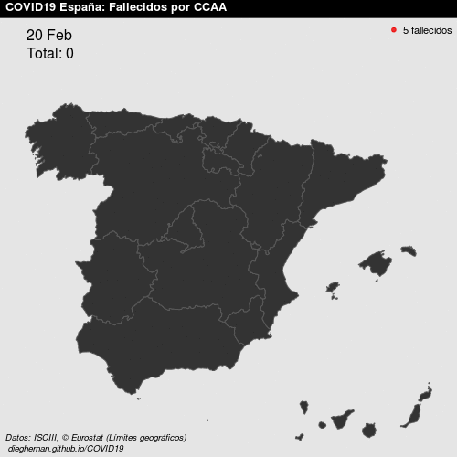

# What are spatial data?

Geospatial data are any data that contain information about a specific location
on the Earth's surface. Spatial data arise in a myriad of fields and
applications, so there are also many spatial data types. @cressie1993 provides a
simple, useful classification of spatial data:

1.  **Geostatistical data.** For example, the level of log CO in Madrid:

```{r}
#| echo: false
#| out-width: 60%
#| fig-align: center
#| label: fig-intro1
#| fig-cap: "Example of geostatistical data"
# From cache

```

2.  **Lattice data.** For example, organ donor rate by country.

```{r}
#| echo: false
#| out-width: 50%
#| fig-align: center
#| label: fig-intro2
#| fig-cap: "Example of lattice data"
# From cache

```

3.  **Point patterns.** For example, COVID deaths per day in Spain.

```{r}
#| echo: false
#| out-width: 50%
#| fig-align: center
#| label: fig-intro3
#| fig-cap: "Example of point patterns"
# From cache

```

See @montero2015 for more details. In this work, we focus on geostatistical
data.

## What do we need to carry out a geostatistical data analysis in R?

Some useful libraries we use throughout this article are:

```{r}
#| label: libraries
library(climaemet) # Meteorological data
library(mapSpain) # Base maps of Spain
library(classInt) # Classification
library(terra) # Raster handling
library(sf) # Spatial shape handling
library(gstat) # Spatial interpolation
library(geoR) # Spatial analysis
library(tidyverse) # Collection of R packages designed for data science
library(tidyterra) # Tidyverse methods for the terra package
```

## Where can we find geostatistical data?

In this article, we deal with geostatistical data. Specifically, we model the
air temperature in Spain on [**8 January
2021**](https://en.wikipedia.org/wiki/Storm_Filomena).

We download the data with the **climaemet** package (\>= 1.0.0) [@pizarro2021]
in **R**. **climaemet** allows us to download climate data from the Spanish
Meteorological Agency (AEMET) directly using the AEMET API. The package is
available on [**CRAN**](https://CRAN.R-project.org/package=climaemet):

```{r}
#| label: cran
#| eval: false
# Install climaemet.
install.packages("climaemet")
```

### API key

To download data from AEMET, you also need a free API key, which you can get
[here](https://opendata.aemet.es/centrodedescargas/altaUsuario).

``` r
library(climaemet)
# Get API key from AEMET.
# browseURL("https://opendata.aemet.es/centrodedescargas/altaUsuario")
# Use this function to register your API key temporarily or permanently.
# YOUR_API_KEY

# aemet_api_key("YOUR_AEMET_API_KEY")
```

# What is the structure of geostatistical data?

Geostatistical data arise when the domain under study is a fixed set $D$ that is
continuous. That is, (i) $Z(s)$ can be observed at any point of the domain
(continuous) and (ii) the points in $D$ are non-stochastic (fixed, $D$ is the
same for all realizations of the spatial random function).

First, take a look at the characteristics of the stations. We are interested in
**latitude** and **longitude** attributes.

```{r}
#| label: stations
stations <- aemet_stations()

# Have a look at the data.
stations |>
  dplyr::select(name = nombre, latitude = latitud, longitude = longitud) |>
  head() |>
  knitr::kable(caption = "Preview of AEMET stations")
```

Next, we extract the data. Here, we select the daily values of [**8 January
2021**](https://en.wikipedia.org/wiki/Storm_Filomena):

"2021-01-08"

```{r}
#| label: norun
#| eval: false
# Select data.
date_select <- "2021-01-08"

clim_data <- aemet_daily_clim(
  start = date_select,
  end = date_select,
  return_sf = TRUE
)
```

```{r}
#| label: load_cached
#| include: false
# Load a cached version of the file to avoid unnecessary API calls.
date_select <- "2021-01-08"

clim_data <- sf::read_sf("clim_data.gpkg") |>
  filter(fecha == date_select)

# Need to rename the cached geometry column to `geometry`
clim_data <- st_sf(st_drop_geometry(clim_data),
  geometry = st_geometry(clim_data)
)
```

Now, we examine the possible variables that can be analyzed. We are interested
in **minimum daily temperature** named `tmin`, although the API also provides
other interesting information:

```{r}
#| label: namesdaily
names(clim_data)
```

In this step, we select the variable of interest for each station. For
simplicity, we will remove the Canary Islands in this exercise:

```{r}
#| label: fig-selecttemp
#| fig-cap: "AEMET stations in Spain (excl. Canary Islands)"
clim_data_clean <- clim_data |>
  # Exclude Canary Islands from analysis.
  filter(str_detect(provincia, "PALMAS|TENERIFE", negate = TRUE)) |>
  dplyr::select(fecha, tmin) |>
  # Exclude NAs.
  filter(!is.na(tmin))

# Plot with outline of Spain.
esp_sf <- esp_get_ccaa(epsg = 4326) |>
  # Exclude Canary Islands from analysis.
  filter(ine.ccaa.name != "Canarias") |>
  # Group the whole country.
  st_union()

ggplot(esp_sf) +
  geom_sf() +
  geom_sf(data = clim_data_clean) +
  theme_light() +
  labs(
    title = "AEMET stations in Spain",
    subtitle = "excluding Canary Islands"
  ) +
  theme(
    plot.title = element_text(
      size = 12,
      face = "bold"
    ),
    plot.subtitle = element_text(
      size = 8,
      face = "italic"
    )
  )
```

Now, plot the values as a choropleth map:

```{r}
#| label: fig-choro
#| fig-cap: "Choropleth map with temperatures in Spain as of January 8, 2021"
# Use common breaks and palette throughout the article.
br_paper <- c(-Inf, seq(-20, 20, 2.5), Inf)
pal_paper <- hcl.colors(15, "PuOr", rev = TRUE)

ggplot(clim_data_clean) +
  geom_sf(data = esp_sf, fill = "grey95") +
  geom_sf(aes(fill = tmin), shape = 21, size = 4, alpha = 0.7) +
  labs(fill = "Min. temp") +
  scale_fill_gradientn(
    colours = pal_paper,
    breaks = br_paper,
    labels = scales::label_number(suffix = "°"),
    guide = "legend"
  ) +
  theme_light() +
  labs(
    title = "Minimum temperature",
    subtitle = format(as.Date(date_select), "%d %b %Y")
  ) +
  theme(
    plot.title = element_text(
      size = 12,
      face = "bold"
    ),
    plot.subtitle = element_text(
      size = 8,
      face = "italic"
    )
  )
```

# Are the observations independent or do they exhibit spatial dependence?

The First Law of Geography states that *Everything is related to everything
else, but near things are more related than distant things* [@tobler1969]. This
law is the basis of the fundamental concepts of **spatial dependence** and
**spatial autocorrelation**.

In our study, we can observe **positive spatial dependence**: high temperature
values are all found together in the south of Spain and low temperatures are
found together in the north of Spain.

```{r}
#| label: summ
clim_data_clean |>
  st_drop_geometry() |>
  select(tmin) |>
  summarise(across(
    everything(),
    list(
      min = min,
      max = max,
      median = median,
      sd = sd,
      n = ~ sum(!is.na(.x)),
      q25 = ~ quantile(.x, 0.25),
      q75 = ~ quantile(., 0.75)
    ),
    .names = "{.fn}"
  )) |>
  knitr::kable()
```

In the next plot, we divide the minimum temperature into quartiles to visualize
the spatial distribution of values.

```{r}
#| label: fig-bubbleplot
#| fig-cap: "Bubble map representing the minimum temperatures in Spain (2021-
#|   01-08)"
bubble <- clim_data_clean |>
  arrange(desc(tmin))

# Create quartiles.
cuart <- classIntervals(bubble$tmin, n = 4)

bubble$quart <- cut(
  bubble$tmin,
  breaks = cuart$brks,
  labels = paste0("Q", seq(1:4))
)

ggplot(bubble) +
  geom_sf(
    aes(size = quart, fill = quart),
    colour = "grey20",
    alpha = 0.5,
    shape = 21
  ) +
  scale_size_manual(values = c(2, 2.5, 3, 3.5)) +
  scale_fill_manual(values = hcl.colors(4, "PuOr", rev = TRUE)) +
  theme_light() +
  labs(
    title = "Minimum temperature - Quartile map",
    subtitle = format(as.Date(date_select), "%d %b %Y"),
    fill = "Quartile",
    size = "Quartile"
  ) +
  theme(
    plot.title = element_text(size = 12, face = "bold"),
    plot.subtitle = element_text(size = 8, face = "italic")
  )
```

# Preparing the data as a spatial object

**An important consideration in any spatial analysis or visualization** is the
[coordinate reference system
(CRS)](https://en.wikipedia.org/wiki/Spatial_reference_system). In this
exercise, we choose to project our objects to ETRS89 / UTM zone 30N
[EPSG:25830](https://epsg.io/25830), which provides projected x and y values in
meters and maximizes the accuracy for Spain.

```{r}
#| label: transform
clim_data_utm <- st_transform(clim_data_clean, 25830)

esp_sf_utm <- st_transform(esp_sf, 25830)
```

## Creating a grid for the spatial prediction

To predict values at locations where no measurements have been made, we need to
create a grid of locations and perform an interpolation. In this article, we use
the **terra** package for working with spatial grids (`SpatRaster` objects).
@hijmans2023 provides a detailed explanation on how to perform spatial
interpolation using the **terra** and **gstat** packages.

This grid is composed of equally spaced points over the full bounding box of
Spain. Most squares do not have any stations, so they do not have observations.
However, we use the values of the cells that contain stations to interpolate the
data.

```{r}
#| label: create_grid
# Create a 5 x 5 km grid (25 square km).
# The resolution is based on the projection unit, in this case meters.
grd <- rast(vect(esp_sf_utm), res = c(5000, 5000))

cellSize(grd)
```

Some additional steps are needed to prepare the data for spatial interpolation.

```{r}
#| label: remove_dups
# Some points are duplicated, so remove them.

clim_data_clean_nodup <- clim_data_utm |>
  distinct(geometry, .keep_all = TRUE)

nrow(clim_data_utm)

nrow(clim_data_clean_nodup)

clim_data_clean_nodup
```

# Structural analysis of the spatial dependence

## Exploratory spatial data analysis (ESDA)

Exploratory Data Analysis (EDA) is the first important step of data modeling, so
ESDA is also the first step in spatial statistics. **What do the data tell us
about the relationship between `X` and `Y` coordinates and the variable
`tmin`?**

To answer this question, we summarize our spatial object and examine: (i) the
number of data points, (ii) the coordinates, (iii) the distances, and (iv) the
data.

```{r}
#| label: ESDA_summary
clim_data_clean_nodup_geor <- clim_data_clean_nodup |>
  st_coordinates() |>
  as.data.frame() |>
  bind_cols(st_drop_geometry(clim_data_clean_nodup)) |>
  as.geodata(coords.col = 1:2, data.col = "tmin")

summary(clim_data_clean_nodup_geor)
```

Second, we generate several exploratory geostatistical plots. The first is a
quartile map. The next two show `tmin` against the `X` and `Y` coordinates and
the last one is a histogram of the `tmin` values.

```{r}
#| label: fig-ESDA_plot
#| fig-cap: "Example of exploratory spatial data analysis"
plot(clim_data_clean_nodup_geor)
```

From the histogram, we see that the dataset is approximately Gaussian. Note that
kriging provides the Best Linear Unbiased Predictor
[BLUP](https://en.wikipedia.org/wiki/Best_linear_unbiased_prediction).

```{r}
#| label: fig-hist
#| fig-cap: "Histogram of minimum temperatures in Spain (2021-01-08)"
ggplot(clim_data_clean_nodup, aes(x = tmin)) +
  geom_histogram(
    aes(fill = cut(tmin, 15)),
    color = "grey40",
    binwidth = 1,
    show.legend = FALSE
  ) +
  scale_fill_manual(values = pal_paper) +
  labs(y = "n obs.", x = "Min. temp (°)") +
  theme_light() +
  labs(
    title = "Histogram - Minimum temperature",
    subtitle = format(as.Date(date_select), "%d %b %Y")
  ) +
  theme(
    plot.title = element_text(size = 12, face = "bold"),
    plot.subtitle = element_text(size = 8, face = "italic")
  )
```

## The semivariogram

The **semivariogram** function is the keystone of geostatistical prediction.
Following @montero2015, we formulate this question: **How do we express in a
function the structure of the spatial dependence or correlation present in the
realization observed?** The answer to this question, known in the geostatistics
literature as the structural analysis of the spatial dependence, or, simply,
*the structural analysis*, is a key issue in the subsequent process of optimal
prediction (kriging), as the success of the kriging methods depends on the
functions yielding information about the spatial dependence detected.

The functions referred to above are covariance functions and semivariograms, but
**they must meet a series of requirements.** Because we only have the observed
realization, in practice, the covariance functions and semivariograms derived
from it may not satisfy these requirements. For this reason, **one of the
theoretical models (also called the valid models) that do comply must be fitted
to it.**

There are several **R** packages for geostatistical analysis, including two
widely used options: **geoR** [@ribeirojr2001] and **gstat** [@pebesma2004;
@graler2016].

The **semivariogram** is, generally, a non-decreasing monotone function, so that
the variability of the first increments of the random functions increases with
distance.

We are going to generate the (omnidirectional) empirical semivariogram of our
data, which, in a second step, has to be fitted to a theoretical one.

```{r}
#| label: fig-variog_geoR
#| fig-asp: 0.5
#| fig-cap: "Semivariogram"
vario_geor <- variog(
  clim_data_clean_nodup_geor,
  coords = clim_data_clean_nodup_geor$coords,
  data = clim_data_clean_nodup_geor$data,
  uvec = seq(0, 1000000, l = 25)
)

plot(vario_geor, pch = 20)
```

`eyefit()` is an interactive function that fits the parameters of the
semivariogram by eye. It is an intuitive function to play with the types and
parameters of the semivariogram. It can help you fit the empirical semivariogram
to a theoretical one. Of course, there are other statistical methods to fit the
semivariogram: Ordinary Least Squares (OLS), Weighted Least Squares (WLS),
Maximum Likelihood (ML), Restricted Maximum Likelihood (REML).

Run it locally.

```{r}
#| label: eyefit.geoR
#| eval: false
eyefit(vario_geor)
```

With `geoR::eyefit()`, we observed that there **are different types of
semivariograms** and each type contains **several parameters** that have to be
fitted.

The main types of semivariograms are:

- *Spherical*.
- *Exponential*.
- *Gaussian*.
- *Hole effect*.
- *K-Bessel*.
- *J-Bessel*.
- *Stable*.
- *Matérn*.
- *Circular*.
- *Nugget*.

A graphical summary of the most common **spatial semivariogram models** can be
found here:

```{r}
#| label: fig-semi_models
#| fig-cap: "Summary of common spatial semivariograms"
show.vgms()
```

Regarding the **parameters**, the main ones are:

- *Sill*: Defined as the a priori variance of the random function.
- *Range*: The distance at which the sill is reached, which defines the
  threshold of spatial dependence.
- *Nugget*: The value at which the semivariogram intercepts the y-value.
  Theoretically, at zero separation distance, the semivariogram value is 0. The
  nugget effect can be attributed to measurement errors or spatial sources of
  variation at distances smaller than the sampling interval or both.

For a detailed study of the semivariogram function, see @montero2015.

Now, we plot the empirical semivariogram of our data (again) with
`gstat::variogram` and we check the semivariogram in four directions (0°, 45°,
90°, 135°).

```{r}
#| label: fig-variog_gstat
#| fig-asp: 0.5
#| fig-cap: "Directional empirical semivariogram in gstat()"
vgm_dir <- variogram(
  tmin ~ 1,
  clim_data_clean_nodup,
  cutoff = 1000000,
  alpha = c(0, 45, 90, 135)
)

plot(vgm_dir)
```

We can see that all the semivariograms exhibit spatial dependence. We choose the
90° semivariogram.

```{r}
#| label: variog.gstat.dir
vgm_dir_selected <- variogram(
  tmin ~ 1,
  clim_data_clean_nodup,
  cutoff = 1000000,
  alpha = 90
)
```

Now, we fit the empirical semivariogram to a theoretical semivariogram, which is
included in the kriging equations. In our case, the object `fit_var` contains
the value of the estimated parameters.

```{r}
#| label: variog.gstat.fit.param
fit_var <- fit.variogram(vgm_dir_selected, model = vgm(model = "Sph"))

fit_var
```

Finally, we plot the empirical and the theoretical semivariograms together.

```{r}
#| label: fig-variog_gstat_fit
#| fig-asp: 0.5
#| fig-cap: "Empirical (dots) and theoretical (line) semivariograms"
plot(
  vgm_dir_selected,
  fit_var,
  main = "Empirical (dots) and theoretical (line) semivariograms "
)
```

# Carrying out ordinary kriging

Once a theoretical semivariogram has been chosen, we are ready for spatial
prediction. The method geostatistics uses for spatial prediction is termed
kriging in honor of the South African mining engineer, Daniel Gerhardus Krige.

According to @montero2015, **kriging** aims to predict the value of a random
function, $Z(s)$, at one or more unobserved points (or blocks) from a collection
of data observed at $n$ points (or blocks in the case of block prediction) of a
domain $D$, and provides the best linear unbiased predictor (BLUP) of the
regionalized variable under study at such unobserved points or blocks

There are different kinds of kriging depending on the characteristics of the
spatial process: simple, ordinary or universal kriging (external drift kriging),
kriging in a local neighborhood, point kriging or kriging of block mean values
and conditional (Gaussian or indicator) simulation equivalents for all kriging
varieties.

In this work, we deal with ordinary kriging, the most widely used kriging
method. According to @wackernagel1995 it serves to estimate a value at a point
of a region for which a variogram is known, using data in the neighborhood of
the estimation location.

In this study, we perform ordinary kriging (OK) following @hijmans2023.

```{r}
#| label: krig_res
# Pass the input as a data frame.
clim_data_clean_nodup_df <- vect(clim_data_clean_nodup) |>
  as_tibble(geom = "XY")

clim_data_clean_nodup_df

k <- gstat(
  formula = tmin ~ 1,
  locations = ~ x + y,
  data = clim_data_clean_nodup_df,
  model = fit_var
)

kriged <- interpolate(grd, k, debug.level = 0)
```

Now, we plot the kriging prediction:

```{r}
#| label: fig-krig_plot1
#| fig-cap: "Ordinary kriging - minimum temperature"
pred <- ggplot(esp_sf_utm) +
  geom_spatraster(data = kriged, aes(fill = var1.pred)) +
  geom_sf(colour = "black", fill = NA) +
  scale_fill_gradientn(
    colours = pal_paper,
    breaks = br_paper,
    labels = scales::label_number(suffix = "°"),
    guide = guide_legend(
      reverse = TRUE,
      title = "Min. temp\n(kriged)"
    )
  ) +
  theme_light() +
  labs(
    title = "Ordinary kriging - minimum temperature",
    subtitle = format(as.Date(date_select), "%d %b %Y")
  ) +
  theme(
    plot.title = element_text(size = 12, face = "bold"),
    plot.subtitle = element_text(size = 8, face = "italic"),
    panel.grid = element_blank(),
    panel.border = element_blank()
  )

pred
```

And the variance of the prediction:

```{r}
#| label: fig-krig_plot2
#| fig-cap: "OK prediction variance - Minimum temperature"
ggplot(esp_sf_utm) +
  geom_spatraster_contour_filled(
    data = kriged,
    aes(z = var1.var),
    breaks = c(0, 1.5, 3, 6, 8, 10, 15, 20, Inf)
  ) +
  geom_sf(colour = "black", fill = NA) +
  geom_sf(data = clim_data_clean_nodup, colour = "blue", shape = 4) +
  scale_fill_whitebox_d(
    palette = "pi_y_g",
    alpha = 0.7,
    guide = guide_legend(title = "Variance")
  ) +
  theme_light() +
  labs(
    title = "OK prediction variance - Minimum temperature",
    subtitle = format(as.Date(date_select), "%d %b %Y")
  ) +
  theme(
    plot.title = element_text(size = 12, face = "bold"),
    plot.subtitle = element_text(size = 8, face = "italic"),
    panel.grid = element_blank(),
    panel.border = element_blank()
  )
```

Finally, we plot the variance and the prediction together:

```{r}
#| label: fig-predandvar
#| fig-cap: "OK: Prediction and variance prediction"
pred +
  geom_sf(data = clim_data_clean_nodup, colour = "darkred", shape = 20) +
  geom_spatraster_contour(
    data = kriged,
    aes(z = var1.var),
    breaks = c(0, 2.5, 5, 10, 15, 20)
  ) +
  labs(
    title = "OK: Prediction and variance prediction",
    caption = "Points: Climate stations.\nLines: Cluster of variances"
  )
```

The prediction variance is minimal in areas near the observed points. In
contrast, prediction variance is higher in areas where no monitoring stations
are available.

# Comparing ordinary kriging with inverse distance weighting

In this section, we compare ordinary kriging (OK) with inverse distance
weighting (IDW), one of several approaches for spatial interpolation. Once
again, we apply the approach described in @hijmans2023 on how to perform this
analysis in **R** with **terra**.

IDW is a deterministic interpolation technique that creates surfaces from sample
points using an inverse distance function of neighboring points. On the other
hand, stochastic interpolation techniques like kriging use the statistical
properties of the sample points (based on the variogram, which gives the spatial
structure of the studied variable). Moreover, kriging provides an error
prediction map.

```{r}
#| label: fig-idw
#| fig-cap: "Comparing ordinary kriging with inverse distance weighting"
gs <- gstat(
  formula = tmin ~ 1,
  locations = ~ x + y,
  data = clim_data_clean_nodup_df,
  set = list(idp = 2.0)
)

idw <- interpolate(grd, gs)

# Create a SpatRaster with two layers, one prediction each.

all_methods <- c(
  kriged |> select(Kriging = var1.pred),
  idw |> select(IDW = var1.pred)
)

# Plot and compare.
ggplot(esp_sf_utm) +
  geom_spatraster(data = all_methods) +
  facet_wrap(~lyr) +
  geom_sf(colour = "black", fill = NA) +
  scale_fill_gradientn(
    colours = pal_paper,
    n.breaks = 10,
    labels = scales::label_number(suffix = "°"),
    guide = guide_legend(
      title = "Min. temp",
      direction = "horizontal",
      keyheight = 0.5,
      keywidth = 2,
      title.position = "top",
      title.hjust = 0.5,
      label.hjust = 0.5,
      nrow = 1,
      byrow = TRUE,
      reverse = FALSE,
      label.position = "bottom"
    )
  ) +
  theme_void() +
  labs(
    title = "OK vs IDW",
    subtitle = format(as.Date(date_select), "%d %b %Y")
  ) +
  theme(
    panel.grid = element_blank(),
    panel.border = element_blank(),
    plot.title = element_text(size = 12, face = "bold"),
    plot.subtitle = element_text(size = 8, face = "italic"),
    legend.text = element_text(size = 10),
    legend.title = element_text(size = 11),
    legend.position = "bottom"
  )
```

## Cross-validation

To compare the two interpolation methods, OK and IDW, we need to carry out a
cross-validation (CV) or leave-one-out process. Moreover, CV is the most
widely-used procedure to validate the semivariogram model selected in a kriging
interpolation.

```{r}
## Cross-validation: OK
xv_ok <- krige.cv(tmin ~ 1, clim_data_clean_nodup, fit_var)

xv_ok |>
  st_drop_geometry() |>
  summarise(across(
    everything(),
    list(min = min, max = max),
    .names = "{.col}_{.fn}"
  )) |>
  pivot_longer(everything(), names_to = c("field", "stat"), names_sep = "_") |>
  pivot_wider(id_cols = stat, names_from = field)
```

```{r}
# Cross-validation: IDW
xv_idw <- krige.cv(tmin ~ 1, clim_data_clean_nodup)

xv_idw |>
  st_drop_geometry() |>
  summarise(across(
    everything(),
    list(min = min, max = max),
    .names = "{.col}_{.fn}"
  )) |>
  pivot_longer(everything(), names_to = c("field", "stat"), names_sep = "_") |>
  pivot_wider(id_cols = stat, names_from = field)
```

Now, we plot the leave-one-out cross-validation residuals and observe that the
residuals with OK are smaller than with IDW.

```{r }
#| label: fig-crossval
#| fig-cap: "Tmin: leave-one-out cross validation residuals"
# Create a unique scale.

allvalues <- values(all_methods, na.rm = TRUE, mat = FALSE)

# Prepare final data
cross_val <- xv_ok |>
  mutate(method = "OK") |>
  bind_rows(
    xv_idw |>
      mutate(method = "IDW")
  ) |>
  select(method, residual) |>
  mutate(method = as_factor(method), cat = cut_number(residual, 5))

ggplot(cross_val) +
  geom_sf(data = esp_sf_utm, fill = "grey90") +
  geom_sf(aes(fill = cat, size = cat), shape = 21) +
  facet_wrap(~method) +
  scale_size_manual(values = c(1.5, 1, 0.5, 1, 1.5)) +
  scale_fill_whitebox_d(palette = "pi_y_g", alpha = 0.7) +
  labs(
    title = "Tmin: leave-one-out cross validation residuals",
    subtitle = "By method",
    fill = "",
    size = ""
  ) +
  theme(
    plot.title = element_text(size = 12, face = "bold"),
    plot.subtitle = element_text(size = 8, face = "italic"),
    strip.text = element_text(face = "bold")
  )
```

Moreover, calculating diagnostic statistics from the results is a good way to
select the best interpolation method. The error-based measures used in the study
include the root-mean-square error (RMSE) and the mean error (ME).

```{r}
me <- function(observed, predicted) {
  mean((predicted - observed), na.rm = TRUE)
}

rmse <- function(observed, predicted) {
  sqrt(mean((predicted - observed)^2, na.rm = TRUE))
}
```

```{r}
# OK Diagnostic statistics

me_ok <- me(xv_ok$observed, xv_ok$var1.pred)

rmse_ok <- rmse(xv_ok$observed, xv_ok$var1.pred)

# IDW Diagnostic statistics

me_idw <- me(xv_idw$observed, xv_idw$var1.pred)

rmse_idw <- rmse(xv_idw$observed, xv_idw$var1.pred)
```

As expected, OK yields better predictions than IDW.

::: {#tbl-diag}
```{r}
#| echo: false
data.frame(
  D = c("OK", "IDW"),
  ME = round(c(me_ok, me_idw), 3),
  RMSE = round(c(rmse_ok, rmse_idw), 3)
) |>
  knitr::kable(digits = 3, col.names = c("Diagnostic statistics", "ME", "RMSE"))
```

Diagnostic statistics: OK vs. IDW
:::

# References
