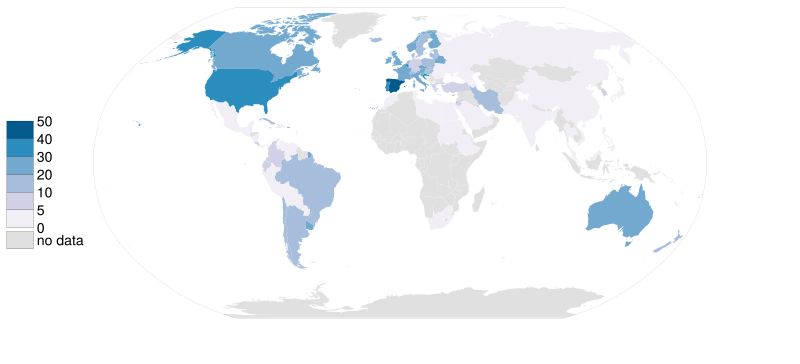

```{r setup, include=FALSE}
knitr::opts_chunk$set(
  collapse = TRUE,
  comment = "#>",
  message = FALSE,
  warning = FALSE,
  dev = "ragg_png",
  dpi = 300,
  tidy = "styler",
  out.width = "100%"
)
```

# What are spatial data?

Geospatial data are any data that contains information about a specific location
on the Earth's surface. Spatial data arise in a myriad of fields and
applications, so there is also a wealth of spatial data types. @cressie1993
provides a simple and useful classification of spatial data:

1.  **Geostatistical data.** For example, the level of (ln)CO in Madrid:

```{r echo=FALSE, out.width="60%", fig.align='center'}
# From cache
knitr::include_graphics("geo.png")
```

2.  **Lattice data**. For example, Organ donor rate by country.

```{r echo=FALSE, out.width="50%", fig.align='center'}
# From cache

```

3.  **Point patterns.** For example, deaths COVID, per day, in Spain.

```{r echo=FALSE, out.width="50%", fig.align='center'}
# From cache
knitr::include_graphics("point.gif")
```

See @montero2015 for more details. In this work, we focus on geostatistical
data.

## What do we need to carry out a geostatistical data analysis in R?

Some useful libraries we are going to use throughout this article are:

```{r libraries}
library(climaemet) # meteorological data
library(mapSpain) # base maps of Spain

library(classInt) # classification

library(terra) # raster handling
library(sf) # spatial shape handling

library(gstat) # for spatial interpolation
library(geoR) # for spatial analysis

library(tidyverse) # collection of R packages designed for data science
library(tidyterra) # tidyverse methods for terra package
```

## Where can we find geostatistical data?

In this paper, we are going to deal with geostatistical data; specifically we
are going to model the air temperature in Spain on [**8 January
2021**](https://en.wikipedia.org/wiki/Storm_Filomena).

We download the data with **climaemet (\>= 1.0.0)** package [@pizarro2021] in R.
**climaemet** allows us to download the climatic data from the Spanish
Meteorological Agency (AEMET) directly using their API. **climaemet** is
available on [**CRAN**](https://CRAN.R-project.org/package=climaemet)**:**

```{r cran, eval=FALSE}
# Install climaemet
install.packages("climaemet")
```

### API Key

To be able to download data from AEMET you will also need a free API key, which
you can get
[here:](https://opendata.aemet.es/centrodedescargas/obtencionAPIKey).

```{r apikey, eval=FALSE}
library(climaemet)
# Get api key from AEMET
# browseURL("https://opendata.aemet.es/centrodedescargas/obtencionAPIKey")
# Use this function to register your API Key temporarily or permanently
# YOUR_API_KEY

# aemet_api_key("YOUR_AEMET_API_KEY")
```

# What is the structure of geostatistical data?

Geostatistical data arises when the domain under study is a fixed set $D$ that
is continuous. That is: (i) $Z(s)$ can be observed at any point of the domain
(continuous); and (ii) the points in $D$ are non-stochastic (fixed, $D$ is the
same for all the realizations of the spatial random function).

First, take a look at the characteristics of the stations. We are interested in
**latitude** and **longitude** attributes.

```{r stations}
stations <- aemet_stations()

# Have a look on the data
stations %>%
  dplyr::select(name = nombre, latitude = latitud, longitude = longitud) %>%
  head() %>%
  knitr::kable(caption = "Preview of AEMET stations")
```

Next, we are going to extract the data. We select here the daily values of [**8
January 2021**](https://en.wikipedia.org/wiki/Storm_Filomena):

```{r selectdaily}
# Select data
date_select <- "2021-01-08"

clim_data <- aemet_daily_clim(
  start = date_select, end = date_select,
  return_sf = TRUE
)
```

Now, we examine the possible variables that can be analyzed. We are interested
in **minimum daily temperature** named `tmin`, although the API also provides
other interesting information:

```{r namesdaily}
names(clim_data)
```

In this step, we select the variable of interest for each station. For
simplicity, we would remove the Canary Islands in this exercise:

```{r selecttemp}
clim_data_clean <- clim_data %>%
  # Exclude Islands from analysis
  filter(!provincia %in% c(
    "LAS PALMAS",
    "STA. CRUZ DE TENERIFE"
  )) %>%
  dplyr::select(fecha, tmin) %>%
  # Exclude NAs
  filter(!is.na(tmin))


# Plot with outline of Spain
ESP <- esp_get_ccaa(epsg = 4326) %>%
  # Exclude Canary Islands from analysis
  filter(ine.ccaa.name != "Canarias") %>%
  # Group the whole country
  st_union()

ggplot(ESP) +
  geom_sf() +
  geom_sf(data = clim_data_clean) +
  theme_light() +
  labs(
    title = "AEMET Stations in Spain",
    subtitle = "excluding Canary Islands"
  ) +
  theme(
    plot.title = element_text(size = 12, face = "bold"),
    plot.subtitle = element_text(size = 8, face = "italic")
  )
```

Now, let's plot the values as a choropleth map:

```{r choro}
# This would be common to all the paper
br_paper <- c(-Inf, seq(-20, 20, 2.5), Inf)
pal_paper <- hcl.colors(15, "PuOr", rev = TRUE)


ggplot(clim_data_clean) +
  geom_sf(data = ESP, fill = "grey95") +
  geom_sf(aes(fill = tmin), shape = 21, size = 6, alpha = .7) +
  labs(fill = "Min. temp") +
  scale_fill_gradientn(
    colours = pal_paper, breaks = br_paper,
    labels = scales::label_number(suffix = "°"),
    guide = "legend"
  ) +
  theme_light() +
  labs(
    title = "Minimum temperature",
    subtitle = format(as.Date(date_select), "%d %b %Y")
  ) +
  theme(
    plot.title = element_text(size = 12, face = "bold"),
    plot.subtitle = element_text(size = 8, face = "italic")
  )
```

# Are the observations independent or do they exhibit spatial dependence?

The First Law of Geography states that *Everything is related to everything
else. But near things are more related than distant things* [@tobler1969]. This
law is the basis of the fundamental concepts of **spatial dependence** and
**spatial autocorrelation**.

In our study, we can observe **positive spatial dependence**: high temperature
values are all found together in the south of Spain and low temperatures are
found together in the north of Spain.

```{r summ}
clim_data_clean %>%
  st_drop_geometry() %>%
  select(tmin) %>%
  summarise(across(everything(), list(
    min = min, max = max, median = median, sd = sd,
    n = ~ sum(!is.na(.x)), q25 = ~ quantile(.x, .25), q75 = ~ quantile(., .75)
  ),
  .names = "{.fn}"
  )) %>%
  knitr::kable()
```

In the next plot, we divide the minimum temperature into quartiles to visualize
the spatial distribution of values.

```{r bubbleplot}
bubble <- clim_data_clean %>%
  arrange(desc(tmin))

# Create quartiles
cuart <- classIntervals(bubble$tmin, n = 4)

bubble$quart <- cut(bubble$tmin, breaks = cuart$brks, labels = FALSE)

ggplot(bubble) +
  geom_sf(aes(size = quart, fill = quart),
    colour = "grey20",
    alpha = 0.7, shape = 21
  ) +
  scale_size(
    range = c(2, 8), labels = scales::label_number(prefix = "Q"),
    guide = "legend"
  ) +
  scale_fill_gradientn(
    colours = pal_paper,
    labels = scales::label_number(prefix = "Q"), guide = "legend"
  ) +
  theme_light() +
  labs(
    title = "Minimum temperature - Quartile map",
    subtitle = format(as.Date(date_select), "%d %b %Y"),
    fill = "Quartile",
    size = "Quartile"
  ) +
  theme(
    plot.title = element_text(size = 12, face = "bold"),
    plot.subtitle = element_text(size = 8, face = "italic")
  )
```

# Preparing the data as a spatial object

**An important thing to consider in any spatial analysis or visualization** is
the [coordinate reference system
(CRS)](https://en.wikipedia.org/wiki/Spatial_reference_system). In this
exercise, we choose to project our objects to ETRS89 / UTM zone 30N
[EPSG:25830](https://epsg.io/25830), which provides projected x and y values in
meters and maximizes the accuracy for Spain.

```{r transform}
clim_data_utm <- st_transform(clim_data_clean, 25830)

ESP_utm <- st_transform(ESP, 25830)
```

## Creating a grid for the spatial prediction

To predict values at locations where no measurements have been made, we need to
create a grid of locations and perform an interpolation. On this article we are
going to use the terra package for working with spatial grids (`SpatRaster`
objects). @hijmans2023 provides a detailed explanation on how to perform spatial
interpolation using **terra** and **gstat** packages.

This grid is composed of equally spaced points over the whole (bounding box) of
Spain. Most of the squares do not have any stations, so no observation
observations are. However, we use the values of the cells that contain stations
to interpolate the data.

```{r create_grid}
# Create grid 5*5 km (25 km2)
# The resolution in set based on the unit of the projection, in this case meters
grd <- rast(vect(ESP_utm), res = c(5000, 5000))

cellSize(grd)
```

There are some additional steps that we must perform in order to prepare our
data for spatial interpolation.

```{r remove_dups}
# There are some points duplicated, we need to remove those

clim_data_clean_nodup <- clim_data_utm %>%
  distinct(geometry, .keep_all = TRUE)


nrow(clim_data_utm)

nrow(clim_data_clean_nodup)

clim_data_clean_nodup
```

# Structural analysis of the spatial dependence

## Exploratory Spatial Data Analysis (ESDA)

Exploratory Data Analysis (EDA) is the first important step of data modeling, so
ESDA is also the first step in spatial statistics. **What do the data tell me
about the relationship between `X` and `Y` coordinates and the variable `tmin`
?**

In order to answer this question, we summarize our spatial object and we observe
a summary of: (i) the number of data points, (ii) the coordinates, (iii) the
distance and (iv) the data.

```{r ESDA_summary}
clim_data_clean_nodup.geoR <- clim_data_clean_nodup %>%
  st_coordinates() %>%
  as.data.frame() %>%
  bind_cols(st_drop_geometry(clim_data_clean_nodup)) %>%
  as.geodata(coords.col = 1:2, data.col = "tmin")

summary(clim_data_clean_nodup.geoR)
```

Second, we generate several exploratory geostatistical plots. The first is a
quartile map, the next two show `tmin` against the `X` and `Y` coordinates and
the last is an histogram of the `tmin` values.

```{r ESDA_plot}
plot(clim_data_clean_nodup.geoR)
```

Looking the histogram, we see the data set is Gaussian! Note that kriging
provides the Best Linear Unbiased Predictor
[BLUP](https://en.wikipedia.org/wiki/Best_linear_unbiased_prediction).

```{r hist}
ggplot(clim_data_clean_nodup, aes(x = tmin)) +
  geom_histogram(aes(fill = cut(tmin, 15)),
    color = "grey40",
    binwidth = 1, show.legend = FALSE
  ) +
  scale_fill_manual(values = pal_paper) +
  labs(y = "n obs.", x = "Min. temp (°)") +
  theme_light() +
  labs(
    title = "Histogram - Minimum temperature",
    subtitle = format(as.Date(date_select), "%d %b %Y")
  ) +
  theme(
    plot.title = element_text(size = 12, face = "bold"),
    plot.subtitle = element_text(size = 8, face = "italic")
  )
```

## The semivariogram

The **semivariogram** function is the keystone of geostatistical prediction. So,
following @montero2015 we formulate this question: **How do we express in a
function the structure of the spatial dependence or correlation present in the
realization observed?** The answer to this question, known in the geostatistics
literature as the structural analysis of the spatial dependence, or, simply,
*the structural analysis*, is a key issue in the subsequent process of optimal
prediction (kriging), as the success of the kriging methods depends on the
functions yielding information about the spatial dependence detected.

The functions referred to above are covariance functions and semivariograms, but
**they must meet a series of requisites.** As we only have the observed
realization, in practice, the covariance functions and semivariograms derived
from it may not satisfy these requisites. For this reason, **one of the
theoretical models (also called the valid models) that do comply must be fitted
to it.**

There are some packages in R to carry out a geostatistical analysis but there
are "the big two": `geoR` [@ribeirojr2001] and `gstat` [@gräler2016].

The **semivariogram** is, generally, a non-decreasing monotone function, so that
the variability of the first increments of the random functions increases with
distance.

We are going to generate the (omnidirectional) empirical semivariogram of our
data, which, in a second step, has to be fitted to a theoretical one.

```{r variog.geoR, fig.asp=0.5}
vario.geor <- variog(clim_data_clean_nodup.geoR,
  coords = clim_data_clean_nodup.geoR$coords,
  data = clim_data_clean_nodup.geoR$data,
  uvec = seq(0, 1000000, l = 25)
)

plot(vario.geor, pch = 20)
```

`eyefit()` is an interactive function that fits the parameters of the
semivariogram by eye. It is an intuitive function to play with the types and
parameters of the semivariogram. It can help you to fit the empirical
semivariogram to a theoretical one. Of course, there are other statistical
methods to fit the semivariogram: Ordinary Least Squares (OLS), Weighted Least
Squares (WLS), Maximum Likelihood (ML), Restricted Maximum Likelihood (REML).

Run it on your PC!

```{r eyefit.geoR, eval=FALSE}
eyefit(vario.geor)
```

With `geoR::eyefit()` we have observed that there **different types of
semivariograms** and each type contains **several parameters** that have to be
fitted.

The main types of semivariograms are:

-   *Spherical*

-   *Exponential*

-   *Gaussian*

-   *Hole Effect*

-   *K-Bessel*

-   *J-Bessel*

-   *Stable*

-   *Mattern*

-   *Circular*

-   *Nugget*

A graphical summary of the most common **spatial semivariogram models** can be
found here:

```{r}
show.vgms()
```

Regarding the **parameters**, the main ones are:

-   *Sill*: is defined as the a priori variance of the random function.

-   *Range*: is the distance at which the sill is reached, which defines the
    threshold of spatial dependence.

-   *Nugget*: The value at which the semivariogram intercepts the y-value.
    Theoretically, at zero separation distance, the semivariogram value is 0.
    The nugget effect can be attributed to measurement errors or spatial sources
    of variation at distances smaller than the sampling interval or both.

For a detailed study of the semivariogram function see @montero2015.

Now, we plot the empirical semivariogram of our data (again) with
`gstat::variogram` and we check the semivariogram in four directions (0°, 45°,
90°, 135°).

```{r variog.gstat, fig.asp=0.5}
# Directional empirical semivariogramin gstat()

vgm.dir <- variogram(tmin ~ 1, clim_data_clean_nodup,
  cutoff = 1000000, alpha = c(0, 45, 90, 135)
)

plot(vgm.dir)
```

We can see that all the semivariograms exhibit spatial dependence. We choose the
45° semivariogram.

```{r variog.gstat.dir}
vgm.dir.45 <- variogram(tmin ~ 1, clim_data_clean_nodup,
  cutoff = 1000000, alpha = 45
)
```

Now, we fit the empirical semivariogram to a theoretical semivariogram, which is
included in the kriging equations. Note that, in our case, the object `fit.var`
contains the value of the estimated parameters.

```{r variog.gstat.fit.param}
fit.var <- fit.variogram(vgm.dir.45, model = vgm(model = "Sph"))

fit.var
```

Finally, we plot the empirical and the theoretical semivariograms together.

```{r variog.gstat.fit, fig.asp=.5}
# Plot empirical (dots) and theoretical (line) semivariograms
plot(vgm.dir.45, fit.var,
  main = "Empirical (dots) and theoretical (line) semivariograms "
)
```

# Carrying out Ordinary Kriging

Once a theoretical semivariogram has been chosen, we are ready for spatial
prediction. The method geostatistics uses for spatial prediction is termed
kriging in honor of the South African mining engineer, Daniel Gerhardus Krige.

According to @montero2015, **kriging** aims to predict the value of a random
function, $Z(s)$, at one or more non-observed points (or blocks) from a
collection of data observed at $n$ points (or blocks in the case of block
prediction) of a domain $D$, and provides the best linear unbiased predictor
(BLUP) of the regionalized variable under study at such non-observed points or
blocks

There are different kinds of kriging depend on the characteristics of the
spatial process: simple, ordinary or universal kriging (external drift kriging),
kriging in a local neighborhood, point kriging or kriging of block mean values
and conditional (Gaussian or indicator) simulation equivalents for all kriging
varieties.

In this work we deal with ordinary kriging, the most widely-used kriging method.
According to @wackernagel1995 it serves to estimate a value at a point of a
region for which a variogram is known, using data in the neighborhood of the
estimation location.

In this study, we perform ordinary kriging (OK) following @hijmans2023.

```{r krig_res}
# Need to pass the input as data frame
clim_data_clean_nodup.df <- vect(clim_data_clean_nodup) %>%
  as_tibble(geom = "XY")

clim_data_clean_nodup.df

k <- gstat(
  formula = tmin ~ 1, locations = ~ x + y, data = clim_data_clean_nodup.df,
  model = fit.var
)


kriged <- interpolate(grd, k, debug.level = 0)
```

Now, we plot the kriging prediction:

```{r krig_plot1}
pred <- ggplot(ESP_utm) +
  geom_spatraster(data = kriged, aes(fill = var1.pred)) +
  geom_sf(colour = "black", fill = NA) +
  scale_fill_gradientn(
    colours = pal_paper, breaks = br_paper,
    labels = scales::label_number(suffix = "°"),
    guide = guide_legend(
      reverse = TRUE,
      title = "Min. temp\n(kriged)"
    )
  ) +
  theme_light() +
  labs(
    title = "Ordinary Kriging - Minimum temperature",
    subtitle = format(as.Date(date_select), "%d %b %Y")
  ) +
  theme(
    plot.title = element_text(size = 12, face = "bold"),
    plot.subtitle = element_text(size = 8, face = "italic"),
    panel.grid = element_blank(),
    panel.border = element_blank()
  )

pred
```

And, the variance of the prediction:

```{r krig_plot2}
ggplot(ESP_utm) +
  geom_spatraster_contour_filled(
    data = kriged, aes(z = var1.var),
    breaks = c(0, 1.5, 3, 6, 8, 10, 15, 20, Inf)
  ) +
  geom_sf(colour = "black", fill = NA) +
  geom_sf(data = clim_data_clean_nodup, colour = "blue", shape = 4) +
  scale_fill_whitebox_d(
    palette = "pi_y_g", alpha = 0.7,
    guide = guide_legend(title = "Variance")
  ) +
  theme_light() +
  labs(
    title = "OK prediction variance - Minimum temperature",
    subtitle = format(as.Date(date_select), "%d %b %Y")
  ) +
  theme(
    plot.title = element_text(size = 12, face = "bold"),
    plot.subtitle = element_text(size = 8, face = "italic"),
    panel.grid = element_blank(),
    panel.border = element_blank()
  )
```

Lastly, we plot the variance and the prediction together:

```{r predandvar}
pred +
  geom_sf(data = clim_data_clean_nodup, colour = "darkred", shape = 20) +
  geom_spatraster_contour(
    data = kriged, aes(z = var1.var),
    breaks = c(0, 2.5, 5, 10, 15, 20)
  ) +
  labs(
    title = "OK: Prediction and variance prediction",
    caption = "Points: Climate stations.\nLines: Cluster of variances"
  )
```

It can be seen that in the areas near to the observed points the prediction
variance is minimal; on the contrary, in the areas where no monitoring stations
can be found the prediction variance is bigger.

# Comparing Ordinary Kriging with Inverse Distance Weighting

In this section, we compare Ordinary Kriging (OK) vs. the Inverse Distance
Weighting (**IDW**) method, which is one of several approaches to perform
spatial interpolation. Once again we would apply the approach described in
@hijmans2023 on how to perform these analysis in **R** with **terra**.

Note that IDW is a deterministic interpolation technique that creates surfaces
from sample points using mathematical functions (it is assumed that the
correlation can be defined as a reverse distance function of every point from
neighboring points). On the contrary, stochastics interpolation techniques, like
kriging, utilize the statistical properties of the sample points (**based on the
variogram which gives the spatial structure of the studied variable**).
Moreover, kriging provides the error prediction map.

```{r idw}
gs <- gstat(
  formula = tmin ~ 1, locations = ~ x + y, data = clim_data_clean_nodup.df,
  set = list(idp = 2.0)
)

idw <- interpolate(grd, gs)


# Now we create a SpatRaster with two layers, one prediction each

all_methods <- c(
  kriged %>% select(Kriging = var1.pred),
  idw %>% select(IDW = var1.pred)
)


# Plot and compare
ggplot(ESP_utm) +
  geom_spatraster(data = all_methods) +
  facet_wrap(~lyr) +
  geom_sf(colour = "black", fill = NA) +
  scale_fill_gradientn(
    colours = pal_paper, n.breaks = 10,
    labels = scales::label_number(suffix = "°"),
    guide = guide_legend(
      title = "Min. temp",
      direction = "horizontal",
      keyheight = 0.5,
      keywidth = 2,
      title.position = "top",
      title.hjust = 0.5,
      label.hjust = .5,
      nrow = 1,
      byrow = TRUE,
      reverse = FALSE,
      label.position = "bottom"
    )
  ) +
  theme_void() +
  labs(
    title = "OK vs IDW",
    subtitle = format(as.Date(date_select), "%d %b %Y")
  ) +
  theme(
    panel.grid = element_blank(),
    panel.border = element_blank(),
    plot.title = element_text(size = 12, face = "bold"),
    plot.subtitle = element_text(size = 8, face = "italic"),
    legend.text = element_text(size = 10),
    legend.title = element_text(size = 11),
    legend.position = "bottom"
  )
```

## Cross-validation

To compare the two interpolation methods, OK and IDW, we should to carry out a
cross-validation (CV) or leave-one-out process. Moreover, CV is the most
widely-used procedure to validate the semivariogram model selected in a kriging
interpolation.

```{r}
## Cross-validation: OK
xv.ok <- krige.cv(tmin ~ 1, clim_data_clean_nodup, fit.var)

xv.ok %>%
  st_drop_geometry() %>%
  summarise(across(everything(), list(min = min, max = max),
    .names = "{.col}_{.fn}"
  )) %>%
  pivot_longer(everything(),
    names_to = c("field", "stat"),
    names_sep = "_"
  ) %>%
  pivot_wider(id_cols = stat, names_from = field)
```

```{r}
# Cross-validation: IDW
xv.idw <- krige.cv(tmin ~ 1, clim_data_clean_nodup)

xv.idw %>%
  st_drop_geometry() %>%
  summarise(across(everything(), list(min = min, max = max),
    .names = "{.col}_{.fn}"
  )) %>%
  pivot_longer(everything(),
    names_to = c("field", "stat"),
    names_sep = "_"
  ) %>%
  pivot_wider(id_cols = stat, names_from = field)
```

Now, we plot the leave-one-out cross validation residuals and observe that the
residuals with OK are smaller than with OK.

```{r crossval }
# Create unique scale

allvalues <- values(all_methods, na.rm = TRUE, mat = FALSE)

# Prepare final data
cross_val <- xv.ok %>%
  mutate(method = "OK") %>%
  bind_rows(xv.idw %>%
    mutate(method = "IDW")) %>%
  select(method, residual) %>%
  mutate(method = as_factor(method), cat = cut_number(residual, 5))


ggplot(cross_val) +
  geom_sf(data = ESP_utm, fill = "grey90") +
  geom_sf(aes(fill = cat, size = cat), shape = 21) +
  facet_wrap(~method) +
  scale_size_manual(values = c(3, 1, 0.5, 1, 3)) +
  scale_fill_whitebox_d(palette = "pi_y_g", alpha = 0.7) +
  labs(
    title = "Tmin: leave-one-out cross validation residuals",
    subtitle = "By Method",
    fill = "",
    size = ""
  ) +
  theme(
    plot.title = element_text(size = 12, face = "bold"),
    plot.subtitle = element_text(size = 8, face = "italic"),
    strip.text = element_text(face = "bold")
  )
```

Moreover, calculating the diagnostic statistics from the results it is a good
way to select the best interpolation method. The error-based measures used in
the study include the root-mean-square error (RMSE) and the mean error (ME).

```{r}
ME <- function(observed, predicted) {
  mean((predicted - observed), na.rm = TRUE)
}

RMSE <- function(observed, predicted) {
  sqrt(mean((predicted - observed)^2, na.rm = TRUE))
}
```

```{r}
# OK Diagnostic statistics

ME.OK <- ME(xv.ok$observed, xv.ok$var1.pred)

RMSE.OK <- RMSE(xv.ok$observed, xv.ok$var1.pred)

# IDw Diagnostic statistics

ME.IDW <- ME(xv.idw$observed, xv.idw$var1.pred)

RMSE.IDW <- RMSE(xv.idw$observed, xv.idw$var1.pred)
```

So, as we expected, we can see that OK yields better predictions than IDW.

```{r echo=FALSE}
data.frame(
  D = c("OK", "IDW"),
  ME = round(c(ME.OK, ME.IDW), 3),
  RMSE = round(c(RMSE.OK, RMSE.IDW), 3)
) %>%
  knitr::kable(digits = 3, col.names = c("Diagnostic statistics", "ME", "RMSE"))
```

# References
