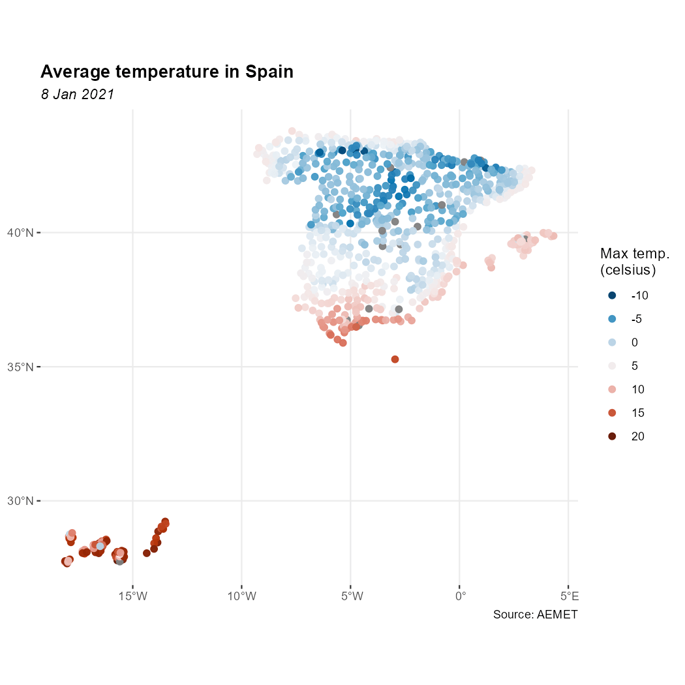

Since the last release, this package has been integrated into
[rOpenSpain](https://ropenspain.es/), a community of **R** enthusiasts whose
ultimate goal is to create high-quality **R** packages for data mining public
Spanish open sources.

From version **1.0.0** onward, we have introduced some improvements and
(breaking) changes on the package, in order to provide a smoother interaction
with the AEMET API service.

## API Key

### Get your API Key

To be able to download data from AEMET you will need a free API key which you
can get at <https://opendata.aemet.es/centrodedescargas/obtencionAPIKey>

Once that you have your API Key, you can use any of the following methods:

#### a. Set API Key with `aemet_api_key()`

This is the recommended option. Just type:


```r
aemet_api_key("YOUR_API_KEY", install = TRUE)
```

Using `install = TRUE` ensures that the API key is stored on your local computer
and it would be reloaded every time you load the library. From now on you can
forget about API keys!

#### b. Use an environment variable

This is a temporary alternative. You can set your API key as an environment
variable


```r
Sys.setenv(AEMET_API_KEY = "YOUR_API_KEY")
```

Note that this is only valid for the current session. You would need to re-run
this command each time you restart your session.

#### c. Modify your `.Renviron` file

This stores your API key permanently on your machine. You can start editing your
`.Renviron` running this command:

``` r
usethis::edit_r_environ()
```

Now you can add the following line to you `.Renviron` file:

    AEMET_API_KEY = YOUR_API_KEY

## New features

### `tidyverse` format

From **v1.0.0** onward, **climaemet** provides its results in [tibble
format](https://tibble.tidyverse.org/). Also, the functions try to guess the
correct format of the fields (i.e. something as a Date/Hour now is an hour,
numbers are parsed as double, etc.).

See how a tibble is displayed:


```r
# See a tibble in action

aemet_last_obs("9434")
#> # A tibble: 24 × 25
#>    idema   lon fint                 prec   alt  vmax    vv    dv   lat  dmax ubi        pres    hr stdvv    ts pres_nmar
#>    <chr> <dbl> <dttm>              <dbl> <dbl> <dbl> <dbl> <dbl> <dbl> <dbl> <chr>     <dbl> <dbl> <dbl> <dbl>     <dbl>
#>  1 9434  -1.00 2023-06-15 13:00:00     0   249  11.6   7.1   315  41.7   300 ZARAGOZA…  988.    27   1.3  36       1016.
#>  2 9434  -1.00 2023-06-15 14:00:00     0   249  10.2   7.6   313  41.7   313 ZARAGOZA…  988.    23   1.5  36.9     1016.
#>  3 9434  -1.00 2023-06-15 15:00:00     0   249  10.9   5.9   323  41.7   305 ZARAGOZA…  987     20   1.2  36.5     1015.
#>  4 9434  -1.00 2023-06-15 16:00:00     0   249   9.7   5.8   328  41.7   308 ZARAGOZA…  987.    20   1.2  36.1     1015.
#>  5 9434  -1.00 2023-06-15 17:00:00     0   249  11.7   5.8   318  41.7   305 ZARAGOZA…  986.    22   1.8  35.7     1014.
#>  6 9434  -1.00 2023-06-15 18:00:00     0   249  10.6   5.2   326  41.7   313 ZARAGOZA…  987.    23   1.2  33.4     1015.
#>  7 9434  -1.00 2023-06-15 19:00:00     0   249   7.2   2.2   343  41.7   328 ZARAGOZA…  987.    26   0.7  29.2     1015.
#>  8 9434  -1.00 2023-06-15 20:00:00     0   249   5.4   3.7   314  41.7   308 ZARAGOZA…  988.    29   0.7  26.8     1016.
#>  9 9434  -1.00 2023-06-15 21:00:00     0   249   6.6   4.7   302  41.7   303 ZARAGOZA…  988.    36   0.5  25.3     1017 
#> 10 9434  -1.00 2023-06-15 22:00:00     0   249   8.6   6.6   295  41.7   298 ZARAGOZA…  988.    42   0.6  24.1     1017.
#> # ℹ 14 more rows
#> # ℹ 9 more variables: tamin <dbl>, ta <dbl>, tamax <dbl>, tpr <dbl>, stddv <dbl>, inso <dbl>, tss5cm <dbl>,
#> #   pacutp <dbl>, tss20cm <dbl>
```

Note that when possible, data representing dates and numbers are converted to
the right format.

### Spatial objects: `sf`

Another major change in **v1.0.0** is the ability of return information on
spatial `sf` format, using `return_sf = TRUE`. The coordinate reference system
(CRS) used is **EPSG 4326**, that correspond to the **World Geodetic System
(WGS)** and return coordinates in latitude/longitude (unprojected coordinates):


```r
# You would need to install `sf` if not installed yet
# run install.packages("sf") for installation

library(ggplot2)
library(dplyr)

all_stations <- aemet_last_obs(return_sf = TRUE)
# Last hour
all_last <-
  all_stations %>% filter(fint == all_stations[["fint"]][1])

last_hour <- max(all_last$fint)


ggplot(all_last) +
  geom_sf(aes(col = ta),
    shape = 19,
    size = 2
  ) +
  labs(
    title = "Temperature in Spain",
    subtitle = last_hour,
    color = "Max temp.\n(celsius)",
    caption = "Source: AEMET"
  ) +
  scale_colour_gradientn(
    colours = hcl.colors(5, "RdBu", rev = TRUE),
    guide = "legend",
    n.breaks = 7
  ) +
  theme_bw() +
  theme(
    panel.border = element_blank(),
    plot.title = element_text(size = 23, face = "bold"),
    plot.subtitle = element_text(size = 16, face = "italic"),
    plot.caption = element_text(size = 15),
    legend.text = element_text(size = 15),
    legend.title = element_text(size = 15)
  )
```

<div class="figure">

<p class="caption">Example: Temperature in Spain</p>
</div>

## Further enhancements

Other enhancements included on the **v1.0.0**:

-   All the functions are now vectorized.
-   New function `get_metadata_aemet()`.
-   New function `ggclimat_walter_lieth()`. This function is now the default for
    `climatogram_*` functions (experimental). Old behavior can be reproduced
    with options `ggplot2 = FALSE`.
-   Plot functions gains new parameters (`verbose` and `...`). Now it is
    possible to pass colors to the plotting functions.
-   New example datasets: `climaemet::climaemet_9434_climatogram`,
    `climaemet::climaemet_9434_temp`, `climaemet::climaemet_9434_wind`.
