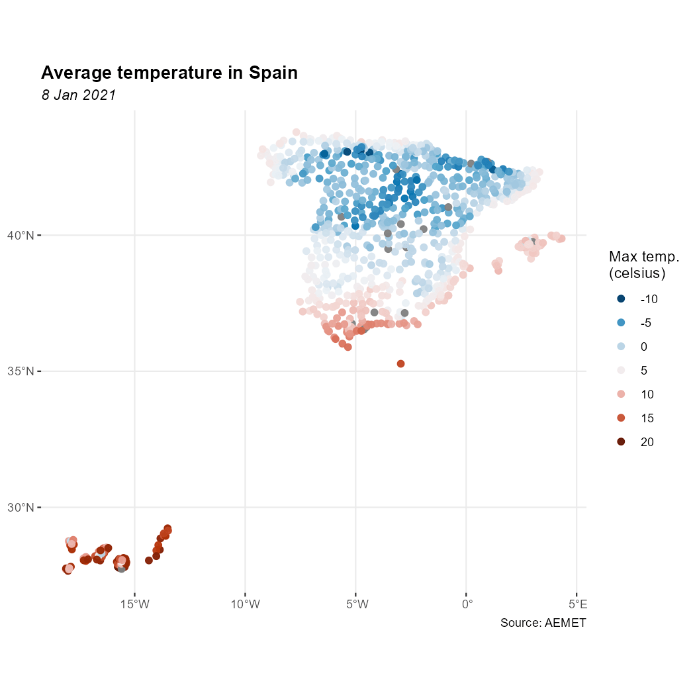

<!--
climaemet.qmd is generated from climaemet.qmd.orig. Please edit that file.
-->


**climaemet** provides access to meteorological observations, forecasts, alerts
and climatology data from the Spanish Meteorological Agency (AEMET). It is part
of [rOpenSpain](https://ropenspain.es/), a community that develops **R**
packages for working with Spanish public data.

## API key

### Get an API key

To download data from AEMET, obtain a free API key from the
[AEMET OpenData registration page](https://opendata.aemet.es/centrodedescargas/altaUsuario).

Once you have your API key, you can use any of the following methods:

#### Set the API key with `aemet_api_key()`

This is the recommended option. Run:


``` r
aemet_api_key("YOUR_API_KEY", install = TRUE)
```

Using `install = TRUE` stores the API key on your local computer so it is
available in future **R** sessions.

#### Use an environment variable

Alternatively, set the API key as an environment variable for the current
session:


``` r
Sys.setenv(AEMET_API_KEY = "YOUR_API_KEY")
```

You need to run this command again after restarting **R**.

#### Modify your `.Renviron` file

You can also store the API key permanently in `.Renviron`. Open the file with:

``` r
usethis::edit_r_environ()
```

Then add the following line:

```
AEMET_API_KEY=YOUR_API_KEY
```

## Data formats

### Tabular results

**climaemet** returns tabular results as [**tibble**
objects](https://tibble.tidyverse.org/). The package also infers column types
when possible. For example, date and time columns are parsed as date-time
objects and numeric columns are parsed as doubles.

The following call returns a tibble:


``` r
# Inspect a tibble.

aemet_last_obs("9434")
#> # A tibble: 12 × 25
#>    idema   lon fint                 prec   alt  vmax    vv    dv   lat  dmax
#>    <chr> <dbl> <dttm>              <dbl> <dbl> <dbl> <dbl> <dbl> <dbl> <dbl>
#>  1 9434  -1.00 2026-07-10 08:00:00   0     249   3.4   1.8    38  41.7    83
#>  2 9434  -1.00 2026-07-10 09:00:00   0     249   6.7   4.2   116  41.7   108
#>  3 9434  -1.00 2026-07-10 10:00:00   0     249   6.5   2.8    92  41.7   133
#>  4 9434  -1.00 2026-07-10 11:00:00   0     249   5.8   2.7   112  41.7    80
#>  5 9434  -1.00 2026-07-10 12:00:00   0.2   249   4     1.3   147  41.7   123
#>  6 9434  -1.00 2026-07-10 13:00:00   0     249   5     2.7    24  41.7    15
#>  7 9434  -1.00 2026-07-10 14:00:00   0     249  10.4   6     103  41.7   105
#>  8 9434  -1.00 2026-07-10 15:00:00   0     249  13     8.2   111  41.7   105
#>  9 9434  -1.00 2026-07-10 16:00:00   0     249  13.8   8.5   113  41.7   125
#> 10 9434  -1.00 2026-07-10 17:00:00   0     249  12.3   7.1   113  41.7   110
#> 11 9434  -1.00 2026-07-10 18:00:00   0     249  12.7   7.7   112  41.7   128
#> 12 9434  -1.00 2026-07-10 19:00:00   0     249  13.8   4.2   157  41.7   125
#> # ℹ 15 more variables: ubi <chr>, pres <dbl>, hr <dbl>, stdvv <dbl>, ts <dbl>,
#> #   pres_nmar <dbl>, tamin <dbl>, ta <dbl>, tamax <dbl>, tpr <dbl>,
#> #   stddv <dbl>, inso <dbl>, tss5cm <dbl>, pacutp <dbl>, tss20cm <dbl>
```

### Spatial objects with **sf**

Data-access functions that support `return_sf = TRUE` can return spatial **sf**
objects. These objects use the EPSG:4326 coordinate reference system (CRS),
corresponding to the World Geodetic System 1984 (WGS 84), with unprojected
longitude and latitude coordinates:


``` r
# You need to install sf if it is not already installed.
# Run install.packages("sf") to install it.

library(ggplot2)
library(dplyr)

all_stations <- aemet_daily_clim(
  start = "2021-01-08",
  end = "2021-01-08",
  return_sf = TRUE
)

ggplot(all_stations) +
  geom_sf(aes(colour = tmed), shape = 19, size = 2, alpha = 0.95) +
  labs(
    title = "Average temperature in Spain",
    subtitle = "8 Jan 2021",
    color = "Max temp.\n(celsius)",
    caption = "Source: AEMET"
  ) +
  scale_colour_gradientn(
    colours = hcl.colors(10, "RdBu", rev = TRUE),
    breaks = c(-10, -5, 0, 5, 10, 15, 20),
    guide = "legend"
  ) +
  theme_bw() +
  theme(
    panel.border = element_blank(),
    plot.title = element_text(face = "bold"),
    plot.subtitle = element_text(face = "italic")
  )
```

<div class="figure">

<p class="caption">Example: temperature in Spain</p>
</div>

## Additional features

Other package features include:

- Data functions accept vector inputs where the AEMET OpenData API supports
  them.
- `get_metadata_aemet()` retrieves metadata from arbitrary AEMET OpenData API
  endpoints.
- `ggclimat_walter_lieth()` creates Walter-Lieth climate diagrams and is the
  default plotting method used by `climatogram_normal()` and
  `climatogram_period()`.
  [](https://lifecycle.r-lib.org/articles/stages.html#experimental).
  Set `ggplot2 = FALSE` to use `climatol::diagwl()` instead.
- Plotting functions accept additional options through `...`.
- The example datasets `climaemet_9434_climatogram`, `climaemet_9434_temp` and
  `climaemet_9434_wind` support the plotting examples.
