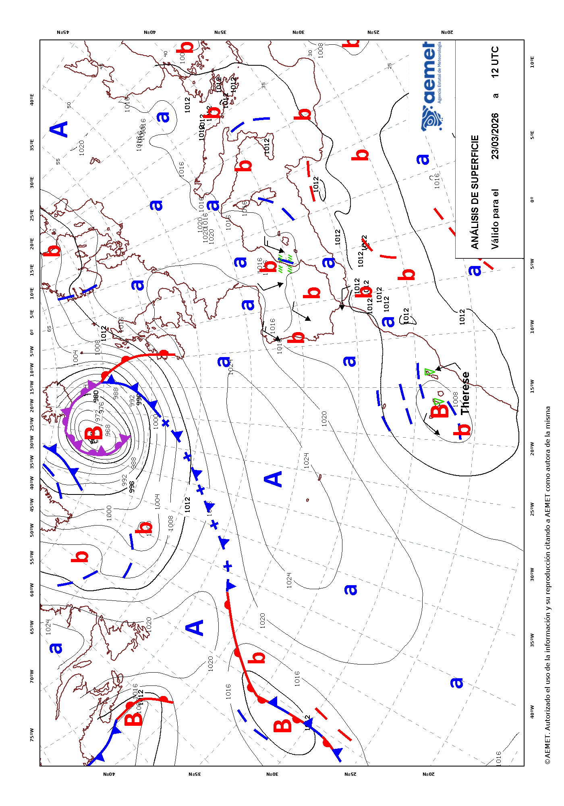

<!-- extending-climaemet.Rmd is generated from extending-climaemet.Rmd.orig. Please edit that file -->


**climaemet** provides several functions for accessing a selection of endpoints
of the [AEMET API tool](https://opendata.aemet.es/dist/index.html?). However,
this package does not cover in full all the capabilities of the API.

For that reason, we provide the `get_data_aemet()` function, that allows to
access any API endpoint freely. The drawback is that the user would need to
handle the results by him/herself.


``` r
library(climaemet)
```

## Example: Normalized text

Some API endpoints, as `predicciones-normalizadas-texto`, provides the results
as plain text on natural language. These results are not parsed by
**climaemet**, but can be retrieved as this:


``` r
# endpoint, today forecast

today <- "/api/prediccion/nacional/hoy"

# Metadata
knitr::kable(get_metadata_aemet(today))
```


|unidad_generadora                           |descripcion                                                                                                                              |periodicidad                                                                                                                                                                                                               |formato   |copyright                                                                                               |notaLegal                          |
|:-------------------------------------------|:----------------------------------------------------------------------------------------------------------------------------------------|:--------------------------------------------------------------------------------------------------------------------------------------------------------------------------------------------------------------------------|:---------|:-------------------------------------------------------------------------------------------------------|:----------------------------------|
|Grupo Funcional de Predicción de Referencia |Predicción general nacional para hoy / mañana / pasado mañana / medio plazo (tercer y cuarto día) / tendencia (del quinto al noveno día) |Disponibilidad. Para hoy, solo se confecciona si hay cambios significativos. Para mañana y pasado mañana diaria a las 15:00 h.o.p.. Para el medio plazo diaria a las 16:00 h.o.p.. La tendencia, diaria a las 18:30 h.o.p. |ascii/txt |© AEMET. Autorizado el uso de la información y su reproducción citando a AEMET como autora de la misma. |https://www.aemet.es/es/nota_legal |


``` r

# Data
pred_today <- get_data_aemet(today)
#> 
#> Results are MIME type: text/plain
#> Returning data as string
```


``` r
# Produce a result

clean <- gsub("\r", "\n", pred_today, fixed = TRUE)
clean <- gsub("\n\n\n", "\n", clean, fixed = TRUE)

cat(paste("---\n\n", clean, "\n---"))
```

---

 AGENCIA ESTATAL DE METEOROLOGÍA
PREDICCIÓN GENERAL PARA ESPAÑA 
DÍA 14 DE NOVIEMBRE DE 2025 A LAS 08:33 HORA OFICIAL
PREDICCIÓN VÁLIDA PARA EL VIERNES 14

A.- FENÓMENOS SIGNIFICATIVOS
Probables precipitaciones fuertes y persistentes en Andalucía,
Pirineo, sistema Central, oeste de Galicia, cordillera Cantábrica
y Alborán, acompañadas de tormentas en el oeste de Andalucía.
Rachas muy fuertes de viento de componente sur en montañas de
Mallorca y del centro y mitad norte peninsular, así como en el
Cantábrico oriental y litorales atlánticos. Descensos notables
de las temperaturas máximas en el Pirineo y zonas de Andalucía
oriental y Castilla-La Mancha.

B.- PREDICCIÓN
La borrasca Claudia permanece estacionaria al noroeste de la
Península dejando un predominio de cielos nubosos o cubiertos y
tendiendo a abrirse claros en la fachada oriental por la tarde. Se
darán precipitaciones en la mayor parte de la Península, aunque
siendo poco probables y de carácter ocasional en los litorales
cantábricos, Ebro y extremo este, así como en Baleares con
intervalos de nubes altas tendiendo a cubrirse. Por el contrario,
serán más abundantes en el resto de Andalucía, Pirineo, sistema
Central y oeste de Galicia, cordillera Cantábrica y Alborán,
donde es probable que sean fuertes y persistentes. Además irán
con tormenta y posible granizo ocasional en el oeste de
Andalucía, así como, de forma aislada, en el oeste de Galicia y
entorno pirenaico oriental. En Canarias, predominio de cielos poco
nubosos o con intervalos y posibilidad de algún chubasco
ocasional en las islas de mayor relieve. Nevará en cumbres de
Pirineos, sistema Central y Sierra Nevada.

Bancos de niebla en entornos de montaña y en Alborán, con brumas
frontales al principio en amplias zonas de los tercios central y
occidental. Calima en el este peninsular y Baleares.

Temperaturas en descenso en la mayor parte del país, localmente
notable para las máximas en el Pirineo y zonas de Andalucía
oriental y Castilla-La Mancha, y con aumentos en el Ebro y fachada
oriental peninsular, extendiéndose también para las mínimas a
Baleares. Heladas débiles en cumbres del Pirineo.

Soplarán vientos flojos del este en el tercio nordeste
peninsular, con poniente moderado en el Estrecho y Alborán y
viento moderado del sur y suroeste en el resto. Se darán
intervalos fuertes en los litorales atlánticos y del sureste
peninsular y en Baleares, con rachas muy fuertes en el Cantábrico
oriental y en los principales entornos de montaña de la
Península y Mallorca, pudiendo ser localmente huracanadas en
cumbres de montañas del norte. Viento moderado de componente
oeste en Canarias amainando.

 
---

## Example: Maps

AEMET also provides map data, usually on `image/gif` format. One way to get this
kind of data is as follows:


``` r
# Endpoint of a map
a_map <- "/api/mapasygraficos/analisis"

# Metadata
knitr::kable(get_metadata_aemet(a_map))
```


|unidad_generadora                 |descripción                                |periodicidad                                                                              |formato   |copyright                                                                                               |notaLegal                          |
|:---------------------------------|:------------------------------------------|:-----------------------------------------------------------------------------------------|:---------|:-------------------------------------------------------------------------------------------------------|:----------------------------------|
|Grupo Funcional de Jefes de Turno |Mapas de análisis de frentes en superficie |Dos veces al día, a las 02:00 y 14:00 h.o.p. en invierno y a las 03:00 y 15:00 en verano. |image/gif |© AEMET. Autorizado el uso de la información y su reproducción citando a AEMET como autora de la misma. |https://www.aemet.es/es/nota_legal |


``` r

the_map <- get_data_aemet(a_map)
#> 
#> Results are MIME type: image/gif
#> Returning raw data


# Write as gif and include it
giffile <- "example-gif.gif"
writeBin(the_map, giffile)

# Display on the vignette
knitr::include_graphics(giffile)
```

<div class="figure">

<p class="caption">Example: Surface analysis map provided by AEMET</p>
</div>
