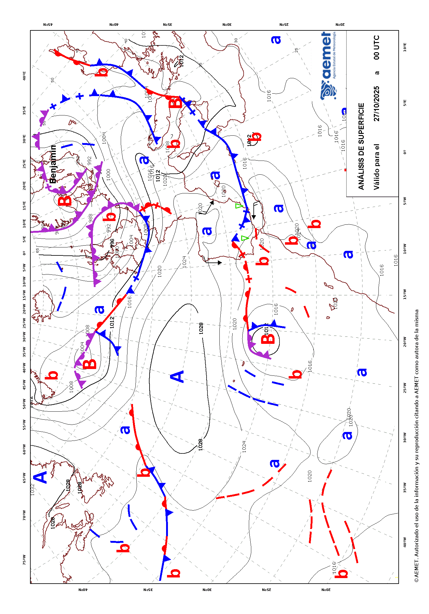

<!-- extending-climaemet.Rmd is generated from extending-climaemet.Rmd.orig. Please edit that file -->


**climaemet** provides several functions for accessing a selection of endpoints
of the [AEMET API tool](https://opendata.aemet.es/dist/index.html?). However,
this package does not cover in full all the capabilities of the API.

For that reason, we provide the `get_data_aemet()` function, that allows to
access any API endpoint freely. The drawback is that the user would need to
handle the results by him/herself.


``` r
library(climaemet)
```

## Example: Normalized text

Some API endpoints, as `predicciones-normalizadas-texto`, provides the results
as plain text on natural language. These results are not parsed by
**climaemet**, but can be retrieved as this:


``` r
# endpoint, today forecast

today <- "/api/prediccion/nacional/hoy"

# Metadata
knitr::kable(get_metadata_aemet(today))
```


|unidad_generadora                           |descripcion                                                                                                                              |periodicidad                                                                                                                                                                                                               |formato   |copyright                                                                                               |notaLegal                          |
|:-------------------------------------------|:----------------------------------------------------------------------------------------------------------------------------------------|:--------------------------------------------------------------------------------------------------------------------------------------------------------------------------------------------------------------------------|:---------|:-------------------------------------------------------------------------------------------------------|:----------------------------------|
|Grupo Funcional de Predicción de Referencia |Predicción general nacional para hoy / mañana / pasado mañana / medio plazo (tercer y cuarto día) / tendencia (del quinto al noveno día) |Disponibilidad. Para hoy, solo se confecciona si hay cambios significativos. Para mañana y pasado mañana diaria a las 15:00 h.o.p.. Para el medio plazo diaria a las 16:00 h.o.p.. La tendencia, diaria a las 18:30 h.o.p. |ascii/txt |© AEMET. Autorizado el uso de la información y su reproducción citando a AEMET como autora de la misma. |https://www.aemet.es/es/nota_legal |


``` r

# Data
pred_today <- get_data_aemet(today)
#> ℹ Results are MIME type: "text/plain".
#> → Returning data as UTF-8 string.
```


``` r
# Produce a result

clean <- gsub("\r", "\n", pred_today, fixed = TRUE)
clean <- gsub("\n\n\n", "\n", clean, fixed = TRUE)

cat(paste("---\n\n", clean, "\n---"))
```

---

 AGENCIA ESTATAL DE METEOROLOGÍA
PREDICCIÓN GENERAL PARA ESPAÑA 
DÍA 06 DE DICIEMBRE DE 2025 A LAS 08:05 HORA OFICIAL
PREDICCIÓN VÁLIDA PARA EL SÁBADO 6

A.- FENÓMENOS SIGNIFICATIVOS
Probable ascenso notable de las temperaturas máximas en el Ebro y
Pirineos orientales y de las mínimas en el alto Ebro. Probables
rachas muy fuertes en el norte de Galicia, Cantábrico occidental
e interiores del Levante. Nieblas densas y persistentes en el
nordeste de Castilla-La Mancha, valle del Guadalquivir y
depresiones del nordeste.

B.- PREDICCIÓN
Tras un periodo marcado por el paso de frentes atlánticos por la
Península y Baleares, durante este día se prevé una transición
hacia un tiempo marcado por la situación anticiclónica, no
obstante, durante el sábado un frente aún afectará al noroeste
Peninsular. Para este día se esperan cielos nubosos o cubiertos
en la mayor parte de la Península, con intervalos de nubes altas
en áreas mediterráneas y Baleares y una tendencia a despejar en
el tercio sur. Se darán precipitaciones en el cuadrante noroeste
sin descartar que puedan darse de forma débil y dispersa en otros
puntos de la Península, más probables en montañas, y
exceptuando los extremos oriental y meridional donde no se
esperan. En el oeste de Galicia pueden ser persistentes dejado
acumulaciones importantes, sin descartar alguna tormenta aislada.
En Canarias intervalos de nubes medias y altas, aunque con
nubosidad baja en el norte de Tenerife y La Palma con posibilidad
de algún chubasco débil, tendiendo a poco nuboso al final del
día.

Brumas y nieblas matinales en amplias zonas de la mitad sur de la
vertiente atlántica, así como en las mesetas y montañas del
norte y depresiones del nordeste. Probable calima ligera en
Canarias.

Las temperaturas aumentarán en la mayor parte de la Península y
Baleares, incluso podrán hacerlo de forma notable las máximas en
el Ebro y Pirineos orientales o las mínimas en el alto Ebro.
Pocos cambios en Canarias. Con los ascensos se alcanzarán valores
elevados para la época en amplias zonas del tercio norte
peninsular, con heladas débiles restringidas al Pirineo.

Predominarán los vientos moderados del oeste y suroeste en la
Península y Baleares, en general flojos en interiores del
nordeste y sur peninsular, y con intervalos fuertes y probables
rachas muy fuertes en el norte de Galicia y Cantábrico occidental
que también podrán afectar a interiores del Levante. En Canarias
viento de componente este, flojo a moderado.

 
---

## Example: Maps

AEMET also provides map data, usually on `image/gif` format. One way to get this
kind of data is as follows:


``` r
# Endpoint of a map
a_map <- "/api/mapasygraficos/analisis"

# Metadata
knitr::kable(get_metadata_aemet(a_map))
```


|unidad_generadora                 |descripción                                |periodicidad                                                                              |formato   |copyright                                                                                               |notaLegal                          |
|:---------------------------------|:------------------------------------------|:-----------------------------------------------------------------------------------------|:---------|:-------------------------------------------------------------------------------------------------------|:----------------------------------|
|Grupo Funcional de Jefes de Turno |Mapas de análisis de frentes en superficie |Dos veces al día, a las 02:00 y 14:00 h.o.p. en invierno y a las 03:00 y 15:00 en verano. |image/gif |© AEMET. Autorizado el uso de la información y su reproducción citando a AEMET como autora de la misma. |https://www.aemet.es/es/nota_legal |


``` r

the_map <- get_data_aemet(a_map)
#> ℹ Results are MIME type: "image/gif".
#> → Returning <raw> bytes. See also `base::writeBin()`.


# Write as gif and include it
giffile <- "example-gif.gif"
writeBin(the_map, giffile)

# Display on the vignette
knitr::include_graphics(giffile)
```

<div class="figure">

<p class="caption">Example: Surface analysis map provided by AEMET</p>
</div>
