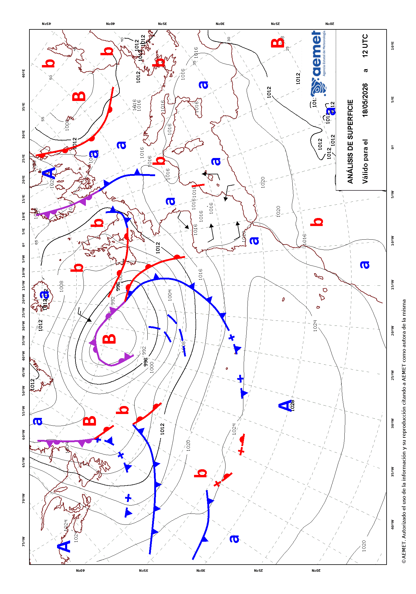

<!-- extending-climaemet.qmd is generated from extending-climaemet.qmd.orig. Please edit that file -->


**climaemet** provides several functions for accessing a selection of endpoints
of the [AEMET API tool](https://opendata.aemet.es/dist/index.html?). However,
this package does not cover in full all the capabilities of the API.

For that reason, we provide the `get_data_aemet()` function, which allows access
to any API endpoint. The drawback is that users need to handle the results
themselves.


``` r
library(climaemet)
```

## Example: Normalized text

Some API endpoints, such as `predicciones-normalizadas-texto`, provide results
as plain natural language text. These results are not parsed by **climaemet**
but can be retrieved as follows:


``` r
# endpoint, today forecast

today <- "/api/prediccion/nacional/hoy"

# Metadata
knitr::kable(get_metadata_aemet(today))
```


|unidad_generadora                           |descripcion                                                                                                                              |periodicidad                                                                                                                                                                                                               |formato   |copyright                                                                                               |notaLegal                          |
|:-------------------------------------------|:----------------------------------------------------------------------------------------------------------------------------------------|:--------------------------------------------------------------------------------------------------------------------------------------------------------------------------------------------------------------------------|:---------|:-------------------------------------------------------------------------------------------------------|:----------------------------------|
|Grupo Funcional de Predicción de Referencia |Predicción general nacional para hoy / mañana / pasado mañana / medio plazo (tercer y cuarto día) / tendencia (del quinto al noveno día) |Disponibilidad. Para hoy, solo se confecciona si hay cambios significativos. Para mañana y pasado mañana diaria a las 15:00 h.o.p.. Para el medio plazo diaria a las 16:00 h.o.p.. La tendencia, diaria a las 18:30 h.o.p. |ascii/txt |© AEMET. Autorizado el uso de la información y su reproducción citando a AEMET como autora de la misma. |https://www.aemet.es/es/nota_legal |


``` r

# Data
pred_today <- get_data_aemet(today)
#> ℹ Results are MIME type: "text/plain".
#> → Returning data as UTF-8 string.
```


``` r
# Produce a result

clean <- gsub("\r", "\n", pred_today, fixed = TRUE)
clean <- gsub("\n\n\n", "\n", clean, fixed = TRUE)

cat("<blockquote>", clean, "</blockquote>", sep = "\n")
```

<blockquote>
AGENCIA ESTATAL DE METEOROLOGÍA
PREDICCIÓN GENERAL PARA ESPAÑA 
DÍA 22 DE MARZO DE 2026 A LAS 08:42 HORA OFICIAL
PREDICCIÓN VÁLIDA PARA EL DOMINGO 22

A.- FENÓMENOS SIGNIFICATIVOS
Chubascos localmente fuertes y persistentes, acompañados de
tormenta y granizo, en las islas occidentales de Canarias, sin
descartar que afecten también a las orientales. Rachas muy
fuertes en Canarias, y puntualmente en el prelitoral de Tarragona
al final del día.

B.- PREDICCIÓN
La borrasca Therese mantendrá un ambiente de inestabilidad en las
islas Canarias, con cielos nubosos o cubiertos y precipitaciones
en forma de chubascos con probabilidad de ser localmente fuertes,
especialmente en las vertientes oeste y sur de las islas
occidentales, que pueden ir acompañados de tormenta y granizo, y
sin descartar que afecten también a las islas orientales. En la
mitad sur de la Península también aumentará la inestabilidad,
con precipitaciones en general débiles y de carácter ocasional,
y nubosidad de evolución en las sierras que podría dejar
chubascos vespertinos moderados. Cielos poco nubosos en general en
el resto de la Península y en Baleares, con nubosidad baja
matinal en el extremo norte y posibles precipitaciones débiles o
moderadas en el nordeste de Cataluña al final del día.

Es probable la formación de bancos de niebla matinales en zonas
bajas del suroeste de la meseta norte y el este de la meseta sur.

Las temperaturas máximas disminuirán en el extremo norte
peninsular predominando los aumentos en el resto, sobre todo en el
centro este peninsular. Pocos cambios en los archipiélagos.
Mínimas en descenso en la Península y Baleares y con pocos
cambios en Canarias. Son probables las heladas, débiles en
general en zonas altas de los Pirineos y la Ibérica.

En el interior de la Península viento flojo variable con
tendencia a predominar la componente norte y algo más intenso por
la tarde; cierzo moderado en el Ebro, con probables rachas muy
fuertes al final del día en los prelitorales de Tarragona. Viento
moderado del este en litorales del sur y del noroeste, con
posibles intervalos fuertes en los litorales atlánticos gallegos.
Nordeste moderado al sur de Baleares y suroeste moderado al norte
de este archipiélago. En Canarias soplará viento del suroeste
con intervalos fuertes y probables rachas muy fuertes, tendiendo a
amainar.


</blockquote>

## Example: Maps

AEMET also provides map data, usually on `image/gif` format. One way to get this
kind of data is as follows:


``` r
# Endpoint of a map
a_map <- "/api/mapasygraficos/analisis"

# Metadata
knitr::kable(get_metadata_aemet(a_map))
```


|unidad_generadora                 |descripción                                |periodicidad                                                                              |formato   |copyright                                                                                               |notaLegal                          |
|:---------------------------------|:------------------------------------------|:-----------------------------------------------------------------------------------------|:---------|:-------------------------------------------------------------------------------------------------------|:----------------------------------|
|Grupo Funcional de Jefes de Turno |Mapas de análisis de frentes en superficie |Dos veces al día, a las 02:00 y 14:00 h.o.p. en invierno y a las 03:00 y 15:00 en verano. |image/gif |© AEMET. Autorizado el uso de la información y su reproducción citando a AEMET como autora de la misma. |https://www.aemet.es/es/nota_legal |


``` r
the_map <- get_data_aemet(a_map)
#> ℹ Results are MIME type: "image/gif".
#> → Returning <raw> bytes. See also `base::writeBin()`.

# Write as gif and include it
giffile <- "example-gif.gif"
writeBin(the_map, giffile)

# Display on the vignette, it may be rotated
knitr::include_graphics(giffile)
```

<div class="figure">

<p class="caption">Example: Surface analysis map provided by AEMET</p>
</div>
