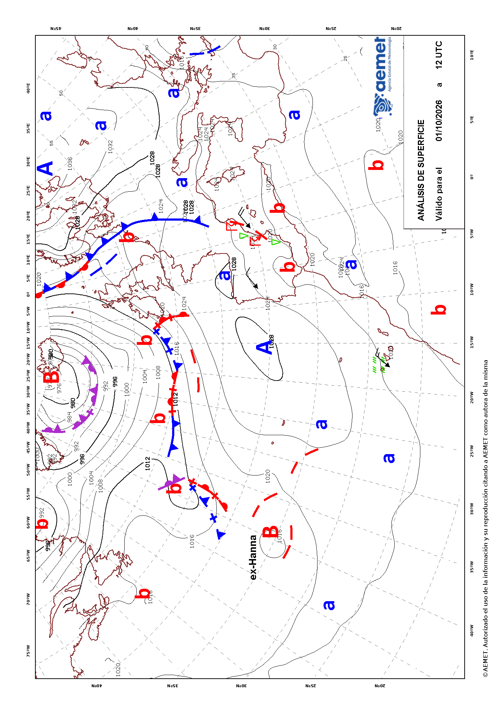

<!--
extending-climaemet.qmd is generated from extending-climaemet.qmd.orig.
Please edit that file.
-->


**climaemet** provides functions for selected [**AEMET OpenData API**
endpoints](https://opendata.aemet.es/dist/index.html). However, the package does
not cover every endpoint.

`get_data_aemet()` provides access to any **AEMET OpenData API** endpoint. Users
must parse endpoint-specific results themselves.


``` r
library(climaemet)
```

## Retrieve normalized text

Some API endpoints, such as `predicciones-normalizadas-texto`, return plain
text. **climaemet** does not parse these responses, but you can retrieve them
directly:


``` r
# Endpoint: today's forecast.

today <- "/api/prediccion/nacional/hoy"

# Retrieve metadata.
knitr::kable(get_metadata_aemet(today))
```


|unidad_generadora                           |descripcion                                                                                                                              |periodicidad                                                                                                                                                                                                               |formato   |copyright                                                                                               |notaLegal                          |
|:-------------------------------------------|:----------------------------------------------------------------------------------------------------------------------------------------|:--------------------------------------------------------------------------------------------------------------------------------------------------------------------------------------------------------------------------|:---------|:-------------------------------------------------------------------------------------------------------|:----------------------------------|
|Grupo Funcional de Predicción de Referencia |Predicción general nacional para hoy / mañana / pasado mañana / medio plazo (tercer y cuarto día) / tendencia (del quinto al noveno día) |Disponibilidad. Para hoy, solo se confecciona si hay cambios significativos. Para mañana y pasado mañana diaria a las 15:00 h.o.p.. Para el medio plazo diaria a las 16:00 h.o.p.. La tendencia, diaria a las 18:30 h.o.p. |ascii/txt |© AEMET. Autorizado el uso de la información y su reproducción citando a AEMET como autora de la misma. |https://www.aemet.es/es/nota_legal |


``` r

# Retrieve data.
pred_today <- get_data_aemet(today)
#> ℹ Response MIME type: "text/plain".
#> → Returning a UTF-8 `character` string.
```


``` r
# Produce a result.

clean <- gsub("\r", "\n", pred_today, fixed = TRUE)
clean <- gsub("\n\n\n", "\n", clean, fixed = TRUE)

cat("<blockquote>", clean, "</blockquote>", sep = "\n")
```

<blockquote>
AGENCIA ESTATAL DE METEOROLOGÍA
PREDICCIÓN GENERAL PARA ESPAÑA 
DÍA 27 DE SEPTIEMBRE DE 2026 A LAS 08:44 HORA OFICIAL
PREDICCIÓN VÁLIDA PARA EL DOMINGO 27

A.- FENÓMENOS SIGNIFICATIVOS
Chubascos y tormentas localmente fuertes en el norte de Castilla y
León, interior oriental de Cantabria, País Vasco y La Rioja con
probable granizo asociado. No se descartan chubascos localmente
fuertes en el noroeste de Galicia. Rachas puntualmente muy fuertes
en el Estrecho y zonas expuestas de la provincia de Cádiz.

B.- PREDICCIÓN
Una masa de aire frío en altura dejará una jornada con abundante
nubosidad en la mitad oeste. Se esperan cielos muy nubosos o
cubiertos en Galicia y Asturias, donde se podrán producir
precipitaciones en la segunda mitad del día, localmente fuertes
en el noroeste gallego, y sin descartar alguna tormenta aislada;
se formarán algunas nubes bajas con brumas asociadas en los
litorales y prelitorales mediterráneos, el Estrecho y Baleares,
mientras que en el resto de la Península se prevén intervalos de
nubes medias. A últimas horas, se pueden producir chubascos y
tormentas que podrían afectar al norte de Castilla y León,
interior oriental de Cantabria, La Rioja y el País Vasco, que
pueden ser puntualmente fuertes y con probable granizo asociado.
En Canarias, se prevén intervalos de nubes medias y algo de
calima en altura y no se descartan chubascos con alguna tormenta
que pueden afectar a las islas más occidentales.

Las temperaturas máximas ascenderán en el Cantábrico oriental y
descenderán en el resto, de forma más acusada en Galicia, donde
pueden ser notables. Las mínimas bajarán en el sureste y
subirán en el resto. En Canarias se espera un descenso, mientras
que en Baleares no se esperan cambios significativos. Podrán
superarse los 35 grados en el valle del Guadalquivir.

El levante será moderado en Alborán y con intervalos de fuerte y
con alguna racha puntual muy fuerte en el Estrecho y zonas
expuestas de la provincia de Cádiz. En Canarias, el viento será
moderado y del este o nordeste, y, en Baleares, moderado y del
este. En cuanto al resto de la Península, predominarán las
brisas en los litorales mediterráneos, el viento moderado y de
componente sur en el interior, el viento variable en el
Cantábrico y Galicia.


</blockquote>

## Retrieve maps

AEMET also provides maps, usually with the `image/gif` MIME type. You can
retrieve these binary responses directly:


``` r
# Map endpoint.
a_map <- "/api/mapasygraficos/analisis"

# Retrieve metadata.
knitr::kable(get_metadata_aemet(a_map))
```


|unidad_generadora                 |descripción                                |periodicidad                                                                              |formato   |copyright                                                                                               |notaLegal                          |
|:---------------------------------|:------------------------------------------|:-----------------------------------------------------------------------------------------|:---------|:-------------------------------------------------------------------------------------------------------|:----------------------------------|
|Grupo Funcional de Jefes de Turno |Mapas de análisis de frentes en superficie |Dos veces al día, a las 02:00 y 14:00 h.o.p. en invierno y a las 03:00 y 15:00 en verano. |image/gif |© AEMET. Autorizado el uso de la información y su reproducción citando a AEMET como autora de la misma. |https://www.aemet.es/es/nota_legal |


``` r
the_map <- get_data_aemet(a_map)
#> ℹ Response MIME type: "image/gif".
#> → Returning `raw` bytes. See also `base::writeBin()`.

# Write as GIF and include it.
giffile <- "example-gif.gif"
writeBin(the_map, giffile)

# Display in the vignette. It may be rotated.
knitr::include_graphics(giffile)
```

<div class="figure">

<p class="caption">Example: surface analysis map provided by AEMET</p>
</div>
